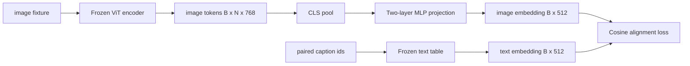

# Modality Alignment with a Projection Layer

> The vision encoder produces image tokens; the text decoder consumes text tokens. The two live in different vector spaces. A small two-layer MLP projects image tokens into the text embedding space, and a cosine alignment loss against paired captions pulls the two spaces together. This projection is the smallest piece of a vision-language model, yet the most critical for transfer.

**Type:** Build
**Languages:** Python
**Prerequisites:** Phase 19, Lessons 30-37 (Track B foundations)
**Time:** ~90 minutes

## Learning Objectives

- Build a two-layer MLP projection that maps image features into text embedding space.
- Construct a mock text embedding table (no pretrained tokenizer, no real corpus).
- Compute cosine alignment loss between projected image tokens and paired caption embeddings.
- Train only the projection while the vision encoder and text table remain frozen.

## The Problem

You have a vision encoder (Lessons 58-59) that outputs tokens of dimension `vision_hidden = 768`. You want to attach a text decoder with embedding dimension `text_hidden = 512` (any other number works just as well). The decoder expects text-shaped tokens. Image tokens are not text-shaped: they live in a basis the encoder learned during vision-only pretraining, entirely unrelated to the decoder's word vectors.

A two-layer MLP projection (linear, GELU, linear) bridges this gap. It is small enough (~`768 * 1024 + 1024 * 512 = 1.3M` parameters) to train in minutes on a single GPU, and it is the only component that needs to learn during the alignment stage. The vision encoder stays frozen. The text embedding table stays frozen. Only the projection moves. This is exactly the recipe LLaVA delivered in 2023, BLIP-2 reformulated as a Q-Former, and every open-source VLM has adopted in some form since.

## The Concept



### Pooling before projection

The vision encoder outputs 197 tokens. The text side has only a single caption-level embedding. To align them, you need one image-level vector per sample. CLS pooling is simplest: take the encoder's first token and project it. Mean pooling over all 197 tokens is an alternative and is what SigLIP uses. Both reduce 197 vectors to one.

### Why two layers instead of one

A single linear projection can rotate and scale, but it cannot correct basis curvature mismatches between the two spaces. Two linear layers with GELU in between give the projection a nonlinear bend that empirically suffices to align CLIP-style features to language model embeddings. Deeper projections (LLaVA-NeXT uses GLU; Qwen-VL uses a stack of attention layers) are extensions; the two-layer MLP is the canonical baseline and what the BLIP-2 Q-Former projection head houses underneath.

| Layer | Shape | Parameters |
|-------|-------|------------|
| fc1 | `(vision_hidden, projection_hidden)` | `768 * 1024 + 1024` |
| Activation | GELU | 0 |
| fc2 | `(projection_hidden, text_hidden)` | `1024 * 512 + 512` |

A `768 -> 1024 -> 512` head is approximately 1.3M parameters.

### Cosine alignment loss

Alignment does not mean `image_emb == text_emb`. It means `image_emb` points in the same direction as `text_emb` in the joint space. Cosine loss is `1 - cos_sim(image, text)`, ranging from 0 (perfect alignment) to 2 (exactly opposite). Training pushes each pair toward zero. Lesson 62 generalizes to contrastive batches (InfoNCE) where each image must be closer to its own caption than to any other caption in the batch; this lesson uses the pairwise version so the dynamics are visible.

### Freezing the encoder is the trick

The vision encoder has 86M parameters. The text table has millions more. Training all of them from scratch on a mock corpus is infeasible. Freezing both means the projection's 1.3M parameters are the only thing moving, and a few hundred steps on synthetic pairs suffice to push the loss down. This is exactly the operating regime of every adapter-based VLM: heavy parts stay frozen, the lightweight bridge trains.

## Build It

`code/main.py` implements:

- `MLPProjector(in_dim, hidden_dim, out_dim)`, a two-layer linear MLP with GELU activation.
- `MockTextEmbedding(vocab_size, dim)`, a frozen embedding table initialized deterministically from a seed.
- `make_pair(seed, vocab_size)`, which synthesizes a paired (image, caption) sample. The caption is a short sequence of ids; the caption embedding is the mean-pooled token embeddings.
- `cosine_alignment_loss(image_emb, text_emb)`, the pairwise `1 - cos_sim` objective.
- A training loop that runs the projection for 200 steps on 32 synthetic pairs (cycled), with both the vision encoder and text table frozen, printing loss every 25 steps.

Run it:

```bash
python3 code/main.py
```

Output: training reports loss dropping from an initial ~1.07 to ~0.80 over 200 steps, demonstrating that the projection alone can pull image tokens toward text space. Final cosine similarity per pair is also printed.

## Use It

The same pattern appears in every open-source VLM:

- **LLaVA 1.5.** A two-layer GELU MLP projection from CLIP-ViT-L hidden to LLaMA embedding dimension. Freeze the vision encoder, freeze the LLM, train only the projection (then unfreeze the LLM in a second stage).
- **BLIP-2.** The Q-Former has 32 learnable query tokens that cross-attend to image tokens, then project into LLM embedding dimension. The projection head at the end of the Q-Former is this lesson's MLP counterpart.
- **MiniGPT-4.** A single linear projection from BLIP-2 Q-Former output to Vicuna embedding dimension.
- **Qwen-VL.** A multi-layer cross-attention adapter, but the final piece is again a projection to LM embedding dimension.

Shapes differ, but the role is identical: pool image tokens, project to text embedding dimension, train separately.

## Ship It

`code/test_main.py` covers:

- Projector output shape equals configured `out_dim`
- Frozen text embedding table has zero `requires_grad` parameters
- Cosine loss is zero for identical vectors and 2 for anti-parallel vectors
- Projector gradients flow after one backward pass
- Training loop reduces loss between step 0 and step 200

Run them:

```bash
python3 -m unittest code/test_main.py
```

## Exercises

1. Replace CLS pooling with mean pooling over the 196 patch tokens and compare final loss after 200 steps. Mean pooling typically trains faster on synthetic data; CLS is more sample-efficient on natural images.

2. Add a learnable scalar temperature (`cos / tau`) to the cosine loss and observe what happens when `tau` is too small (gradient noise) or too large (loss plateaus high).

3. Replace the two-layer MLP with a single linear layer and quantify the loss gap. The nonlinearity matters more on natural image features than on synthetic ones.

4. Add a small L2 penalty on projector weights and observe how it interacts with cosine alignment (cosine is scale-invariant, so the penalty primarily shrinks unused directions).

5. Persist projector weights, then reload and run inference without backpropagating through the vision encoder, verifying that only the projector is needed at deployment time.

## Key Terms

| Term | Meaning |
|------|---------------|
| Modality alignment | The act of making image and text embeddings comparable in a shared space |
| Projection head | A small module mapping one space to another, typically a 2-layer MLP |
| Cosine similarity | Dot product divided by the product of two L2 norms |
| Frozen encoder | All parameters in the vision (or text) model set to `requires_grad=False` |
| Mock corpus | Synthetic pairs used for training so no dataset download is required |

## Further Reading

- LLaVA paper — two-stage training (projection first, then unfreeze the LM).
- BLIP-2 paper — Q-Former as a learnable projection alternative.
- Qwen-VL technical report — cross-attention adapter as a deeper projection head.
