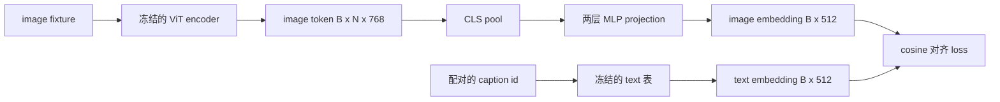

# 用 Projection Layer 做模态对齐

> 视觉 encoder 产出 image token，文本 decoder 消费 text token。两者活在不同的向量空间里。一个小小的两层 MLP 把 image token 投影进 text embedding 空间，再用一个针对配对 caption 的 cosine 对齐 loss，把两个空间拉到一致。这个投影是视觉语言模型里最小的一块，却也是对迁移最关键的一块。

**类型：** Build
**语言：** Python
**前置要求：** 第 19 阶段第 30-37 课（Track B 基础）
**预计时间：** ~90 分钟

## 学习目标

- 构建一个两层 MLP projection，把 image 特征映射进 text embedding 空间。
- 构造一个 mock 的 text embedding 表（没有预训练 tokenizer，没有真实语料）。
- 计算投影后的 image token 与配对 caption embedding 之间的 cosine 对齐 loss。
- 在视觉 encoder 冻结、text 表也冻结的情况下，只训练这个 projection。

## 问题

你有一个视觉 encoder（第 58-59 课），产出维度为 `vision_hidden = 768` 的 token。你想在它上面接一个文本 decoder，embedding 维度是 `text_hidden = 512`（换成任何别的数也同样合理）。decoder 期望的是 text 形状的 token。而 image token 不是 text 形状的：它们活在 encoder 在纯视觉预训练时学到的一组基里，和 decoder 的词向量毫无关系。

两层 MLP projection（linear、GELU、linear）弥合了这个鸿沟。它足够小（约 `768 * 1024 + 1024 * 512 = 1.3M` 个参数），在单卡上几分钟就能训完，而且它是对齐阶段唯一需要学习的部件。视觉 encoder 保持冻结。text embedding 表保持冻结。只有 projection 在动。这正是 LLaVA 在 2023 年交付的配方，BLIP-2 把它重构成了 Q-Former，此后每个开源 VLM 都以某种形式采用了它。

## 核心概念



### 投影前先 pooling

视觉 encoder 吐出 197 个 token。文本侧只有单个 caption 级别的 embedding。要对齐它们，你需要每个样本一个 image 级别的向量。CLS pooling 最简单：取 encoder 的第一个 token 来投影。对全部 197 个 token 做 mean pooling 是另一种选择，也是 SigLIP 采用的方式。两种方式都是把 197 个向量 pool 成一个。

### 为什么是两层而不是一层

单个线性投影可以旋转和缩放，但如果两个空间存在曲率失配，它无法修正基。两个线性层之间夹一个 GELU，给投影加了一个非线性的弯，经验上这就足以把 CLIP 风格的特征对齐到语言模型 embedding。更深的投影（LLaVA-NeXT 用了 GLU；Qwen-VL 用了一叠 attention 层）是扩展；两层 MLP 是规范的 baseline，也是 BLIP-2 的 Q-Former 投影头在底层装着的东西。

| 层 | 形状 | 参数量 |
|-------|-------|------------|
| fc1 | `(vision_hidden, projection_hidden)` | `768 * 1024 + 1024` |
| 激活 | GELU | 0 |
| fc2 | `(projection_hidden, text_hidden)` | `1024 * 512 + 512` |

一个 `768 -> 1024 -> 512` 的头大约 1.3M 个参数。

### Cosine 对齐 loss

对齐不等于 `image_emb == text_emb`。对齐的意思是 `image_emb` 在联合空间里和 `text_emb` 指向同一个方向。cosine loss 是 `1 - cos_sim(image, text)`，取值范围从 0（完美对齐）到 2（完全相反）。训练让每对都把它推向零。第 62 课会推广到对比 batch（InfoNCE），那里每张图都必须比 batch 里任何其他 caption 更接近它自己的 caption；本课用的是逐对版本，好让动态过程看得见。

### 冻结 encoder 是诀窍

视觉 encoder 有 86M 个参数。text 表又有几百万个。从一个 mock 语料把它们全部从头训练，根本不现实。把两者都冻结，意味着 projection 的 1.3M 个参数是唯一在变的东西，在合成对上跑几百步就足以把 loss 压下去。这正是每个基于 adapter 的 VLM 的操作形态：重的部分保持冻结，轻的桥梁去训练。

## 动手实现

`code/main.py` 实现了：

- `MLPProjector(in_dim, hidden_dim, out_dim)`，带 GELU 激活的两层线性 MLP。
- `MockTextEmbedding(vocab_size, dim)`，一个冻结的 embedding 表，从一个 seed 做确定性初始化。
- `make_pair(seed, vocab_size)`，合成一个配对的 (image, caption) 样本。caption 是短 id 序列；caption embedding 是对 token embedding 做 mean-pool。
- `cosine_alignment_loss(image_emb, text_emb)`，逐对的 `1 - cos_sim` 目标。
- 一个训练循环，在 32 个合成对（循环复用）上把 projection 跑 200 步，视觉 encoder 和 text 表都冻结，每 25 步打印一次 loss。

运行它：

```bash
python3 code/main.py
```

输出：训练报告显示 loss 在 200 步内从初始约 1.07 降到约 0.80，证明仅靠 projection 就能把 image token 拉向 text 空间。还会打印每对最终的 cosine 相似度。

## 实战应用

同样的模式出现在每个开源 VLM 里：

- **LLaVA 1.5。** 一个两层 GELU MLP projection，从 CLIP-ViT-L 的 hidden 投到 LLaMA 的 embedding 维。冻结视觉 encoder、冻结 LLM，只训练 projection（然后在第二阶段解冻 LLM）。
- **BLIP-2。** Q-Former 让 32 个可学习 query token 通过 cross-attention 去对着 image token，然后投影到 LLM embedding 维。Q-Former 最末端的投影头就是本课 MLP 的对应物。
- **MiniGPT-4。** 从 BLIP-2 Q-Former 的输出到 Vicuna embedding 维的单个线性投影。
- **Qwen-VL。** 一个多层的 cross-attention adapter，但最后一块又是一个到 LM embedding 维的投影。

形状各异，但角色完全相同：pool image token、投影到 text embedding 维、单独训练。

## 测试

`code/test_main.py` 覆盖了：

- projector 的输出形状等于配置的 `out_dim`
- 冻结的 text embedding 表的 `requires_grad` 参数数为零
- cosine loss 在向量相同时为零，在反平行向量上为 2
- 一次反向传播后 projector 的梯度能流动
- 训练循环在第 0 步和第 200 步之间降低了 loss

运行它们：

```bash
python3 -m unittest code/test_main.py
```

## 练习

1. 把 CLS pooling 换成对 196 个 patch token 做 mean pooling，对比 200 步后的最终 loss。在合成数据上 mean pooling 通常训练更快；在自然图像上 CLS 更省样本。

2. 给 cosine loss 加一个可学习的标量温度（`cos / tau`），观察 `tau` 太小（梯度噪声）或太大（loss 高位停滞）时会发生什么。

3. 把两层 MLP 换成单个线性层，量化 loss 差距。非线性在自然图像特征上更重要，在合成特征上则不那么重要。

4. 给 projector 权重加一个小的 L2 惩罚，观察它如何与 cosine 对齐相互作用（cosine 对尺度不变，所以惩罚主要是收缩那些没用到的方向）。

5. 持久化 projector 权重，然后重新加载并在不跑视觉 encoder 反向传播的情况下做推理，验证部署时只需要 projector。

## 关键术语

| 术语 | 含义 |
|------|---------------|
| Modality alignment | 让 image 和 text embedding 在一个共享空间里可比的动作 |
| Projection head | 把一个空间映射到另一个空间的小模块，通常是一个 2 层 MLP |
| Cosine similarity | 点积除以两个 L2 范数之积 |
| Frozen encoder | 视觉（或文本）模型的所有参数都 `requires_grad=False` |
| Mock corpus | 用来训练的合成对，这样就不依赖数据集下载 |

## 延伸阅读

- LLaVA 论文，讲两阶段训练（先投影，再解冻 LM）。
- BLIP-2 论文，讲 Q-Former 作为一种可学习的投影替代方案。
- Qwen-VL 技术报告，讲 cross-attention adapter 作为更深的投影头。
