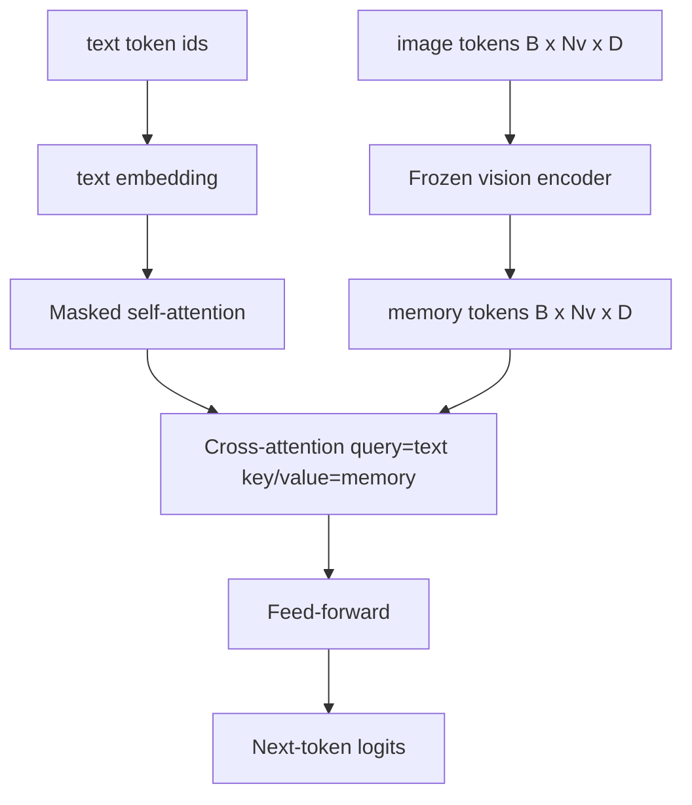
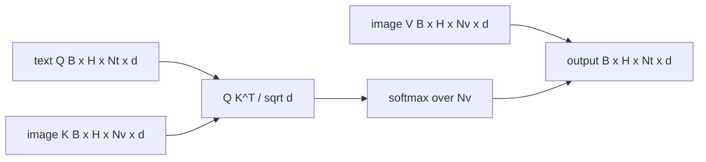

# Cross-Attention Fusion

> The projection layer aligns a single image vector with a single caption vector. But a real vision-language decoder needs every text token to attend to every patch token so the model can ground each word to a region. Cross-attention is how that grounding happens. Text supplies the queries; vision supplies keys and values. This lesson builds the cross-attention block, causal text self-attention, and the mask shapes that make both legal.

**Type:** Build
**Languages:** Python
**Prerequisites:** Phase 19, Lessons 30-37 (Track B foundations)
**Time:** ~90 minutes

## Learning Objectives

- Implement multi-head cross-attention where the query stream is text and the key/value stream is vision.
- Compose a decoder block: causal self-attention + cross-attention + feed-forward.
- Get mask shapes right: causal mask for self-attention, no mask for cross-attention.
- Run a forward pass with batched text tokens and a fixed image token pool.

## The Problem

Concatenating image tokens and text tokens into one sequence is one fusion option (early fusion — the path Chameleon and Emu3 take). Cross-attention is the other (late fusion — introduced by Flamingo and replicated by every Flamingo-shaped decoder since). In late fusion, the text decoder runs only on text-only tokens and reaches into the image stream at every layer via cross-attention.

Late fusion has two advantages. First, the text stream stays clean and the model retains text-only capability. Second, the image stream is computed once per image and reused by every decode step, so generation is cheap even for long captions. The cost is one additional attention sub-layer per block.

## The Concept





### Mask shapes

The two attentions inside a decoder block require different masks:

| Attention | Query length | Key length | Mask | Why |
|-----------|--------------|------------|------|-----|
| Self-attention | `Nt` (text) | `Nt` (text) | Causal: lower-triangular `(Nt, Nt)` | Text tokens must not see the future during autoregressive generation |
| Cross-attention | `Nt` (text) | `Nv` (vision) | No mask | The entire image is visible to every text position |

This lesson includes a shape validation function so that confusing the two surfaces as a `ValueError` rather than a silently broken loss curve.

### Why cross-attention has no mask

The image is fully observed before any text is generated. The `t`-th caption token may attend to any patch of the image; there is no temporal ordering among image patches. Some Flamingo variants add a per-sample mask pattern when interleaving multiple images with multiple text segments, but for a single image plus a single caption, cross-attention sees everything.

### Key/value cache

Image keys and values are computed once at the start of decoding and stored in a cache. Each new text token uses the cache without recomputing. This is why captioning is fast at inference time: the heavy ViT runs once; cross-attention reuses its keys and values at every step. This lesson exposes the cache and tests the cache-hit path.

### Block composition

A decoder block runs: pre-LN -> self-attention -> residual -> pre-LN -> cross-attention -> residual -> pre-LN -> feed-forward -> residual. Three sub-layers, each with its own LayerNorm. The Flamingo paper adds a learnable gate on cross-attention so the model can selectively bypass the image path at the cost of training stability; the canonical baseline (used here) has no gate.

```python
class DecoderBlock:
  def forward(self, text_tokens, image_tokens, text_mask, cross_mask):
      text_tokens = text_tokens + self.self_attn(self.ln1(text_tokens),
                                                 mask=text_mask)
      text_tokens = text_tokens + self.cross_attn(self.ln2(text_tokens),
                                                  image_tokens,
                                                  mask=cross_mask)
      text_tokens = text_tokens + self.ffn(self.ln3(text_tokens))
      return text_tokens
```

## Build It

`code/main.py` implements:

- `CrossAttention(hidden, heads)`, multi-head cross-attention with separate `q` and `kv` projections.
- `CausalSelfAttention(hidden, heads)`, standard masked self-attention for a decoder.
- `DecoderBlock`, combining the three sub-layers with pre-LN residuals.
- `VisionLanguageDecoder`, a four-layer decoder fed by a mock vision encoder output and a small text embedding table.
- `causal_mask(length)`, which returns a `(length, length)` lower-triangular boolean tensor.
- A demo that feeds a batch (two text sequences of length 10) and image memory of length 197, printing output shape, self-attention mask shape, and cross-attention output norm at each position.

Run it:

```bash
python3 code/main.py
```

Output: the decoder produces a `(2, 10, text_vocab)` logits tensor. Mask shape is `(10, 10)`. The KV-cache reuse check confirms that the cached path and the uncached path produce identical logits.

## Use It

Cross-attention appears in two production families:

- **Flamingo and IDEFICS.** A cross-attention sub-layer is inserted every K language-model blocks, with the LM frozen. The vision-language adapter is the cross-attention block plus its gate.
- **BLIP-2.** The Q-Former uses a fixed set of 32 query tokens that cross-attend to image features, then projects those queries into LM embedding space.

The block shape in this lesson maps directly to both. Mask discipline (causal for self, none for cross) is the same.

## Ship It

`code/test_main.py` covers:

- Causal mask is lower-triangular and matches expected boolean shape
- Cross-attention output shape is `(B, Nt, hidden)` regardless of key length
- KV-cache path matches uncached path within floating-point tolerance
- Shape mismatch between text and image streams raises a clear `ValueError`
- Full decoder forward produces correct batch and sequence shapes

Run them:

```bash
python3 -m unittest code/test_main.py
```

## Exercises

1. Add a learnable tanh gate on the cross-attention residual (Flamingo's trick) and verify that training converges from a near-zero initial gate. The gate starts at 0; the model first recovers text-only behavior, then mixes in the image stream.

2. Implement interleaved attention where the same decoder consumes multiple images plus multiple text segments. Build per-sample cross-attention masks that prevent text segment 2 from attending to image 1.

3. Compare cross-attention vs. self-attention layer cost at `Nt=64, Nv=576` (a 24x24 grid at higher resolution). Cross-attention cost is `Nt * Nv`, which dominates at high image resolution.

4. Add query-side dropout on the cross-attention map and measure caption diversity on the demo (variance in sampled captions increases with dropout in the cross map).

5. Replace the cross-attention layer with a Q-Former-style attention block where a fixed 32-token query pool attends to image features once per layer.

## Key Terms

| Term | Meaning |
|------|---------------|
| Late fusion | Text and vision maintain separate streams; cross-attention connects them at each block |
| Cross-attention | Q comes from one stream, K and V come from the other |
| Causal mask | Lower-triangular boolean mask preventing autoregressive peeks into the future |
| KV cache | Image keys and values stored once, reused at every decode step |
| Memory tokens | The frozen image tokens the decoder reaches into |

## Further Reading

- Flamingo (2022) — the canonical late-fusion design with gated cross-attention.
- BLIP-2 (2023) — Q-Former, which is essentially a cross-attention block disguised as a learnable query pool.
- IDEFICS (2023) — open-source reproduction of the Flamingo recipe.
