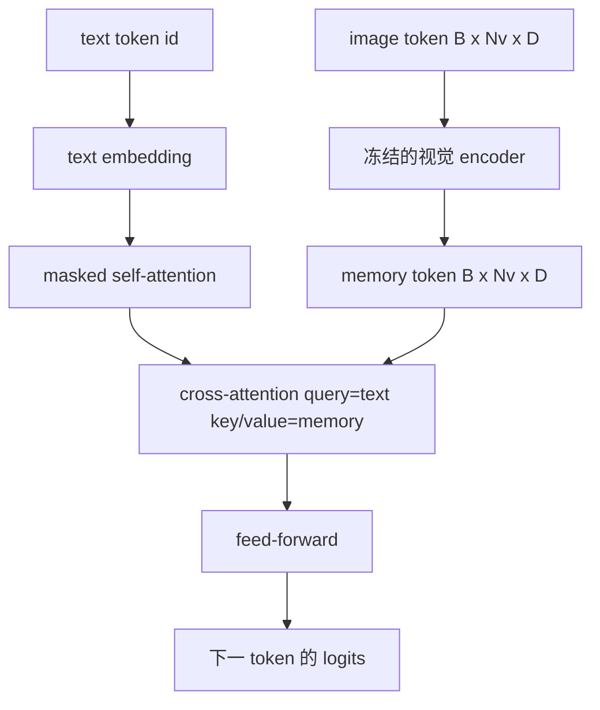
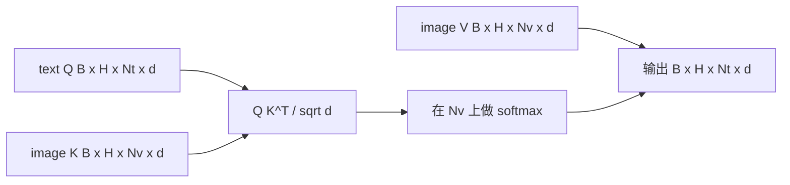

# Cross-Attention 融合

> 投影层把一个 image 向量和一个 caption 向量对齐。但一个真正的视觉语言 decoder，需要每个 text token 都能关注每个 patch token，这样模型才能把每个词落地到某个区域。cross-attention 就是这种落地发生的方式。text 来 query；vision 用 key 和 value 来回答。这节课构建 cross-attention block、causal text self-attention，以及让两者都合法的 mask 形状。

**类型：** Build
**语言：** Python
**前置要求：** 第 19 阶段第 30-37 课（Track B 基础）
**预计时间：** ~90 分钟

## 学习目标

- 实现 multi-head cross-attention，其中 query 流是 text，key/value 流是 vision。
- 组合一个 decoder block：causal self-attention + cross-attention + feed-forward。
- 把 mask 形状搞对：self-attention 用 causal mask，cross-attention 不用 mask。
- 用 batched 的 text token 和一个固定的 image token 池跑一次 forward。

## 问题

把 image token 和 text token 拼接成一个序列，是一种 fusion 选项（early fusion，Chameleon 和 Emu3 走的路）。cross-attention 是另一种（late fusion，Flamingo 引入、此后每个 Flamingo 形状的 decoder 都照抄的路）。在 late fusion 里，文本 decoder 只在 text-only 的 token 上运行，并在每一层通过 cross-attention 伸进 image 流里去取信息。

late fusion 有两个优势。第一，text 流保持干净，模型保留了 text-only 的能力。第二，image 流每张图只算一次，然后被每个 decode step 复用，所以即便 caption 很长，生成也很便宜。代价是每个 block 多了一个 attention 子层。

## 核心概念





### Mask 形状

decoder block 内部的两个 attention 需要不同的 mask：

| Attention | Query 长度 | Key 长度 | Mask | 为什么 |
|-----------|--------------|------------|------|-----|
| Self-attention | `Nt`（text） | `Nt`（text） | Causal：下三角 `(Nt, Nt)` | 自回归时 text token 不能看未来 |
| Cross-attention | `Nt`（text） | `Nv`（vision） | 无 mask | 整张图对每个 text 位置都可见 |

本课包含一个形状校验函数，这样把两者搞混的错误会以 `ValueError` 的形式暴露出来，而不是变成一条悄无声息坏掉的 loss 曲线。

### 为什么 cross-attention 不用 mask

图像在生成任何 text 之前就被完整观测了。caption 的第 `t` 个 token 可以关注图像的任意 patch；image patch 之间没有时间顺序。某些 Flamingo 变体在交错多张图和多个文本段时会加一个 per-sample 的 mask 模式，但对于单张图加一个 caption，cross-attention 看到的是全部。

### Key/value 缓存

image 的 key 和 value 在 decode 开始时算一次，存进一个 cache。每个新的 text token 用 cache 而无需重算。这就是 captioning 在推理时快的原因：重的 ViT 只跑一次；cross-attention 在每一步都复用它的 key 和 value。本课暴露了这个 cache，并测试 cache 命中路径。

### Block 组合

一个 decoder block 跑：pre-LN -> self-attention -> 残差 -> pre-LN -> cross-attention -> 残差 -> pre-LN -> feed-forward -> 残差。三个子层，各有自己的 LayerNorm。Flamingo 论文在 cross-attention 上加了一个可学习的 gate，让模型能以训练期稳定性为代价而选择性地绕开 image 路径；规范的 baseline（这里用的）没有 gate。

```python
class DecoderBlock:
  def forward(self, text_tokens, image_tokens, text_mask, cross_mask):
      text_tokens = text_tokens + self.self_attn(self.ln1(text_tokens),
                                                 mask=text_mask)
      text_tokens = text_tokens + self.cross_attn(self.ln2(text_tokens),
                                                  image_tokens,
                                                  mask=cross_mask)
      text_tokens = text_tokens + self.ffn(self.ln3(text_tokens))
      return text_tokens
```

## 动手实现

`code/main.py` 实现了：

- `CrossAttention(hidden, heads)`，带分开的 `q` 和 `kv` 投影的 multi-head cross-attention。
- `CausalSelfAttention(hidden, heads)`，标准 decoder 里的 masked self-attention。
- `DecoderBlock`，用 pre-LN 残差组合这三个子层。
- `VisionLanguageDecoder`，一个四层 decoder，由一个 mock 视觉 encoder 输出和一个小 text embedding 表喂入。
- `causal_mask(length)`，返回一个 `(length, length)` 的下三角布尔张量。
- 一个 demo，喂入一个 batch（两条长度为 10 的 text 序列）和长度为 197 的 image memory，打印输出形状、self-attention 的 mask 形状，以及每个位置的 cross-attention 输出范数。

运行它：

```bash
python3 code/main.py
```

输出：decoder 产出一个 `(2, 10, text_vocab)` 的 logits 张量。mask 形状是 `(10, 10)`。KV-cache 复用检查确认了缓存路径和未缓存路径产生相同的 logits。

## 实战应用

cross-attention 出现在两个生产系列里：

- **Flamingo 和 IDEFICS。** 每隔 K 个语言模型 block 插入一个 cross-attention 子层，LM 冻结。视觉语言 adapter 就是 cross-attention block 加它的 gate。
- **BLIP-2。** Q-Former 用一组固定的 32 个 query token，通过 cross-attention 去看 image 特征，然后把这些 query 投影进 LM embedding 空间。

本课 block 的形状直接对应到这两者。mask 纪律（self 用 causal，cross 不用）是一样的。

## 测试

`code/test_main.py` 覆盖了：

- causal mask 是下三角，并匹配预期的布尔形状
- cross-attention 输出形状为 `(B, Nt, hidden)`，与 key 长度无关
- KV-cache 路径在浮点容差内匹配未缓存路径
- text 流和 image 流之间形状不匹配时抛出清晰的 `ValueError`
- 完整的 decoder forward 产出正确的 batch 和序列形状

运行它们：

```bash
python3 -m unittest code/test_main.py
```

## 练习

1. 给 cross-attention 残差加一个可学习的 tanh gate（Flamingo 的技巧），验证从接近零的初始 gate 开始训练能收敛。gate 从 0 起步；模型先恢复 text-only 行为，再把 image 流混进来。

2. 实现交错 attention，让同一个 decoder 消费多张图加多个文本段。构建 per-sample 的 cross-attention mask，阻止文本段 2 去关注图像 1。

3. 在 `Nt=64, Nv=576`（更高分辨率下的 24x24 网格）下对比 cross-attention 和 self-attention 层。cross-attention 的开销是 `Nt * Nv`，在高图像分辨率下占主导。

4. 在 cross-attention map 上加一个 query 侧的 dropout，在 demo 上测量 caption 多样性（cross map 里加 dropout 后 caption 采样的方差会增大）。

5. 把 cross-attention 层换成 Q-Former 风格的 attention block，让一个固定的 32-token query 池每层关注一次 image 特征。

## 关键术语

| 术语 | 含义 |
|------|---------------|
| Late fusion | text 和 vision 各自保持独立的流；cross-attention 在每个 block 把它们连起来 |
| Cross-attention | Q 来自一个流，K 和 V 来自另一个流 |
| Causal mask | 下三角布尔 mask，阻止自回归时看未来 |
| KV cache | image 的 key 和 value 存一次，被每个 decode step 复用 |
| Memory token | decoder 伸进去取信息的那些冻结 image token |

## 延伸阅读

- Flamingo（2022），带 gated cross-attention 的规范 late-fusion 设计。
- BLIP-2（2023），Q-Former，其本质是一个伪装成可学习 query 池的 cross-attention block。
- IDEFICS（2023），Flamingo 配方的开源复现。
