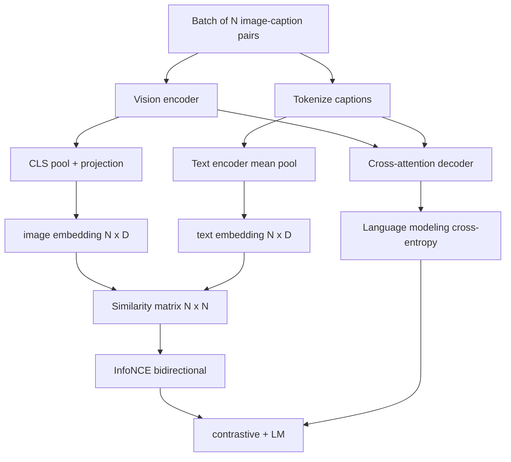

# Vision-Language Pretraining

> The encoder, projection, and decoder are all wired up. Now train them together. Two objectives drive learning: a contrastive image-text loss (InfoNCE) that pulls matching pairs closer in a joint embedding space, and a language modeling loss that asks the decoder to caption each image. Combined, they teach the network both to find the right image for a caption and to write a caption for an image.

**Type:** Build
**Languages:** Python
**Prerequisites:** Phase 19, Lessons 30-37 (Track B foundations)
**Time:** ~90 minutes

## Learning Objectives

- Implement InfoNCE contrastive loss over a batch of image-caption pairs.
- Combine the contrastive loss with an autoregressive language modeling loss.
- Synthesize a 200-pair mock image-caption corpus with no real dataset downloads.
- Run a 50-step demo training loop and observe both losses decreasing.

## The Problem

A vision-language model needs two skills. It must rank: given a caption, find the right image among many. It must also generate: given an image, write a caption. Pretraining the model on only one skill yields half a system. CLIP perfected ranking but cannot caption. GPT-4V captions but uses a separate retrieval head for ranking. Multi-objective pretraining achieves both in one pass.

InfoNCE handles the ranking half. For a batch of N pairs, the model treats N matching pairs as positives and `N^2 - N` mismatched pairs as negatives, then runs cross-entropy over the resulting `(N, N)` similarity matrix. The LM loss handles the generation half: standard next-token prediction conditioned on the image. Both losses are differentiable and can share encoder, projector, and decoder weights.

## The Concept



### InfoNCE in one paragraph

Stack N image embeddings as rows; stack N text embeddings as rows. L2-normalize both. Compute the `N x N` matrix `S = I T^T / tau` where `tau` is a learnable temperature. Diagonal entries are matching pairs; off-diagonal entries are negatives. Apply cross-entropy with target argmax along the diagonal: row `i` should peak at column `i`. Symmetrically repeat along columns. The total loss is the average of both. This is the CLIP loss in 8 lines.

### Temperature is critical

Temperature `tau` controls how peaked the softmax is. Too small (e.g., `tau = 0.01`) and gradients come only from the hardest negative, making training noisy. Too large and the softmax flattens, causing gradients to vanish. CLIP learns `tau` as a parameter; so does this demo.

### Language modeling loss

The decoder consumes image memory tokens via cross-attention and predicts the next text token at each position. The loss is standard cross-entropy with next-position targets. Padding positions are masked out of the loss.

### Combining the two losses

`total = contrastive + lm_weight * lm`, where `lm_weight` is a scalar (commonly 1.0). Both losses share gradients flowing into the encoder and projection; only the decoder receives LM-loss gradients. This is the multi-task recipe used by CoCa, BLIP, and SigLIP-style models with varying weights.

| Component | Loss surface | Scope |
|-----------|--------------|---------|
| InfoNCE | Pairwise ranking in joint space | Encoder + projection + text head |
| LM | Image-conditioned token prediction | Encoder + projection + decoder |
| Combined | Multi-task | Entire system |

### Why 50 steps suffice for the demo

The mock corpus is a synthetic 200-pair set with random images and random caption ids. After 50 steps of SGD at batch size 16, both losses decrease noticeably even though their absolute values remain higher than what a real-data model would achieve. The demo's purpose is to confirm the gradient plumbing is end-to-end correct and that adding the LM loss does not destabilize the contrastive objective.

## Build It

`code/main.py` implements:

- `MultimodalModel`, combining a small ViT encoder, MLP projector, a minimal text-side encoder (mean-pool over embedded ids), and the cross-attention decoder from Lesson 61.
- `info_nce_loss(image_emb, text_emb, temperature)`, bidirectional CLIP-style contrastive loss.
- `lm_loss(logits, target_ids, padding_id)`, masked next-token cross-entropy.
- `make_mock_corpus(seed, n_pairs)`, returning 200 deterministic (image, caption_ids) pairs.
- A training loop running 50 steps, batch size 16, Adam optimizer, with a learnable log-temperature parameter. Both losses are printed every 5 steps.

Run it:

```bash
python3 code/main.py
```

Output: contrastive loss drops from ~`ln(16) = 2.77` toward 2.4; LM loss drops from the random-uniform baseline `ln(512) ~ 6.24` toward ~4.7. Both decreasing confirms correct gradient wiring. Real models train for millions of steps; the dynamics are the same.

## Use It

This is the same loss recipe delivered by:

- **CLIP (2021).** Image-text contrastive only, plus a separate frozen-encoder caption probe.
- **CoCa (2022).** Image-text contrastive plus image-captioning LM loss in one model. This lesson builds exactly that pattern.
- **BLIP (2022) and BLIP-2.** Contrastive plus LM plus image-text matching head. Three losses combined.
- **SigLIP (2023).** Replaces InfoNCE with sigmoid pairwise loss; the contrastive role is the same, the functional form differs.
- **LLaVA family.** Two-stage training: stage 1 is alignment (cosine on a frozen LM), stage 2 adds LM loss and unfreezes the LM. Lesson 60 corresponds to stage 1; this lesson corresponds to stage 2.

## Ship It

`code/test_main.py` covers:

- InfoNCE loss is symmetric between image/text rows
- InfoNCE loss returns 0 when the similarity matrix is a perfect diagonal of large positive values
- LM loss correctly masks padding positions
- Model forward produces both losses without error
- A 5-step training loop reduces the combined loss

Run them:

```bash
python3 -m unittest code/test_main.py
```

## Exercises

1. Replace InfoNCE with SigLIP-style sigmoid pairwise loss and compare convergence on the mock corpus.

2. Add a hard-negative mining step: every other batch, select the hardest off-diagonal pair from the previous batch and append it. Train and check whether contrastive loss decreases faster.

3. Add an image-text matching binary classification head (true/false: do these match?) on top of the joint embedding as a third loss, reproducing BLIP's three-head setup.

4. Replace the mock corpus with caption-id sequences drawn from a Markov chain whose transition matrix is conditioned on image hash. The captioning loss should decrease more because there is genuinely learnable signal.

5. Train the same model with `lm_weight = 0` and again with `lm_weight = 1`. Compare contrastive loss; the LM loss should not degrade the ranking objective.

## Key Terms

| Term | Meaning |
|------|---------------|
| InfoNCE | Noise contrastive estimation: cross-entropy on a similarity matrix |
| Temperature | Scalar controlling how peaked the contrastive softmax is |
| Hard negative | An off-diagonal pair the model finds difficult to distinguish, useful for sampling |
| LM loss | Standard next-token cross-entropy on the captioning side |
| Joint embedding space | The shared space where image and text vectors live after projection |

## Further Reading

- CLIP paper — the original contrastive recipe.
- CoCa paper — contrastive plus captioning in one model.
- SigLIP paper — sigmoid pairwise loss variant and why it scales better.
