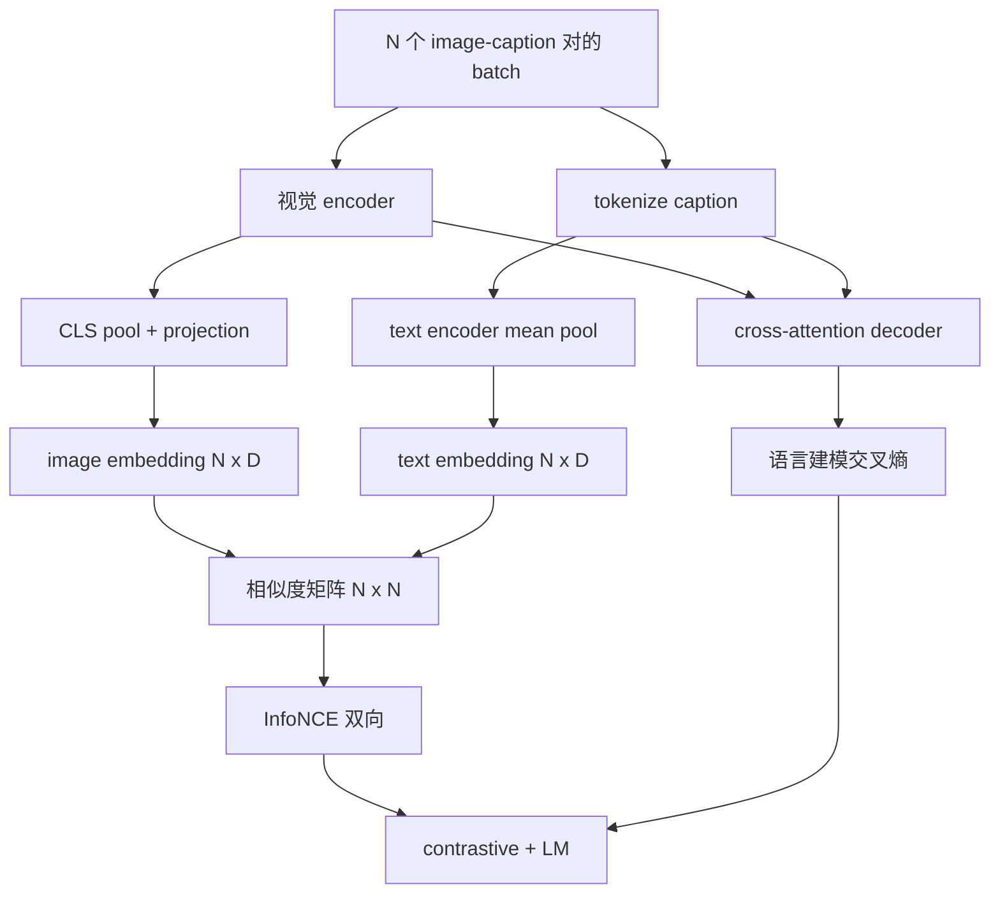

# Vision-Language 预训练

> encoder、projection、decoder 都接好了。现在把它们放在一起训练。两个目标驱动学习：一个对比式的 image-text loss（InfoNCE），把匹配的对在联合 embedding 空间里拉近；一个语言建模 loss，要求 decoder 为每张图写 caption。两者结合，既教会网络为一句 caption 找到对的图，也教会它为一张图写出 caption。

**类型：** Build
**语言：** Python
**前置要求：** 第 19 阶段第 30-37 课（Track B 基础）
**预计时间：** ~90 分钟

## 学习目标

- 在一个 batch 的 image-caption 对上实现 InfoNCE 对比 loss。
- 把对比 loss 和自回归语言建模 loss 组合起来。
- 合成一个 200 对的 mock image-caption 语料，无需下载任何真实数据集。
- 跑一个 50 步的 demo 训练循环，观察两个 loss 都在下降。

## 问题

一个视觉语言模型需要两种本领。它得会排序：给一句 caption，在众多图里找到对的那张。它还得会生成：给一张图，写一句 caption。只在一种本领上预训练模型，你得到的是半个系统。CLIP 把排序做到了极致，却不会 captioning。GPT-4V 会 captioning，但排序用的是一个单独的检索头。多目标预训练一遍拿下两者。

InfoNCE 负责排序这一半。对于一个 N 对的 batch，模型把 N 个匹配对当作正例，把 `N^2 - N` 个不匹配对当作负例，然后在得到的 `(N, N)` 相似度矩阵上跑交叉熵 loss。LM loss 负责生成那一半：以图像为条件做标准的 next-token 预测。两个 loss 都可微，并且可以共享 encoder、projector 和 decoder 的权重。

## 核心概念



### 一段话讲清 InfoNCE

把 N 个 image embedding 堆成行，把 N 个 text embedding 也堆成行。两者都做 L2 归一化。计算 `N x N` 的矩阵 `S = I T^T / tau`，其中 `tau` 是一个可学习的温度。对角线上的项是匹配对；非对角线上的项是负例。施加交叉熵，目标的 `argmax` 沿对角线走：第 `i` 行应该在第 `i` 列取得最高值。沿列对称地再做一遍。总 loss 是两者的平均。这就是 8 行写出来的 CLIP loss。

### 温度很关键

温度 `tau` 控制 softmax 有多尖。太小（例如 `tau = 0.01`），梯度就只来自最难的那个负例，训练很噪。太大，softmax 就摊平了，梯度消失。CLIP 把 `tau` 当作一个参数来学；这里的 demo 也一样。

### 语言建模 loss

decoder 通过 cross-attention 消费 image memory token，在每个位置预测下一个 text token。loss 是带 next-position 目标的标准交叉熵。padding 位置被从 loss 里 mask 掉。

### 组合两个 loss

`total = contrastive + lm_weight * lm`，其中 `lm_weight` 是一个标量（常取 1.0）。两个 loss 共享流进 encoder 和 projection 的梯度；只有 decoder 收到 LM-loss 的梯度。这就是 CoCa、BLIP、SigLIP 风格模型都在用的多任务配方，只是权重各异。

| 组件 | Loss 面 | 影响范围 |
|-----------|--------------|---------|
| InfoNCE | 联合空间里的对排序 | Encoder + projection + text head |
| LM | 以图像为条件的 token 预测 | Encoder + projection + decoder |
| Combined | 多任务 | 整个系统 |

### 为什么 demo 跑 50 步就够

mock 语料是一个合成的 200 对集合，图像是随机的，caption id 也是随机的。batch size 16 跑 50 步 SGD 之后，两个 loss 都明显下降，即便其绝对值仍高于真实数据模型能达到的水平。demo 的意义是确认梯度管路端到端打通，以及加上 LM loss 不会让对比目标失稳。

## 动手实现

`code/main.py` 实现了：

- `MultimodalModel`，组合了一个小 ViT encoder、MLP projector、一个极小的 text 侧 encoder（对 embedded id 做 mean-pool），以及第 61 课的 cross-attention decoder。
- `info_nce_loss(image_emb, text_emb, temperature)`，双向的 CLIP 风格对比 loss。
- `lm_loss(logits, target_ids, padding_id)`，带 mask 的 next-token 交叉熵。
- `make_mock_corpus(seed, n_pairs)`，返回 200 个确定性的 (image, caption_ids) 对。
- 一个训练循环，跑 50 步，batch size 16，Adam 优化器，带一个可学习的 log-temperature 参数。每 5 步打印两个 loss。

运行它：

```bash
python3 code/main.py
```

输出：对比 loss 从约 `ln(16) = 2.77` 降向 2.4；LM loss 从随机均匀的 baseline `ln(512) ≈ 6.24` 降向约 4.7。两者的下降证明梯度接对了。真实模型要训练数百万步；动态过程是一样的。

## 实战应用

这是以下模型交付的同一套 loss 配方：

- **CLIP（2021）。** 仅 image-text 对比，外加一个单独的冻结-encoder caption 探针。
- **CoCa（2022）。** image-text 对比加 image-captioning LM loss，在一个模型里。本课构建的正是这个模式。
- **BLIP（2022）和 BLIP-2。** 对比加 LM 加 image-text matching 头。三个 loss 组合。
- **SigLIP（2023）。** 把 InfoNCE 换成 sigmoid 对 loss；对比角色相同，函数形式不同。
- **LLaVA 系列。** 两阶段训练，第一阶段是对齐（在冻结 LM 上做 cosine），第二阶段加上 LM loss 并解冻 LM。第 60 课对应第一阶段；本课对应第二阶段。

## 测试

`code/test_main.py` 覆盖了：

- InfoNCE loss 在 image/text 行之间是对称的
- 当相似度矩阵是一个由大正数构成的完美对角线时，InfoNCE loss 返回 0
- LM loss 正确地 mask 掉 padding 位置
- 模型 forward 无错地产出两个 loss
- 5 步训练循环降低了组合 loss

运行它们：

```bash
python3 -m unittest code/test_main.py
```

## 练习

1. 把 InfoNCE 换成 SigLIP 风格的 sigmoid 对 loss，在 mock 语料上对比收敛情况。

2. 加一个 hard-negative mining 步骤：每隔一个 batch，从上一个 batch 选出最难的那个非对角线对并追加进来。训练并检查对比 loss 是否下降更快。

3. 在联合 embedding 之上加一个 image-text matching 的二分类头（true/false：这两个匹配吗？）作为第三个 loss，复现 BLIP 的三头设置。

4. 把 mock 语料换成由 Markov 链抽取的 caption-id 序列，链的转移矩阵以 image hash 为条件。captioning loss 应该会下降得更多，因为有了真正可学习的信号。

5. 用 `lm_weight = 0` 训练同一个模型，再用 `lm_weight = 1` 训一次。对比对比 loss；LM loss 不应该让排序目标退步。

## 关键术语

| 术语 | 含义 |
|------|---------------|
| InfoNCE | 噪声对比估计：在相似度矩阵上做交叉熵 |
| Temperature | 控制对比 softmax 有多尖的标量 |
| Hard negative | 模型觉得难分辨的非对角线对，适合用来采样 |
| LM loss | captioning 侧的标准 next-token 交叉熵 |
| Joint embedding space | 投影后 image 和 text 向量共处的共享空间 |

## 延伸阅读

- CLIP 论文，原始的对比配方。
- CoCa 论文，对比加 captioning 在一个模型里。
- SigLIP 论文，sigmoid 对 loss 变体，以及它为什么扩展性更好。
