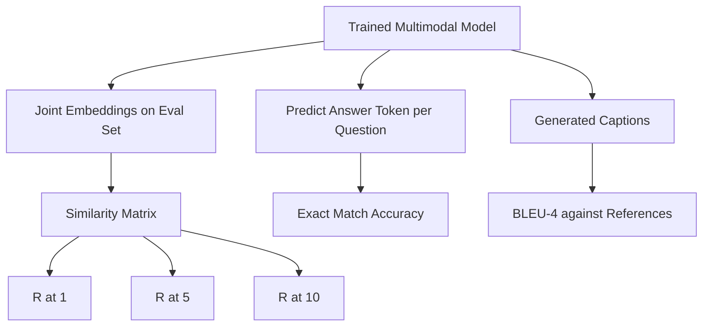

# Multimodal Evaluation

> Training is only half the loop. The other half is measurement. This lesson builds three evaluation facets from basic primitives: image-caption retrieval reported as R@1, R@5, R@10; visual question answering reported as exact-match accuracy; and image captioning reported as BLEU-4. Each metric is a function over model outputs, paired with a synthetic evaluation suite that runs in seconds.

**Type:** Build
**Languages:** Python
**Prerequisites:** Phase 19 Lessons 58-62 (Track E foundations: encoder, transformer, projection, cross-attention fusion, pretraining)
**Time:** ~90 minutes

## Learning Objectives

- Compute Recall@K from the similarity matrix between image and caption embeddings.
- Compute exact-match VQA accuracy from a model that maps (image, question) pairs to a fixed answer vocabulary.
- Compute BLEU-4 from generated and reference sequences without any external libraries.
- Run all three evaluations on a synthetic suite built on top of the model trained in Lesson 62.

## The Problem

The temptation to declare a multimodal model finished the moment training loss plateaus is strong. Training loss measures fit on the training distribution; it does not measure whether the model can rank correctly on a held-out batch, answer a question, or write a caption a human would accept. Three evaluation facets are standard practice:

- **Retrieval (R@1, R@5, R@10).** Build a joint embedding for a query caption; rank every image in the evaluation pool by cosine; report whether the matching image lands in the top 1, top 5, top 10. The symmetric (image-to-text) form runs identically.
- **Visual Question Answering (exact match).** Given (image, question), the model outputs an answer token. Exact match is one bit per sample: does the predicted answer equal the reference answer? Average over the evaluation set.
- **Captioning (BLEU-4).** Generate a caption. Compute the geometric mean of 1-gram through 4-gram precision against a reference caption, plus a brevity penalty. The standard form is multi-reference (one image, multiple reference captions).

Each metric is a lightweight function. This lesson builds all of them in code, making the math concrete and keeping the evaluation facets under your control. Real benchmark suites (MS-COCO, VQA v2, GQA, OK-VQA) all plug into the same function shapes.

## The Concept



### Computing Recall@K from the Similarity Matrix

Build the `(N, N)` cosine similarity matrix between image and caption embeddings. For each row, sort columns by descending similarity. Recall@K is the fraction of rows where the diagonal column index falls within the top K positions. Symmetric Recall@K (caption-to-image) is computed on the transposed matrix. Both numbers are reported. For an N=100 evaluation, R@1 = 0.6 means 60 out of 100 captions retrieved their correct image as the top match.

### VQA Exact Match

For each (image, question, answer), encode the image, embed the question, fuse through the decoder, and read out the next token. Compare the predicted token id to the reference id; equality counts as correct. Average over the evaluation set. Real VQA datasets carry multiple human-annotated answers per question and use a soft-accuracy formula (at least 3 out of 10 annotators agree counts as 1.0, fewer than 3 scales down); this lesson uses single-answer exact match for clarity.

### BLEU-4

```text
BLEU-4 = BP * exp(mean(log p1, log p2, log p3, log p4))
```

where `p_n` is the modified n-gram precision (clipped count of generated n-grams appearing in any reference, divided by the total number of generated n-grams), and `BP` is the brevity penalty:

```text
BP = 1                if generated length > reference length
   = exp(1 - r/g)    otherwise, where r is reference length, g is generated length
```

For small samples where some `p_n` is zero, smoothing is needed. The implementation uses Chen and Cherry's "method 1" (add 1 to both numerator and denominator for any zero count), which is the safest default for low-count cases.

### Synthetic Evaluation Suite

A 50-sample evaluation suite is built in memory following the mock corpus pattern from Lesson 62, using a held-out seed. Three lists compose the suite:

- `pairs`: 50 (image, caption_ids) pairs for retrieval.
- `vqa`: 50 (image, question_ids, answer_id) triples.
- `caps`: 50 (image, [reference_caption_ids, ...]) entries, up to 3 references per image.

The suite is deterministic by seed and held out from the training corpus, so metrics are computed on data the model has never seen. Persisting the suite as JSON is left as an exercise (see below).

| Metric | Range | Random baseline (N=50) |
|--------|-------|------------------------|
| R@1 | 0 to 1 | 0.02 (1 / N) |
| R@5 | 0 to 1 | 0.10 |
| R@10 | 0 to 1 | 0.20 |
| VQA EM | 0 to 1 | 1 / vocab |
| BLEU-4 | 0 to 1 | very small but nonzero |

For a 50-step training run on synthetic data, metrics are not expected to be high; they should be above random baseline, which is exactly what the demo checks.

## Build It

`code/main.py` implements:

- `recall_at_k(sim_matrix, k)`, returning a `[0, 1]` float for each direction.
- `vqa_exact_match(predictions, references)`, returning the mean of `int` equalities.
- `bleu4(generated, references, smoothing=True)`, supporting multiple references.
- `build_eval_suite(seed, n_samples, vocab_size, max_len)`, returning three deterministic evaluation lists.
- `evaluate(model, suite)`, running all three metrics and returning a numeric `dict`.
- A demo that loads a freshly initialized multimodal model from Lesson 62, evaluates it, trains for 50 steps, evaluates again, and prints before/after metrics.

Run it:

```bash
python3 code/main.py
```

Output: a before/after metrics table showing retrieval improving from near-random to learned signal, VQA improving above random, and BLEU-4 improving (the synthetic structure is sufficient to yield 4-gram precision gains).

## Use It

Each metric maps directly to a production benchmark:

- **Retrieval.** MS-COCO 5K val, Flickr30K, ImageNet zero-shot are all R@K problems on the same similarity matrix. Replace the synthetic evaluation with real files; the function signatures remain unchanged.
- **VQA.** VQA v2, GQA, OK-VQA use the same exact-match shape (VQA v2 replaces single-answer EM with soft-acc).
- **BLEU-4.** MS-COCO captioning, NoCaps, Flickr30K captioning all use BLEU-4 plus CIDEr and METEOR. Adding CIDEr is just one more function.

For real benchmarks, replace `build_eval_suite` with a real loader and keep the function bodies. The math is benchmark-agnostic.

## Tests

`code/test_main.py` covers:

- recall@k returns 1.0 on a perfect identity similarity matrix and 0.0 on an inverted matrix for k < N
- recall@k respects the `k <= N` upper bound
- bleu4 returns 1.0 when generated exactly matches one reference
- bleu4 returns 0.0 when vocabularies are disjoint
- vqa exact match equals the fraction of equal pairs
- build_eval_suite returns the expected number of pairs, vqa items, and caption entries

Run them:

```bash
python3 -m unittest code/test_main.py
```

## Exercises

1. Add CIDEr to the captioning metrics. CIDEr uses TF-IDF weighting on n-grams, which rewards informative tokens.

2. Implement soft-accuracy VQA: each question has multiple human answers, and accuracy is `min(human_count / 3, 1)` if any match. Reproduce VQA v2.

3. Add a NaN-safe variant of `bleu4` that handles empty generated sequences without crashing.

4. Compute mean reciprocal rank (MRR) alongside R@K. MRR is sensitive to where the correct item falls beyond the top K; R@K only cares whether it falls within top K.

5. Run evaluation at five checkpoints during training (step 0, 10, 20, 30, 40, 50) and plot learning curves. Confirm that metric trajectories are consistent with loss trajectories.

## Key Terms

| Term | Meaning |
|------|---------------|
| R@K | Fraction of queries where the correct match falls within the top K results |
| Exact match | Simplest VQA scoring: predicted answer equals reference |
| BLEU-4 | Geometric mean of 1- through 4-gram precision with brevity penalty |
| Multi-reference | A captioning metric accepting multiple reference captions per image |
| Held-out | Evaluation set sampled from a seed disjoint from the training corpus |

## Further Reading

- VQA v2 paper, soft-accuracy formula and dataset statistics.
- CIDEr paper, TF-IDF weighted n-gram captioning.
- Original BLEU paper (Papineni et al., 2002), smoothing variants.
- MS-COCO captioning evaluation scripts, canonical reference implementation.
