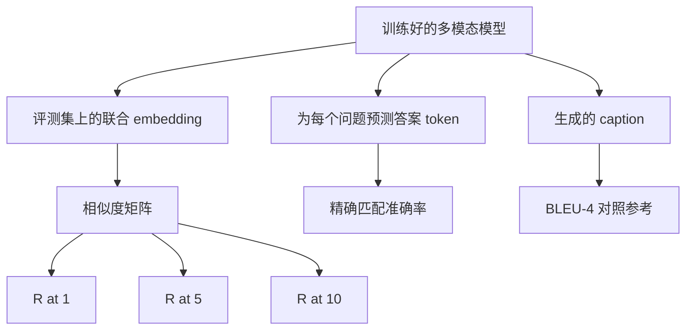

# 多模态评测

> 训练只是循环的一半。另一半是测量。这节课从基本原语构建三个评测面：以 R@1、R@5、R@10 报告的 image-caption 检索；以精确匹配准确率报告的视觉问答；以及以 BLEU-4 报告的图像 captioning。每个指标都是一个作用于模型输出的函数，配上一个几秒就能跑完的合成评测套件。

**类型：** Build
**语言：** Python
**前置要求：** 第 19 阶段第 58-62 课（Track E 基础：encoder、transformer、projection、cross-attention fusion、预训练）
**预计时间：** ~90 分钟

## 学习目标

- 从 image 和 caption embedding 之间的相似度矩阵计算 Recall@K。
- 从一个把 (image, question) 对映射到固定答案词表的模型，计算精确匹配的 VQA 准确率。
- 不借助任何外部库，从生成序列和参考序列计算 BLEU-4。
- 在第 62 课训出的模型之上构建的合成套件上，跑完这三个评测。

## 问题

训练 loss 一停滞，就想宣布多模态模型完工——这种诱惑很大。训练 loss 衡量的是在训练分布上的拟合度；它衡量不了模型能否在留出 batch 里给对排序、能否回答一个问题、能否写一句人类愿意接受的 caption。三个评测面是标准做法：

- **检索（R@1、R@5、R@10）。** 为一句 query caption 构建联合 embedding；按 cosine 给评测池里的每张图排序；报告匹配的那张图是否落进 top 1、top 5、top 10。对称的（image-to-text）形式同理运行。
- **视觉问答（精确匹配）。** 给定 (image, question)，模型输出一个答案 token。精确匹配对每个样本是一比特：预测的答案是否等于参考答案？在评测集上取平均。
- **Captioning（BLEU-4）。** 生成一句 caption。对照参考 caption 计算 1-gram 到 4-gram 精度的几何平均，加上一个简短惩罚（brevity penalty）。标准形式是多参考（一张图，多句参考 caption）。

每个指标都是一个轻量函数。本课在代码里把它们全部构建出来，让数学具体可见，评测面也始终在你的掌控之中。真实的 benchmark 套件（MS-COCO、VQA v2、GQA、OK-VQA）都插进同样的函数形状里。

## 核心概念



### 从相似度矩阵算 Recall@K

构建 image 和 caption embedding 之间的 `(N, N)` cosine 相似度矩阵。对每一行，按相似度降序给列排序。Recall@K 是「对角线列下标落在 top K 位置之内」的行的占比。对称的 Recall@K（caption-to-image）在转置矩阵上计算。两个数都报告。对一个 N=100 的评测，R@1 = 0.6 意味着 100 句 caption 里有 60 句把它们正确的图作为 top 匹配检索了出来。

### VQA 精确匹配

对每个 (image, question, answer)，编码图像、embed 问题、通过 decoder 融合、读出下一个 token。把预测的 token id 和参考 id 比较；相等则算对。在评测集上取平均。真实的 VQA 数据集每个问题带多个人工标注答案，使用 soft-accuracy 公式（10 个标注者里至少 3 个一致就算 1.0，少于 3 个则缩放）；本课为清晰起见用单答案精确匹配。

### BLEU-4

```text
BLEU-4 = BP * exp(mean(log p1, log p2, log p3, log p4))
```

其中 `p_n` 是修正后的 n-gram 精度（生成的 n-gram 中出现在任一参考里的、做了截断的计数，除以生成的 n-gram 总数），`BP` 是简短惩罚：

```text
BP = 1                如果生成长度 > 参考长度
   = exp(1 - r/g)     否则，其中 r 是参考长度，g 是生成长度
```

对于某些 `p_n` 为零的小样本，需要平滑。实现采用 Chen 和 Cherry 的「method 1」（对任何零计数，分子分母各加 1），这是低计数情形下最安全的默认做法。

### 合成评测套件

一个 50 样本的评测套件在内存里构建，沿用第 62 课的 mock 语料模式，使用一个留出的 seed。三个列表组成这个套件：

- `pairs`：50 个 (image, caption_ids) 对，用于检索。
- `vqa`：50 个 (image, question_ids, answer_id) 三元组。
- `caps`：50 个 (image, [reference_caption_ids, ...]) 条目，每张图最多 3 句参考。

套件由 seed 确定，并从训练语料中留出，所以指标是在模型从未见过的数据上计算的。把套件持久化为 JSON 留作练习（见下文）。

| 指标 | 范围 | 随机 baseline（N=50） |
|--------|-------|------------------------|
| R@1 | 0 到 1 | 0.02（1 / N） |
| R@5 | 0 到 1 | 0.10 |
| R@10 | 0 到 1 | 0.20 |
| VQA EM | 0 到 1 | 1 / vocab |
| BLEU-4 | 0 到 1 | 很小但非零 |

对于合成数据上 50 步的训练运行，指标不指望很高；它们应该高于随机 baseline，这正是 demo 检查的东西。

## 动手实现

`code/main.py` 实现了：

- `recall_at_k(sim_matrix, k)`，为两个方向各返回一个 `[0, 1]` 的浮点数。
- `vqa_exact_match(predictions, references)`，返回 `int` 相等性的均值。
- `bleu4(generated, references, smoothing=True)`，支持多参考。
- `build_eval_suite(seed, n_samples, vocab_size, max_len)`，返回三个确定性的评测列表。
- `evaluate(model, suite)`，跑完这三个指标并返回一个数字 `dict`。
- 一个 demo，加载一个第 62 课新初始化的多模态模型，评测它，然后训练 50 步再评测一次，打印前后的指标。

运行它：

```bash
python3 code/main.py
```

输出：前后对比的指标表显示检索从接近随机改善到模型学到的信号，VQA 改善到随机之上，BLEU-4 也改善（合成结构足以带来 4-gram 精度的提升）。

## 实战应用

每个指标都直接对应到一个生产 benchmark：

- **检索。** MS-COCO 5K val、Flickr30K、ImageNet zero-shot 都是同一个相似度矩阵上的 R@K 问题。把合成评测换成真实文件，函数签名不变。
- **VQA。** VQA v2、GQA、OK-VQA 用的是同样的精确匹配形状（VQA v2 用 soft-acc 替代单答案 EM）。
- **BLEU-4。** MS-COCO captioning、NoCaps、Flickr30K captioning 都用 BLEU-4 外加 CIDEr 和 METEOR。加上 CIDEr 只是多一个函数。

对于真实 benchmark，把 `build_eval_suite` 换成一个真实 loader，保留函数体。这些数学与 benchmark 无关。

## 测试

`code/test_main.py` 覆盖了：

- recall@k 在完美单位相似度矩阵上返回 1.0，在翻转的矩阵上对 k < N 返回 0.0
- recall@k 遵守 `k <= N` 的上界
- bleu4 在生成恰好等于某句参考时返回 1.0
- bleu4 在词表不相交时返回 0.0
- vqa 精确匹配等于相等对的占比
- build_eval_suite 返回预期数量的 pair、vqa 项和 caption 条目

运行它们：

```bash
python3 -m unittest code/test_main.py
```

## 练习

1. 给 captioning 指标加上 CIDEr。CIDEr 对 n-gram 用 TF-IDF 加权，这会奖励信息量大的 token。

2. 实现 soft-accuracy VQA：每个问题有多个人工答案，若有任一匹配则准确率为 `min(human_count / 3, 1)`。复现 VQA v2。

3. 给 `bleu4` 加一个 NaN-safe 变体，能处理空的生成序列而不崩溃。

4. 在 R@K 之外计算 mean reciprocal rank（MRR）。MRR 对正确项落在 top K 之外的位置敏感；R@K 只对它是否落进 top K 敏感。

5. 在训练期间的五个 checkpoint（step 0、10、20、30、40、50）上跑评测，画出学习曲线。确认指标轨迹和 loss 轨迹一致。

## 关键术语

| 术语 | 含义 |
|------|---------------|
| R@K | 正确匹配落在 top K 结果之内的 query 占比 |
| Exact match | 最简单的 VQA 评分：预测答案等于参考 |
| BLEU-4 | 1- 到 4-gram 精度的几何平均，带简短惩罚 |
| Multi-reference | 一个 captioning 指标接受每张图多句参考 caption |
| Held-out | 评测集从一个与训练语料不相交的 seed 采样 |

## 延伸阅读

- VQA v2 论文，soft-accuracy 公式和数据集统计。
- CIDEr 论文，TF-IDF 加权的 n-gram captioning。
- BLEU 原始论文（Papineni 等，2002），平滑变体。
- MS-COCO captioning 评测脚本，规范的参考实现。
