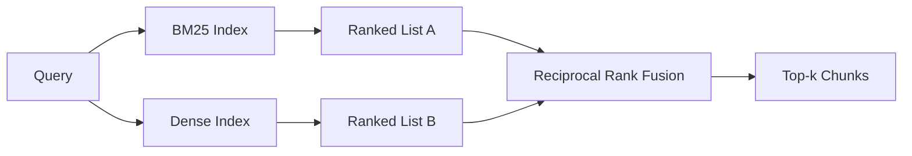

# Hybrid Retrieval with BM25 and Dense Embeddings

> Lexical retrieval and semantic retrieval each fail on opposite query distributions. Hybrid retrieval with reciprocal rank fusion is not interpolating—it is voting—and that vote wins on every class of query.

**Type:** Build
**Languages:** Python
**Prerequisites:** Phase 11 Lesson 04 (embedding), Lesson 06 (RAG); Phase 19 Track B foundations (Lessons 20-29); Phase 19 Lesson 64 (chunking strategies)
**Time:** ~90 minutes

## Learning Objectives
- Implement BM25 from scratch starting from the Robertson and Sparck Jones formula, with field weighting, document-length normalization, and tunable k1 and b.
- Build a dense retriever on top of a deterministic mock embedding so the entire loop runs offline.
- Implement reciprocal rank fusion strictly following the form published by Cormack, Clarke, and Buettcher in 2009, and explain why it dominates score-weighted interpolation.
- Tune the RRF k constant and per-modality weights, reading the tradeoffs on a small fixture corpus.

## The Problem

When a query carries a literal identifier that exists verbatim in the corpus, lexical search wins. A search for `AbortMultipartOnFail` returns the correct Go function from BM25 in microseconds. The same query, once embedded, lands at the intersection of three similarity clusters, and the dense retriever ranks the wrong file first.

When a query is rephrased away from the corpus's literal tokens, dense search wins. A user asks "how do we handle cancelled uploads" without ever typing abort or multipart. BM25 returns the document chunk about "uploading large files" because that page contains the word uploads. Dense retrieval finds the abort function whose summary mentions cancellation.

Choosing one or the other is not a static decision. The variable is query distribution. A production RAG system serves both classes from the same endpoint, so retrieval must catch both in a single pass. That is hybrid retrieval. And the merge step is the part that must be done correctly.

## The Concept



### BM25 in One Paragraph

BM25 scores a query-document pair by summing over the query's terms, where each term contributes an inverse document frequency factor multiplied by a saturating term-frequency factor that includes a document-length normalization correction. Two knobs. `k1` controls how quickly term-frequency saturates; the paper-recommended default of 1.5 should not be changed without benchmark evidence. `b` controls how much document length matters; the default of 0.75 means long documents are penalized, but not linearly.

The IDF formula uses the smoothed Robertson and Sparck Jones definition: `log((N - df + 0.5) / (df + 0.5) + 1)`. The plus-one inside the log keeps IDF positive when a term appears in more than half the corpus. This matters in small corpora where stopwords are technically rare.

Field weighting lets you tell BM25 that a hit in a symbol name is worth more than a hit in body text. It is implemented by multiplying term counts at index time, not at scoring time. This keeps the math unchanged and avoids computing a separate score per field.

### Dense Retrieval in One Paragraph

Encode each chunk into a fixed-dimension vector using an embedding model. At query time, embed the query, rank every chunk by cosine similarity, and return top-k. The variable that determines quality is the model. The retrieval algorithm itself is two lines: dot product plus sort.

This lesson uses a deterministic hash-based embedding so you can read the fusion math without network calls. The hash accumulates token-keyed offsets into a 96-dimensional vector and normalizes. Cosine ranking is deterministic across runs, which is what the test suite requires.

### Reciprocal Rank Fusion, the Paper Formula

Two ranked lists. For every candidate appearing in either list, sum its reciprocal-rank contributions. The 2009 paper uses `1 / (k + rank)` with k defaulting to 60. Sort by total score. That is the entire algorithm.

The paper's constant k = 60 is not arbitrary. When k = 60, the rank-1 contribution is 1 / 61 and the rank-10 contribution is 1 / 70. Contributions decay slowly, so candidates ranked lower still cast votes. Smaller k lets top results dominate; larger k flattens the contribution curve.

Our implementation has two tunable knobs. One is the `k` constant. The other is a pair of per-modality weights so you can boost BM25 or dense when you have prior evidence that one performs better on your corpus. Multiplying rank contributions by a weight is the simplest principled implementation; it preserves the rank-decay shape and remains dimensionless.

### Why Fusion Beats Score-Weighted Interpolation

BM25 scores are unbounded and corpus-dependent. Cosine similarity is bounded between -1 and 1. A linear combination `alpha * bm25 + (1 - alpha) * cosine` requires per-corpus tuning of alpha and breaks every time the index is rebuilt. Rank-based fusion does not. Both ranks are comparable across modalities. Since 2010, the paper's RRF baseline has beaten score interpolation on every published TREC track.

This is the same argument you hear in Vespa and Weaviate documentation about RankFusion vs RRF. They reach the same conclusion: unless you have very strong evidence to interpolate scores, stay on the rank side.

## Build It

`code/main.py` implements:

- `tokenize(text)` — a fast regex tokenizer.
- `BM25Index` — with field weighting, containing `add` and `search`, tunable k1 and b.
- `mock_embed`, `DenseIndex` — same deterministic embedding as Lesson 64 so chunks are comparable.
- `rrf(rankings, k, weights)` — the paper's fusion with multi-modality weights.
- `HybridRetriever` — combines BM25 and dense.
- A demo `main()` that loads a small fixture corpus, runs three queries targeting each retriever's strengths and weaknesses, and prints each modality's ranked output alongside the fused list.

Run:

```bash
python3 code/main.py
```

Read the demo output side by side. The literal-identifier query lands at BM25 rank 1, dense rank 4, RRF rank 1. The rephrased query lands at BM25 rank 6, dense rank 1, RRF rank 1. The ambiguous query lands at BM25 rank 3, dense rank 3, RRF rank 1. Fusion is not a tiebreaker; it is the system that wins on every class of query.

## Tuning Knobs

| Knob | Default | When to increase | When to decrease |
|------|---------|----------------|------------------|
| BM25 k1 | 1.5 | Terms repeat in documents and you want frequency to matter more | Documents are short and term repetition is noise |
| BM25 b | 0.75 | Longer documents genuinely carry less information per token | Document length is unrelated to topic |
| RRF k | 60 | Lower-ranked candidates should continue voting | Top-1 should dominate |
| BM25 weight | 1.0 | Your corpus contains literal identifiers and queries hit them exactly | Your queries are user-rephrased |
| Dense weight | 1.0 | Queries are rephrased | Queries are literal |

Tuning is done by re-running Lesson 68's evaluation framework on your held-out query set, not by intuition.

## Failure Modes the Demo Hides

**Out-of-vocabulary tokens.** BM25's IDF is computed from the corpus, so terms appearing only in the query contribute zero. Dense embeddings fabricate a vector for the same token. On identifiers outside the corpus, the dense modality returns plausible but incorrect neighbors. Fusion absorbs this because BM25 returns nothing and its rank contribution drops out—but only if you deduplicate by document, not by chunk.

**Stop-token dominance.** BM25 produces a uniform ranking across the entire corpus for the term "the." Either filter stop tokens in the indexer or accept that high-IDF terms naturally dominate.

**Identical content across modalities.** If your corpus is small enough that BM25's top-1 also happens to be dense's top-1, RRF gives you the same top-1 and the same neighbors. This is correct behavior, not a failure, but it makes fusion appear invisible. Add a pair of adversarial queries to your evaluation to verify fusion is actually contributing.

## Use It

Production practices:

- BM25 indexes in-process; the bottleneck is the term-frequency dictionary, not vectors.
- Dense vectors live in separate storage (this lesson uses a flat list; in production you would use HNSW).
- Both retrieval paths run in parallel; fusion is a constant-time merge over the union.
- Persist the modality of each retrieval hit so downstream rerankers can see which modality voted for it.

## Ship It

Lesson 66 takes this lesson's fused top-k and re-ranks with a cross-encoder. Lesson 68 evaluates the full pipeline with precision, recall, MRR, and nDCG. This lesson's hybrid retriever is the first stage of the end-to-end system in Lesson 69.

## Exercises

1. Replace `mock_embed` with your provider's real model. Re-run the demo and report how the pure-dense ranking changes on the rephrased query.
2. Add a third modality: index chunk summaries separately as a third ranked list for fusion. Measure the gain.
3. Sweep RRF k across 10, 30, 60, 100, 200. Plot Lesson 68's recall@k curve. Report the k value where the curve peaks on your corpus.
4. Implement proper BM25F (per-field length normalization instead of the multiplier trick) and compare on a corpus where symbol hits matter most.

## Key Terms

| Term | What people say | What it actually means |
|------|-----------------|------------------------|
| BM25 | "Lexical search" | Probabilistic ranking: idf x saturating tf x length normalization |
| RRF | "Rank fusion" | Sum of 1 / (k + rank) across ranked lists; k defaults to 60 |
| k1 | "TF saturation" | Controls how quickly a repeated term stops contributing additional score |
| b | "Length penalty" | 0 means ignore document length, 1 means fully normalize |
| Field weighting | "Symbol boosting" | Repeat tokens at index time to boost hits on that field |
| Rank-based vs score-based fusion | "Why RRF beats linear" | Ranks are comparable across modalities; scores are not |

## Further Reading

- Cormack, Clarke, Buettcher, "Reciprocal Rank Fusion outperforms Condorcet and individual rank learning methods", SIGIR 2009
- Robertson, Walker, Beaulieu, Gatford, Payne, "Okapi at TREC-3" (the original BM25 paper)
- [Vespa: Hybrid Retrieval with BM25 and Embeddings](https://docs.vespa.ai/en/tutorials/hybrid-search.html)
- [Weaviate: Hybrid Search](https://weaviate.io/developers/weaviate/search/hybrid)
- Phase 11 Lesson 06 — RAG foundations
- Phase 19 Lesson 64 — the chunker whose output is indexed here
- Phase 19 Lesson 66 — the cross-encoder reranker that consumes the fused top-k
