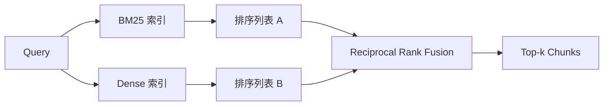

# 用 BM25 与 Dense Embedding 做 Hybrid Retrieval

> Lexical 检索和 semantic 检索分别在两类相反的 query 分布上翻车。用 reciprocal rank fusion 的 hybrid retrieval 不是在做插值，它是在投票——而这一票，能在每一类 query 上都赢。

**类型：** Build
**语言：** Python
**前置要求：** 阶段 11 第 04 课（embedding）、第 06 课（RAG）；阶段 19 Track B 基础（第 20-29 课）；阶段 19 第 64 课（chunking 策略）
**预计时间：** ~90 分钟

## 学习目标
- 从 Robertson 和 Sparck Jones 的公式出发，从零实现 BM25，带字段加权、文档长度归一化，以及可调的 k1 和 b。
- 在一个确定性 mock embedding 之上构建一个 dense retriever，让整个循环离线就能跑。
- 严格按照 Cormack、Clarke、Buettcher 于 2009 年发表的形式实现 reciprocal rank fusion，并解释为什么它碾压基于分数加权的插值。
- 调 RRF 的 k 常数和各 modality 的权重，在一个小 fixture corpus 上读出其中的权衡。

## 问题所在

当 query 携带着一个 corpus 里逐字存在的字面标识符时，lexical 搜索赢。对 `AbortMultipartOnFail` 的一次查询，BM25 在微秒级就返回了那个正确的 Go 函数。同一个 query 被 embed 之后，却落在三个相似度 cluster 的交界处，于是 dense retriever 把错误的文件排到了第一。

当 query 被改写、偏离了 corpus 的字面 token 时，dense 搜索赢。一个用户问"我们怎么处理被取消的上传"，他压根没敲过 abort 或 multipart 这两个词。BM25 返回了那篇讲"上传大文件"的文档 chunk，因为那一页里有 uploads 这个词。Dense retrieval 找到的，是那个 summary 里提到了 cancellation 的 abort 函数。

二选一不是一个静态决策。变量是 query 分布。一个生产级 RAG 系统从同一个 endpoint 同时处理这两类，所以检索必须一次性把两类都接住。这就是 hybrid retrieval。而那个 merge 步骤，正是必须做对的那部分。

## 核心概念



### 一段话讲清 BM25

BM25 给一对 query-document 打分的方式是：在 query 的各个词项上求和，每一项都是一个 inverse document frequency 因子乘以一个会饱和的 term-frequency 因子，后者里还含一个长度归一化的修正。两个旋钮。`k1` 控制 term-frequency 的饱和速度；默认的 1.5 是论文推荐值，没有 benchmark 就别去动它。`b` 控制文档长度有多重要；默认的 0.75 表示长文档会被惩罚，但不是线性的。

IDF 公式用的是平滑后的 Robertson 和 Sparck Jones 定义，即 `log((N - df + 0.5) / (df + 0.5) + 1)`。log 里头那个加一，能在某个词出现在超过半数 corpus 时把 IDF 保持为正。在 stopword 技术上罕见的小 corpus 里，这一点很重要。

字段加权让你能告诉 BM25：命中符号名比命中正文更值钱。它的实现是在建索引时给词项计数乘上一个倍数，而不是在打分时。这让数学保持不变，也避免了为每个字段单独算一份分数。

### 一段话讲清 dense retrieval

用一个 embedding 模型把每个 chunk 编码成固定维度的向量。query 时刻，把 query embed 出来，按余弦相似度给每个 chunk 排序，返回 top-k。决定质量的变量是模型。检索算法本身就两行：点积加排序。

本课用一个确定性的、基于 hash 的 embedding，让你不用网络调用就能读懂 fusion 的数学。这个 hash 把 token 为键的偏移量累加进一个 96 维向量并归一化。余弦排序在多次运行间是确定的，这正是测试套件所要求的。

### Reciprocal rank fusion，论文里的公式

两个排序列表。对于出现在任一列表里的每个候选，把它的 reciprocal-rank 贡献加起来。2009 年的论文用的是 `1 / (k + rank)`，k 默认取 60。按总分排序。这就是整个算法。

论文里的常数 k = 60 不是随便定的。当 k = 60 时，rank-1 的贡献是 1 / 61，rank-10 的贡献是 1 / 70。贡献衰减得很慢，所以靠后的候选仍然能投上票。k 更小，会让头部结果一家独大；k 更大，则把贡献曲线压平。

我们的实现里有两个可调旋钮。一个是 `k` 常数。另一个是一对各 modality 的权重，这样当你有先验证据表明某一种在你 corpus 上更好时，可以把 BM25 或 dense 抬上去。把 rank 贡献乘以权重，是最简单且有原则的实现；它保住了 rank 衰减的形状，也保持了无量纲。

### 为什么 fusion 打得过基于分数加权的插值

BM25 分数无上界，且依赖 corpus。余弦相似度被限定在 -1 到 1 之间。一个线性组合 `alpha * bm25 + (1 - alpha) * cosine` 要求按 corpus 调 alpha，而且每次重建索引都会崩。基于 rank 的 fusion 不会。两个 rank 在跨 modality 时是可比的。自 2010 年起，论文里的 RRF baseline 在每一届公开的 TREC track 上都打赢了分数插值。

这跟你在 Vespa 和 Weaviate 文档里听到的关于 RankFusion vs RRF 的说法是同一套论证。它们得出了同一个结论：除非你有非常强的证据要去插值分数，否则就老老实实留在 rank 这一边。

## 动手构建

`code/main.py` 实现了：

- `tokenize(text)` —— 一个快速的正则 tokenizer。
- `BM25Index` —— 带字段加权，含 `add` 和 `search`，k1、b 可调。
- `mock_embed`、`DenseIndex` —— 跟第 64 课同款的确定性 embedding，这样 chunk 之间可比。
- `rrf(rankings, k, weights)` —— 论文里那套 fusion，带多 modality 权重。
- `HybridRetriever` —— 把 BM25 和 dense 合到一起。
- 一个演示用的 `main()`，加载一个小 fixture corpus，跑三个分别针对每个 retriever 强项和弱项的 query，打印每个 modality 产出的排序以及融合后的列表。

运行：

```bash
python3 code/main.py
```

把演示输出并排着读。字面标识符那个 query 落在 BM25 rank 1、dense rank 4、RRF rank 1。改写过的 query 落在 BM25 rank 6、dense rank 1、RRF rank 1。歧义那个 query 落在 BM25 rank 3、dense rank 3、RRF rank 1。fusion 不是一个用来打破平局的东西；它是那个在每一类 query 上都赢的系统。

## 调旋钮

| 旋钮 | 默认值 | 什么时候往上调 | 什么时候往下调 |
|------|---------|----------------|------------------|
| BM25 k1 | 1.5 | 词项在文档里重复出现，而你想让频率更重要 | 文档很短，词项重复是噪声 |
| BM25 b | 0.75 | 长文档确实每个词承载的信息更少 | 文档长度跟主题不相关 |
| RRF k | 60 | 靠后的候选应该继续投票 | top-1 应该一家独大 |
| BM25 weight | 1.0 | 你的 corpus 含字面标识符，且 query 能精确命中 | 你的 query 是用户改写过的 |
| Dense weight | 1.0 | query 是改写过的 | query 是字面的 |

调参靠的是在你留出的 query 集上重跑第 68 课的评测框架，不是靠直觉。

## 演示会藏起来的失败模式

**Out-of-vocabulary token。** BM25 的 IDF 是从 corpus 算出来的，所以只在 query 里出现的词项贡献为零。Dense embedding 却会为同一个词凭空捏一个向量出来。在 corpus 之外的标识符上，dense modality 会返回看似合理实则错误的近邻。fusion 能吸收掉这个，因为 BM25 啥也不返回、rank 贡献直接掉出去——但前提是你按 document 去重，而不是按 chunk。

**Stop-token 一家独大。** BM25 对 "the" 这个词会在整个 corpus 上产出一个均匀的排序。要么在索引器里过滤 stop token，要么接受高 IDF 词项自然占主导这个事实。

**跨 modality 的内容完全相同。** 如果你的 corpus 小到 BM25 的 top-1 也正好是 dense 的 top-1，那 RRF 给你的就是同一个 top-1、同一批近邻。这是正确行为，不是失败，但它会让 fusion 看起来像隐形了一样。在你的评测里加一对对抗性的 query，来验证 fusion 真的在起作用。

## 投入使用

生产实践：

- BM25 在进程内建索引；瓶颈是 term-frequency 词典，不是向量。
- dense 向量放在单独的存储里（本课用一个扁平列表；生产里你会用 HNSW）。
- 两路查询并行跑；fusion 是在并集上的一次常数时间 merge。
- 把每个检索命中的 modality 持久化下来，好让下游 reranker 看到是哪个 modality 给它投了票。

## 交付上线

第 66 课接过本课融合后的 top-k，用一个 cross-encoder 重排。第 68 课用 precision、recall、MRR 和 nDCG 评测整条 pipeline。本课的 hybrid retriever 是第 69 课端到端系统的第一级。

## 练习

1. 把 `mock_embed` 换成你 provider 的真实模型。重跑演示，报告改写过的 query 上、纯 dense 排序发生了怎样的变化。
2. 加上第三个 modality：把 chunk 的 summary 单独建索引，作为第三个排序列表参与融合。测量增益。
3. 把 RRF k 在 10、30、60、100、200 上扫一遍。画出第 68 课的 recall@k 曲线。报告曲线在你 corpus 上达到峰值时的 k 值。
4. 把 BM25F 正经地实现出来（按字段做长度归一化，而不是那个倍数小技巧），在一个符号命中最重要的 corpus 上对比。

## 关键术语

| 术语 | 大家嘴上怎么说 | 它实际指什么 |
|------|-----------------|------------------------|
| BM25 | "lexical 搜索" | 概率排序：idf x 饱和 tf x 长度归一化 |
| RRF | "rank fusion" | 在各排序列表上求 1 / (k + rank) 之和；k 默认 60 |
| k1 | "TF 饱和" | 控制一个重复词项多快就停止再加分 |
| b | "长度惩罚" | 0 表示忽略文档长度，1 表示完全归一化 |
| Field weighting | "符号加权" | 建索引时重复 token，以抬高对该字段的命中 |
| 基于 rank vs 基于 score 的 fusion | "为什么 RRF 打得过线性" | rank 跨 modality 可比；score 不可比 |

## 延伸阅读

- Cormack, Clarke, Buettcher, "Reciprocal Rank Fusion outperforms Condorcet and individual rank learning methods", SIGIR 2009
- Robertson, Walker, Beaulieu, Gatford, Payne, "Okapi at TREC-3"（最初的 BM25 论文）
- [Vespa: Hybrid Retrieval with BM25 and Embeddings](https://docs.vespa.ai/en/tutorials/hybrid-search.html)
- [Weaviate: Hybrid Search](https://weaviate.io/developers/weaviate/search/hybrid)
- 阶段 11 第 06 课 —— RAG 基础
- 阶段 19 第 64 课 —— 其产出在这里被建索引的 chunker
- 阶段 19 第 66 课 —— 消费融合后 top-k 的 cross-encoder reranker
