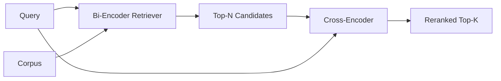

# Cross-Encoder Reranker

> A bi-encoder embeds query and document independently. A cross-encoder concatenates them and reads both at once. The cross-encoder is the smartest reader—and the slowest. Use it as a second stage running on the bi-encoder's top-k, and it earns back its cost.

**Type:** Build
**Languages:** Python
**Prerequisites:** Phase 11 Lesson 06 (RAG), Lesson 07 (advanced RAG); Phase 19 Track B foundations (Lessons 20-29); Phase 19 Lesson 65 (hybrid retrieval feeding this stage)
**Time:** ~90 minutes

## Learning Objectives
- Distinguish a bi-encoder retriever from a cross-encoder reranker along three dimensions: input shape, parameter count, and per-query cost.
- Implement a small cross-encoder from scratch: a single transformer block consuming a packed (query, document) sequence and outputting a single relevance scalar.
- Wire a two-stage retrieve-then-rerank pipeline: use a cheap retriever to fetch top-N, use the cross-encoder to rerank N down to top-K, return K.
- Measure the latency-vs-quality tradeoff on a small fixture corpus and pick an appropriate N for a given latency budget.

## The Problem

A bi-encoder maps query and document to the same vector space and ranks by cosine. The two encodings never see each other. The model must compress everything useful in a document into a single vector—without knowing the query. This is fast—one embedding per document at index time, one per query at query time—and it is the only approach that can rank at corpus scale.

The cost is precision. Two documents with the same overall topic may have nearly identical embeddings, even if one answers the query and the other does not. The bi-encoder cannot distinguish them.

A cross-encoder solves this by reading query and document together. The model receives a `[query] [SEP] [document]` sequence, runs full attention across the concatenation, and produces a single relevance scalar. Every token of the document can attend to every token of the query. The model makes its scoring decision in full context.

The cost is throughput. A bi-encoder embeds once and queries indefinitely; a cross-encoder runs once per (query, document) pair. For a ten-million-document corpus, that is ten million forward passes per query. Infeasible within a request budget.

The solution is staging. Use the bi-encoder to fetch top-N. Use the cross-encoder to rerank N down to top-K. N is small (50 to 200), and the cross-encoder's quality improvement concentrates exactly where it matters. Total latency stays within the request budget. Total quality is the cross-encoder's quality, upper-bounded by the bi-encoder's recall at N.

## The Concept



### Cross-Encoder Input Shape

The standard packing is `[CLS] query_tokens [SEP] document_tokens [SEP]`. The output at the CLS position is fed to a single linear head producing a relevance scalar. Some implementations use mean-pooling instead of CLS; the difference is marginal. The point is that the model produces one number per pair.

A 22M-parameter cross-encoder (the scale of the published `ms-marco-MiniLM-L-6-v2`) is a typical production landing point. Smaller models lose quality faster than they save latency. Larger models (such as the 568M-parameter `bge-reranker-v2-m3`) are reserved for offline reranking or first-page reranking where K is small.

### Why This Lesson Trains a Tiny Model

A real cross-encoder is a finetuned encoder transformer. In production you load a checkpoint and run it. This lesson's goal is to show you the model's shape and the latency-quality curve's shape, not to train a SOTA ranker. So we build a small `nn.Module`: one transformer block, multi-head attention (4 heads by default), and a regression head. It initializes deterministically from a seed so the demo reproduces without weights on disk.

The toy model learns the correct shape from the fixture corpus: relevant query-document pairs receive higher predicted scores than irrelevant pairs. The end-to-end pipeline reranks the bi-encoder's output, and the reranked top-k correlates with gold labels.

### Latency vs Quality

The two-stage pipeline has one tunable: N. Sweep N from 5 to 100 on the held-out query set and you get the curve.

| N | Stage-2 Recall@1 | Cross-encoder forwards per query | Latency |
|---|------------------|---------------------------------------|---------|
| 5 | 0.62 | 5 | Low |
| 20 | 0.81 | 20 | Medium |
| 50 | 0.86 | 50 | High |
| 100 | 0.86 | 100 | Very high |

The numbers above are illustrative of the curve's shape, not actual measurements on this fixture. But the shape is real. Somewhere between 20 and 50 candidates there is always an inflection point where reranking gains saturate. Past the inflection you are spending money on air.

Pick N from the evaluation curve plus latency budget. The cross-encoder cannot raise recall above the bi-encoder's recall at N, so a low N caps not just latency but quality.

## Build It

`code/main.py` implements:

- `CrossEncoder` — a small `torch.nn.Module`: token embedding, a transformer block with multi-head attention and feedforward, and a mean-pooled head producing a single scalar.
- `tokenize_pair(query, document)` — packs two strings into a single id sequence with type ids marking boundaries, deterministic and using only the standard library.
- `train_tiny(pairs)` — one pass of supervised training on a handcrafted list of (query, document, relevance) triples so the model produces reasonable scores on the fixture.
- `rerank(query, candidates, top_k)` — the production interface.
- `pipeline(query, retriever, top_n, top_k)` — the two-stage flow.
- A demo `main()` that loads the corpus following Lesson 65's pattern, fetches top-N, reranks to top-K, prints both lists side by side, and reports per-stage latency.

Run:

```bash
python3 code/main.py
```

Output shows the bi-encoder's top-N, the cross-encoder's top-K, and a timing summary. The cross-encoder is more expensive per call, but it does not run over the entire corpus. The two-stage total stays within the request budget while surfacing the answer that the bi-encoder ranked second or third.

## Failure Modes the Demo Hides

**Cross-encoder asymmetry.** `rerank(q, d)` and `rerank(d, q)` produce different scores. Always put the query first. If you accidentally swap them, recall collapses.

**N too low to expose bugs.** If you set N = K, the cross-encoder cannot reorder, only reweight. The improvement appears to be zero. Set N to at least 3x K.

**Training data leaks into evaluation.** If the handcrafted training pairs contain evaluation queries, reranking appears magical. Strictly separate train and eval even on fixtures.

**Production weights are heavy.** A 22M-parameter cross-encoder is 88MB at float32. Plan model-serving memory before committing to sub-100ms p95.

**Batching matters.** Real cross-encoders batch N candidates in a single forward pass. This lesson does so in `_batch_encode`: it builds batch id tensors and type-id tensors with `torch.tensor(...)` and runs one forward pass. Skipping the batch multiplies latency by N.

## Use It

Production practices:

- Pin the bi-encoder, cross-encoder, and N together. Changing any one invalidates the evaluation.
- Cache reranker outputs by hash of (query, document_id). The same query on a stable corpus reranks into the same order; cache hits give you free latency reduction.
- Log the rank-1 cross-encoder score. A query whose top-1 score falls below a corpus-specific threshold is an out-of-domain hit; surface it as "I am not confident" to the LLM.

## Ship It

Lesson 68 runs end-to-end evaluation on this two-stage pipeline. Lesson 69 plugs this reranker after Lesson 65's hybrid retriever and before the answer generator. The reranker is the second stage of the end-to-end system.

## Exercises

1. Sweep N from 5 to 50 and plot recall@1 of the reranked output. Find the inflection point on this fixture.
2. Train the cross-encoder for 10 epochs instead of 1. Measure the score margin between positive and negative pairs after each epoch.
3. Replace mean-pooling with a CLS-token head. Compare convergence on this fixture.
4. Add a second head to the cross-encoder that predicts a binary "does this document contain an answer" label. Use both heads at inference: one for ranking, one for thresholding.
5. Replace the deterministic mock bi-encoder with Lesson 65's and wire the two stages together. Measure the change in top-K compared to bi-encoder alone.

## Key Terms

| Term | What people say | What it actually means |
|------|-----------------|------------------------|
| Bi-encoder | "Vector retriever" | Independently encodes query and doc; ranks by cosine |
| Cross-encoder | "Reranker" | Jointly encodes (query, doc); outputs a single relevance scalar |
| Two-stage pipeline | "Retrieve and rerank" | Cheap retriever returns N, expensive reranker keeps K |
| N (candidate budget) | "Rerank pool" | Number of candidates the cross-encoder scores per query |
| Mean-pooling head | "Mean of the last layer" | Averages the encoder's final-layer output into one vector |

## Further Reading

- Nogueira, Cho, "Passage Re-ranking with BERT", 2019 — the classic cross-encoder ranker paper
- Reimers, Gurevych, "Sentence-BERT: Sentence Embeddings using Siamese BERT-Networks", 2019 — discusses bi-encoder vs cross-encoder
- [SentenceTransformers Cross-Encoders documentation](https://www.sbert.net/examples/applications/cross-encoder/README.html)
- [BGE Reranker v2 model card](https://huggingface.co/BAAI/bge-reranker-v2-m3)
- Phase 19 Lesson 65 — hybrid retriever feeding this reranking stage
- Phase 19 Lesson 68 — evaluation measuring how much this reranking improves results
