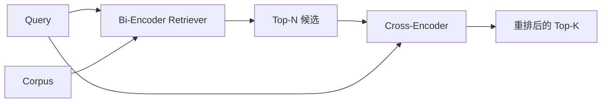

# Cross-Encoder Reranker

> Bi-encoder 把 query 和 document 各自独立 embed。Cross-encoder 把它们拼起来、一次性同时阅读。Cross-encoder 是最聪明的读者，也是最慢的那个。把它当作第二级、跑在 bi-encoder 的 top-k 上，它就能把自己的开销赚回来。

**类型：** Build
**语言：** Python
**前置要求：** 阶段 11 第 06 课（RAG）、第 07 课（advanced RAG）；阶段 19 Track B 基础（第 20-29 课）；阶段 19 第 65 课（喂给这一级的 hybrid retrieval）
**预计时间：** ~90 分钟

## 学习目标
- 从输入形状、参数量、每 query 成本三个维度，区分 bi-encoder retriever 和 cross-encoder reranker。
- 从零实现一个小型 cross-encoder：一个 transformer block，消费一个打包好的 (query, document) 序列，吐出单个 relevance 标量。
- 接出一条两级的 retrieve-then-rerank pipeline：用一个廉价 retriever 取 top-N，用 cross-encoder 把 N 重排到 top-K，返回 K。
- 在一个小 fixture corpus 上测量 latency-vs-quality 的权衡，并为给定的 latency 预算挑出合适的 N。

## 问题背景

Bi-encoder 把 query 和 document 映射到同一个向量空间，按余弦排序。两个编码彼此从不照面。模型必须把一篇 document 里所有有用的东西压进单个向量，而且是在对 query 一无所知的情况下。这很快——索引时每篇 document 一次 embedding，query 时每个 query 一次——而且这是唯一能在 corpus 规模上做排序的办法。

代价是 precision。两篇整体主题相同的 document，即便其中一篇回答了 query 而另一篇没有，它们的 embedding 也可能几乎一模一样。Bi-encoder 分不出它俩。

Cross-encoder 靠把 query 和 document 一起读来解决这个问题。模型收到的是 `[query] [SEP] [document]` 这样一个序列，在拼接处跑完整的 attention，产出单个 relevance 标量。document 的每个 token 都能 attend 到 query 的每个 token。模型在完整上下文中做出打分决定。

代价是吞吐。Bi-encoder embed 一次就能查询无数次，cross-encoder 却是每一对 (query, document) 都要跑一次。对于一个一千万篇 document 的 corpus，那就是每 query 一千万次前向传播。在一个请求预算里根本跑不动。

解法是分级。用 bi-encoder 取 top-N。用 cross-encoder 把 N 重排到 top-K。N 很小（50 到 200），而 cross-encoder 的质量提升恰好集中在要紧的地方。总 latency 留在请求预算内。总质量是 cross-encoder 的质量，上限被 bi-encoder 在 N 处的 recall 卡住。

## 核心概念



### Cross-encoder 的输入形状

标准的打包方式是 `[CLS] query_tokens [SEP] document_tokens [SEP]`。CLS 位置的输出被喂进单个线性 head，输出 relevance 标量。有些实现用 mean-pooling 代替 CLS；差别不大。重点是，模型为每一对产出一个数。

一个 22M 参数的 cross-encoder（已发布的 `ms-marco-MiniLM-L-6-v2` 那个量级）是典型的生产落点。更小的模型掉质量的速度比省 latency 的速度更快。更大的模型（比如 568M 参数的 `bge-reranker-v2-m3`）则留给离线重排，或者留给 K 很小的首屏重排。

### 为什么本课只训练一个小不点

真正的 cross-encoder 是一个 finetune 过的 encoder transformer。生产里你加载一个 checkpoint 然后跑它。本课的目标是给你看清模型的形状和 latency-quality 曲线的形状，而不是训出一个 SOTA 排序器。所以我们搭一个小 `nn.Module`：一个 transformer block、multi-head attention（默认 4 个 head）、一个回归 head。它从一个 seed 确定性初始化，于是演示无需磁盘上的权重就能复现。

这个玩具模型从 fixture corpus 学到了正确的形状：相关的 query-document 对，其预测分数高于不相关的对。端到端 pipeline 重排 bi-encoder 的输出，重排后的 top-k 跟 gold 标签相关。

### Latency vs quality

两级 pipeline 只有一个可调项：N。在留出的 query 集上把 N 从 5 扫到 100，你就得到了那条曲线。

| N | 第二级的 Recall@1 | 每 query 的 cross-encoder 前向次数 | Latency |
|---|--------------------|---------------------------------------|---------|
| 5 | 0.62 | 5 | 低 |
| 20 | 0.81 | 20 | 中 |
| 50 | 0.86 | 50 | 高 |
| 100 | 0.86 | 100 | 极高 |

上面这些数字是用来示意曲线形状的，不是这个 fixture 上的真实测量值。但形状是真的。在 20 到 50 个候选附近，总有一个拐点，重排的提升在那里饱和。过了拐点，你就是在花钱买空气。

从评测曲线加上 latency 预算挑 N。Cross-encoder 没法把 recall 抬到超过 bi-encoder 在 N 处的 recall，所以一个偏低的 N 卡住的不只是 latency，还有质量。

## 动手构建

`code/main.py` 实现了：

- `CrossEncoder` —— 一个小 `torch.nn.Module`：token embedding、一个含 multi-head attention 和 feedforward 的 transformer block、一个产出单标量的 mean-pooled head。
- `tokenize_pair(query, document)` —— 把两个字符串打包成单个 id 序列，带标记边界的 type id，确定且仅用标准库。
- `train_tiny(pairs)` —— 在一个手工标注的 (query, document, relevance) 三元组列表上做一遍监督训练，让模型在 fixture 上产出合理的分数。
- `rerank(query, candidates, top_k)` —— 生产接口。
- `pipeline(query, retriever, top_n, top_k)` —— 两级流程。
- 一个演示用的 `main()`，按第 65 课的模式加载 corpus，取 top-N，重排到 top-K，把两个列表并排打印，并报告每一级的 latency。

运行：

```bash
python3 code/main.py
```

输出展示 bi-encoder 的 top-N、cross-encoder 的 top-K，以及一段计时小结。Cross-encoder 每次调用更耗时，但它不在整个 corpus 上跑。两级总和留在请求预算内，同时把那个被 bi-encoder 排到第二或第三的答案挑了出来。

## 演示会藏起来的失败模式

**Cross-encoder 不对称。** `rerank(q, d)` 和 `rerank(d, q)` 是不同的分数。永远把 query 放前面。要是你不小心调换了，recall 会崩。

**N 太低，暴露不出 bug。** 如果你设 N = K，cross-encoder 没法重排序，只能重新加权。提升看起来是零。把 N 设成至少 K 的三倍。

**训练数据漏进了评测。** 如果手工标注的训练对包含了评测 query，重排会显得像魔法一样。严格隔开 train 和 eval，哪怕是在 fixture 上。

**生产权重很重。** 一个 22M 参数的 cross-encoder 在 float32 下是 88MB。在你承诺 sub-100ms p95 之前，先把模型服务的内存规划好。

**batch 很重要。** 真正的 cross-encoder 会把 N 个候选放进一个 batch 里跑。本课在 `_batch_encode` 里这么做了：它用 `torch.tensor(...)` 构建批量的 id 张量和 type-id 张量，跑一次前向传播。要是跳过 batch，latency 就会乘以 N。

## 投入使用

生产实践：

- 把 bi-encoder、cross-encoder 和 N 一起钉死。改动其中任意一个，评测就作废。
- 按 (query, document_id) 的 hash 缓存 reranker 的输出。同一个 query 对一个稳定 corpus 会重排成同样的顺序；缓存命中给你白送一段 latency 削减。
- 记录 rank-1 的 cross-encoder 分数。一个 top-1 分数低于 corpus 特定阈值的 query，就是一次域外命中；把它作为"我没把握"上抛给 LLM。

## 交付上线

第 68 课对这条两级 pipeline 做端到端评测。第 69 课把这个 reranker 接在第 65 课的 hybrid retriever 之后、答案生成器之前。reranker 是端到端系统的第二级。

## 练习

1. 把 N 从 5 扫到 50，画出重排输出的 recall@1。在这个 fixture 上找出拐点。
2. 把 cross-encoder 训 10 个 epoch 而不是 1 个。测量每个 epoch 后正样本对和负样本对之间的分数边距。
3. 把 mean-pooling 换成 CLS-token head。在这个 fixture 上对比收敛情况。
4. 给 cross-encoder 加第二个 head，预测一个二元的"这篇 document 里有没有答案"标签。推理时两个 head 都用：一个用来排序，一个用来设阈值。
5. 把确定性 mock bi-encoder 换成第 65 课的那个，把两级串起来。测量 top-K 相比单用 bi-encoder 的变化。

## 关键术语

| 术语 | 大家嘴上怎么说 | 它实际指什么 |
|------|-----------------|------------------------|
| Bi-encoder | "向量 retriever" | 独立编码 query 和 doc；按余弦排序 |
| Cross-encoder | "reranker" | 联合编码 (query, doc)；输出单个 relevance 标量 |
| 两级 pipeline | "retrieve and rerank" | 廉价 retriever 返回 N，昂贵 reranker 留下 K |
| N（候选预算） | "重排池" | cross-encoder 每 query 打分的候选数量 |
| Mean-pooling head | "最后一层的均值" | 把 encoder 最后一层的输出平均成一个向量 |

## 延伸阅读

- Nogueira, Cho, "Passage Re-ranking with BERT", 2019 —— 经典的 cross-encoder 排序器论文
- Reimers, Gurevych, "Sentence-BERT: Sentence Embeddings using Siamese BERT-Networks", 2019 —— 讲 bi-encoder vs cross-encoder
- [SentenceTransformers Cross-Encoders documentation](https://www.sbert.net/examples/applications/cross-encoder/README.html)
- [BGE Reranker v2 model card](https://huggingface.co/BAAI/bge-reranker-v2-m3)
- 阶段 19 第 65 课 —— 喂给这个重排级的 hybrid retriever
- 阶段 19 第 68 课 —— 衡量这次重排带来多少提升的评测
