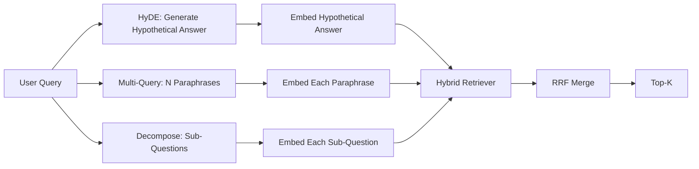

# Query Rewriting: HyDE, Multi-Query, and Decomposition

> The query the user typed is not the query your retriever wants. Rewriting bridges that gap before retrieval, making the index see something closer to what the answer looks like.

**Type:** Build
**Languages:** Python
**Prerequisites:** Phase 11 Lesson 04 (embedding), Lesson 06 (RAG); Phase 19 Track B foundations (Lessons 20-29); Phase 19 Lessons 64, 65
**Time:** ~90 minutes

## Learning Objectives
- Implement Hypothetical Document Embeddings (HyDE): generate a hypothetical answer, embed it, and use that vector instead of the query vector for retrieval.
- Implement multi-query expansion: rewrite a query into N paraphrases, retrieve with each, and merge the union using reciprocal rank fusion.
- Implement query decomposition: break a complex question into sub-questions, retrieve per sub-question, and merge.
- Compare all three rewriters head-to-head on a fixture and explain when each strategy wins.
- Wire a mock LLM that produces deterministic, fixture-aligned outputs so the rewriting loop runs offline.

## The Problem

A user types "what does our team do when uploads fail and the budget is spent?" The corpus contains a document reading "AbortMultipartOnFail aborts an in-progress S3 multipart upload and decrements the per-bucket retry budget when an upload fails." The query and document share no noun phrase. BM25 misses. The bi-encoder ranks this document third or fourth because the query vector lands in a region of embedding space that favors the "cancelled tasks" document over the "aborted uploads" document. Lesson 66's two-stage reranking can rescue the answer—provided it lands within top-N; but if it fails to even enter top-N, the reranker never sees it.

The fix is to rewrite the query before it hits the retriever. The 2023 paper "Precise Zero-Shot Dense Retrieval without Relevance Labels" (Gao et al.) introduced HyDE: have an LLM write the document that would answer the query, embed that hypothetical document, and use its embedding as the retrieval vector. The hypothetical document lands in the right region of embedding space because it is written in the voice of the corpus. The query vector cannot do this.

Two cousin techniques complement HyDE. Multi-query expansion (the term Microsoft GraphRAG uses) generates N paraphrases of the query, retrieves with each, and merges. Decomposition (popularized in the 2024 Stanford DSPy work as "subquery decomposition") splits "what does our team do when uploads fail and the budget is spent" into two questions: "what happens when an upload fails" and "what happens when the retry budget is exhausted." Two retrievals, one merged result, both pieces of the answer become reachable.

This lesson implements all three, running them on the same fixture corpus.

## The Concept



### HyDE in Detail

HyDE replaces the user's query vector with a vector from an LLM-written hypothetical document. The prompt is short:

```
You are a domain expert. Write a one-paragraph passage that answers the question
below. Use the same vocabulary and phrasing the documentation in this domain would
use. Do not refuse. Do not say you do not know.

Question: {user_query}

Passage:
```

As a factual answer, what the LLM writes is wrong because the LLM does not know your corpus. That is fine. The retriever does not care about factual correctness—only token distribution. The hypothetical passage contains words like "abort," "multipart," "bucket," "budget" because a document passage on this topic would naturally use them. Embed this passage. The vector lands near the real passage.

In production, limit the hypothetical document to two or three sentences. Longer hypotheticals collect more noise. Shorter ones lose the lexical signal HyDE needs.

### Multi-Query Expansion in Detail

Generate N paraphrases of the user's query. The simplest prompt:

```
Rewrite the following question in {N} different ways. Each rewrite must preserve
the original intent. Number them 1 to {N}. Do not add explanations.
```

Retrieve top-k for each paraphrase. Merge the N ranked lists with RRF (the same algorithm from Lesson 65). Cheap, parallelizable, deterministic.

Multi-query wins when the user's phrasing is just one of many equally valid ways to ask, and any rewrite could ask it better. It loses when all rewrites are equally bad—because the original query is bad in the same way.

### Decomposition in Detail

A single retrieval cannot satisfy a multi-faceted question. Decomposition has the LLM break the question into sub-questions, and the system retrieves per sub-question. The prompt:

```
The following question may require information from multiple distinct topics.
Decompose it into a list of sub-questions. Each sub-question must be answerable
independently. If the question is already atomic, return it unchanged.

Question: {user_query}
```

Retrieve per sub-question, merge. For questions with conjunctions, multi-clause comparisons, or two unrelated topics, decomposition is the right tool. For atomic questions it is the wrong tool; in that case the splitter's job is to return the single question unchanged rather than inventing fake sub-questions.

### Why All Three Exist

The three are complementary. HyDE bridges the token gap between query and corpus. Multi-query covers paraphrase variance. Decomposition covers multi-topic queries. A production system runs all three and selects per query (Lesson 69's end-to-end system demonstrates that selector).

## Mock LLM

This lesson runs offline. The mock LLM is a small lookup table keyed by user query with a fallback for unseen queries. The lookup table contains:

- For each fixture query: a pre-written hypothetical passage, three paraphrases, and a decomposition.
- For an unknown query: a deterministic transformation—extract content words from the query, expand them through a synonym map, and return the result.

What matters is the shape of the mock, not its data. In production you replace the mock with a real model call. The retriever does not change.

## Build It

`code/main.py` implements:

- `MockLLM` — the deterministic stand-in described above.
- `HyDERewriter` — calls the LLM to write a hypothetical document, returns a `RewriteResult` containing the hypothetical text and the query the retriever should use.
- `MultiQueryRewriter` — calls the LLM for N paraphrases, returns a list of queries.
- `DecomposeRewriter` — calls the LLM to decompose, returns sub-questions.
- `retrieve_with_rewriter` — takes a rewriter and a retriever, runs the rewrite, fuses results.
- A demo that runs all three rewriters on the fixture and prints which strategy first returns the gold answer document.

The retriever shape reuses Lesson 65 (hybrid BM25 + dense). Fusion is the same RRF. The only new shape is the rewriter interface, which is small.

Run:

```bash
python3 code/main.py
```

Output is each strategy's ranking plus a final summary. HyDE wins on the phrasing-mismatch query. Multi-query wins on the paraphrase-variance query. Decomposition wins on the multi-topic query. The fallback (no rewriting) loses to at least one of the three.

## Failure Modes the Demo Hides

**HyDE hallucinates corpus-specific identifiers incorrectly.** The model invents a function name. The hypothetical's BM25 score on the correct document collapses because the invented name is now a high-weight token absent from the index. Limit hypothetical length and lower BM25 weight in fusion.

**Multi-query rewrites all converge.** A weak model produces three near-identical paraphrases. N retrievals return the same top-k. RRF merge is no better than a single retrieval. Add an explicit diversity instruction to the rewrite prompt and detect duplicates with Jaccard.

**Decomposition over-splits.** The splitter decomposes an atomic question into a list. Each retrieval returns the same document but at lower rank. The merged result is worse than the original. Detect this with an "are these sub-questions sufficiently different" check before fan-out.

**Latency doubles.** HyDE costs one LLM call. Multi-query costs one LLM call to generate N rewrites plus N retrievals. Decomposition costs one LLM call to decompose plus M retrievals. Retrievals run in parallel; the LLM call is the floor.

## Use It

Production practices:

- Per-query strategy selection by query length: short atomic queries use multi-query, complex multi-clause queries use decomposition, jargon-heavy queries use HyDE.
- Cache rewriter outputs by query hash. Many queries repeat.
- Run all three in parallel and fuse the three result sets with RRF. Cost is three LLM calls plus one fusion; quality is the union of all three strategies' coverage.

## Ship It

Lesson 69 plugs this rewriting stage before Lesson 65's retriever and Lesson 66's reranker. Lesson 68 evaluates the improvement in retrieval recall from rewriters.

## Exercises

1. Implement RAG-Fusion (a 2024 multi-query variant): the rewriter's paraphrases are deliberately diverse, then a reranking step (Lesson 66) picks the final list.
2. Add a fourth strategy: step-back prompting (ask the LLM for the more general question, retrieve on that, then narrow down). Compare on the fixture.
3. Add an "is the question atomic" head to the splitter and train it to recognize atomic queries. Measure over-splitting rate before and after.
4. Replace the mock LLM with a real model call. Measure per-strategy latency on your tech stack.
5. Add a confidence score to each rewrite. Drop rewrites below threshold. Measure the impact on recall.

## Key Terms

| Term | What people say | What it actually means |
|------|-----------------|------------------------|
| HyDE | "Hypothetical document retrieval" | LLM writes an answer; embed and retrieve on it instead of the query |
| Multi-query | "Paraphrase expansion" | N rewrites of the query; retrieve N times, merge with RRF |
| Decomposition | "Subquery splitting" | Multi-topic query split into sub-questions, retrieved separately |
| Atomic query | "Single-topic" | Cannot be split without inventing fake sub-questions |
| Step-back | "Abstract the query" | Ask the more general question, retrieve, then narrow |

## Further Reading

- Gao, Ma, Lin, Callan, "Precise Zero-Shot Dense Retrieval without Relevance Labels" (HyDE), 2023
- Microsoft Research, "Multi-Query Expansion for Retrieval"
- Stanford DSPy, "Subquery Decomposition for Multi-Hop QA"
- [LlamaIndex query transformations documentation](https://docs.llamaindex.ai/en/stable/optimizing/advanced_retrieval/query_transformations/)
- Phase 11 Lesson 07 — advanced RAG patterns
- Phase 19 Lesson 65 — the retriever this rewriter feeds
- Phase 19 Lesson 68 — evaluation measuring rewriter improvement
