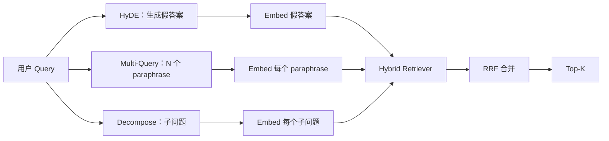

# Query 改写：HyDE、Multi-Query 与 Decomposition

> 用户敲进来的那个 query，并不是你的 retriever 想要的那个 query。改写在检索之前把这道鸿沟填上，让索引看到一个更接近答案样子的东西。

**类型：** Build
**语言：** Python
**前置要求：** 阶段 11 第 04 课（embedding）、第 06 课（RAG）；阶段 19 Track B 基础（第 20-29 课）；阶段 19 第 64、65 课
**预计时间：** ~90 分钟

## 学习目标
- 实现 Hypothetical Document Embeddings（HyDE）：生成一个假答案，把它 embed，用这个向量而非 query 向量去检索。
- 实现 multi-query 扩展：把一个 query 改写成 N 个 paraphrase，各自检索，再用 reciprocal rank fusion 把并集合并。
- 实现 query decomposition：把一个复杂问题拆成若干子问题，按子问题分别检索，再合并。
- 在一个 fixture 上把这三种改写器头对头对比，并解释每种策略各自在什么时候胜出。
- 接出一个 mock LLM，让它产出确定的、贴合 fixture 的输出，使改写循环离线就能跑。

## 问题背景

一个用户敲进"我们团队在上传失败、预算又耗光时会怎么做？"。corpus 里有一篇文档写着"AbortMultipartOnFail 会中止一个进行中的 S3 multipart upload，并在上传失败时把 per-bucket 的 retry budget 减一"。这个 query 和那篇 document 没有共享任何一个名词短语。BM25 漏了。Bi-encoder 把这篇 document 排到了第三或第四，因为 query 向量落进了 embedding 空间里一块更偏爱"被取消的任务"那篇文档、而非"被中止的上传"那篇文档的区域。第 66 课的两级重排能把答案救回来——前提是它落在 top-N 里；但要是它连 top-N 都进不去，reranker 就根本看不到它。

修法是在 query 碰到 retriever 之前先把它改写掉。2023 年的论文《Precise Zero-Shot Dense Retrieval without Relevance Labels》（Gao 等）提出了 HyDE：让一个 LLM 写出那篇能回答 query 的 document，把这篇假想 document embed，用它的 embedding 当检索向量。这篇假想 document 落在了 embedding 空间里正确的区域，因为它是用 corpus 的口吻写的。query 向量做不到这一点。

两个表亲技术跟 HyDE 配套。Multi-query 扩展（微软 GraphRAG 用的术语）生成 query 的 N 个 paraphrase、各自检索，再合并。Decomposition（在 2024 年斯坦福 DSPy 工作里以"subquery decomposition"流行起来）把"我们团队在上传失败、预算又耗光时会怎么做"拆成两个问题："上传失败时会发生什么"和"retry budget 耗光时会发生什么"。两次检索，一个合并结果，答案的两块都可达。

本课把这三种都实现出来，在同一个 fixture corpus 上跑一遍。

## 核心概念



### HyDE 细说

HyDE 用一篇 LLM 写的假想 document 向量，替换掉用户的 query 向量。prompt 很短：

```
You are a domain expert. Write a one-paragraph passage that answers the question
below. Use the same vocabulary and phrasing the documentation in this domain would
use. Do not refuse. Do not say you do not know.

Question: {user_query}

Passage:
```

作为事实性答案，LLM 写的东西是错的，因为 LLM 不了解你的 corpus。这没关系。retriever 不在乎事实正确性，只在乎 token 分布。这篇假想 passage 里含有 "abort"、"multipart"、"bucket"、"budget" 这些词，因为一篇讲这个主题的文档 passage 本来就会这么写。把这篇 passage embed。向量就落在了真正那篇 passage 附近。

生产里你会把假想 document 限制在两三句之内。更长的假想会收集更多噪声。更短的又会丢掉 HyDE 需要的那点 lexical 信号。

### Multi-query 扩展细说

生成用户 query 的 N 个 paraphrase。最简单的 prompt：

```
Rewrite the following question in {N} different ways. Each rewrite must preserve
the original intent. Number them 1 to {N}. Do not add explanations.
```

为每个 paraphrase 取 top-k。用 RRF（跟第 65 课同一个算法）合并这 N 个排序列表。廉价、可并行、确定。

当用户的措辞只是众多同样有效问法中的一种、而且任何一个改写都能问得更好时，multi-query 胜出。当所有改写都同样糟糕——因为原 query 本来就糟在同一个点上——时，它就输了。

### Decomposition 细说

单次检索满足不了一个多面问题。Decomposition 让 LLM 把问题拆成子问题，系统按子问题分别检索。prompt：

```
The following question may require information from multiple distinct topics.
Decompose it into a list of sub-questions. Each sub-question must be answerable
independently. If the question is already atomic, return it unchanged.

Question: {user_query}
```

按子问题检索，合并。对于含连接词、多从句对比，或者两个不相关主题的问题，decomposition 是对的工具。对原子问题它是错的工具；那种情况下拆分器的活儿是把那个单一问题原样返回，而不是发明假子问题。

### 为什么三种都存在

三者互补。HyDE 弥合 query 与 corpus 之间的 token 鸿沟。Multi-query 覆盖 paraphrase 的方差。Decomposition 覆盖多主题 query。一个生产系统三种都跑，并按 query 挑策略（第 69 课的端到端系统演示了那个选择器）。

## Mock LLM

本课离线运行。这个 mock LLM 是一张以用户 query 为键的小查找表，外加一个对没见过的 query 的兜底。查找表里包含：

- 对每个 fixture query：一篇写好的假想 passage、三个 paraphrase，和一个 decomposition。
- 对一个未知 query：一个确定性变换——取出 query 里的实词，通过一张同义词映射表扩展它们，返回结果。

要紧的是这个 mock 的形状，不是它的数据。生产里你把 mock 换成一次真实模型调用。retriever 不变。

## 动手构建

`code/main.py` 实现了：

- `MockLLM` —— 上面描述的那个确定性替身。
- `HyDERewriter` —— 调 LLM 写出假想 document，把改写结果作为 `RewriteResult` 返回，里面带假想文本和 retriever 应该用的那个 query。
- `MultiQueryRewriter` —— 调 LLM 要 N 个 paraphrase，返回一个 query 列表。
- `DecomposeRewriter` —— 调 LLM 做 decompose，返回子问题。
- `retrieve_with_rewriter` —— 接收一个改写器和一个 retriever，跑改写，融合结果。
- 一个演示，在 fixture 上跑这三种改写器，打印出哪种策略最先返回了 gold 答案 document。

retriever 的形状复用自第 65 课（hybrid BM25 + dense）。fusion 还是同一个 RRF。唯一的新形状是改写器接口，它很小。

运行：

```bash
python3 code/main.py
```

输出是每种策略的排序，加一个最终小结。HyDE 在措辞错配的 query 上胜出。Multi-query 在 paraphrase 方差的 query 上胜出。Decomposition 在多主题的 query 上胜出。兜底（不改写）在三者中至少一个上会输。

## 演示会藏起来的失败模式

**HyDE 把 corpus 特定的标识符幻觉错了。** 模型发明了一个函数名。这篇假想的 BM25 分数在正确那篇 doc 上崩了，因为这个被发明出来的名字如今成了一个不在索引里出现的高权重 token。给假想限长，并在 fusion 里把 BM25 的权重压低。

**Multi-query 的改写全都收敛了。** 一个弱模型产出三个近乎相同的 paraphrase。N 次检索返回同样的 top-k。RRF 合并并不比单次检索更好。在改写 prompt 里加一条明确的多样性指令，并用 Jaccard 检测重复。

**Decomposition 拆过头了。** 拆分器把一个原子问题拆成了一个列表。各次检索全返回同一篇 document，但 rank 都降低了。合并结果比原始还差。在 fan-out 之前用一个"这些子问题彼此够不够不同"的检查来发现这种情况。

**Latency 翻倍。** HyDE 花一次 LLM 调用。Multi-query 花一次 LLM 调用生成 N 个改写，再加 N 次检索。Decomposition 花一次 LLM 调用做 decompose，再加 M 次检索。检索并行跑；LLM 调用是地板。

## 投入使用

生产实践：

- 按 query 长度做按 query 的策略选择：原子的短 query 走 multi-query，复杂的多从句 query 走 decomposition，行话密集的 query 走 HyDE。
- 按 query hash 缓存改写器输出。很多 query 会重复。
- 三种并行跑，用 RRF 把三个结果集融成一个。成本是三次 LLM 调用加一次 fusion；质量是三种策略覆盖范围的并集。

## 交付上线

第 69 课把这个改写级接在第 65 课的 retriever 和第 66 课的 reranker 之前。第 68 课评测改写器给检索 recall 带来的提升。

## 练习

1. 实现 RAG-Fusion（2024 年的一个 multi-query 变体）：改写器的 paraphrase 故意做得多样，再由重排步骤（第 66 课）挑出最终列表。
2. 加上第四种策略：step-back prompting（向 LLM 要那个更一般的问题，对它检索，再收窄）。在 fixture 上对比。
3. 给拆分器加一个"问题是否原子"的 head，训它识别原子 query。测量加之前和之后的过拆率。
4. 把 mock LLM 换成一次真实模型调用。在你的技术栈上测量每种策略的 latency。
5. 给每个改写加一个置信度分数。丢掉低于阈值的改写。测量它对 recall 的影响。

## 关键术语

| 术语 | 大家嘴上怎么说 | 它实际指什么 |
|------|-----------------|------------------------|
| HyDE | "假文档检索" | LLM 写出答案；对它而非 query 做 embed 和检索 |
| Multi-query | "paraphrase 扩展" | query 的 N 个改写；检索 N 次，用 RRF 合并 |
| Decomposition | "subquery 拆分" | 多主题 query 拆成子问题，分别检索 |
| Atomic query | "单一主题" | 不发明假子问题就无法拆分 |
| Step-back | "把 query 抽象" | 问那个更一般的问题，检索，再收窄 |

## 延伸阅读

- Gao, Ma, Lin, Callan, "Precise Zero-Shot Dense Retrieval without Relevance Labels"（HyDE），2023
- Microsoft Research, "Multi-Query Expansion for Retrieval"
- Stanford DSPy, "Subquery Decomposition for Multi-Hop QA"
- [LlamaIndex query transformations documentation](https://docs.llamaindex.ai/en/stable/optimizing/advanced_retrieval/query_transformations/)
- 阶段 11 第 07 课 —— advanced RAG 模式
- 阶段 19 第 65 课 —— 这个改写器喂给的那个 retriever
- 阶段 19 第 68 课 —— 衡量改写器提升的那个评测
