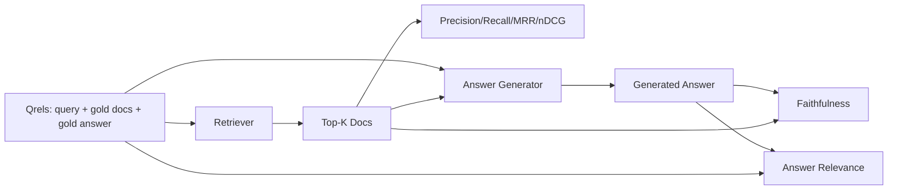

# RAG Evaluation: Precision, Recall, MRR, nDCG, Faithfulness, Answer Relevance

> If you cannot score both retrieval and answers, you cannot ship the system. These are not the same metric, and the same prompt will fail on different dimensions.

**Type:** Build
**Languages:** Python
**Prerequisites:** Phase 11 Lesson 06 (RAG), Lesson 10 (Evaluation); Phase 19 Track B foundations (Lessons 20-29); Phase 19 Lessons 64, 65, 66, 67
**Time:** ~90 minutes

## Learning Objectives
- Compute four retrieval metrics from gold qrels: precision@k, recall@k, MRR (mean reciprocal rank), and nDCG@k.
- Compute two answer-level metrics: faithfulness (every claim is grounded in retrieved context) and answer relevance (the answer actually addresses the question).
- Build a fixture qrels file (query, gold doc id, gold answer text) that the evaluation reads end-to-end.
- Read these metric values to diagnose where the pipeline fails: retrieval, ranking, generation, or grounding.

## The Problem

A RAG system has at least four moving parts: chunker, retriever, reranker, generator. Any one of them can be the root cause of a wrong answer. Without per-level metrics, you are flying blind.

A user reports a wrong answer. Is it because the chunker split the answer span? Is it because the retriever did not place that chunk in the top-k? Is it because the reranker pushed the correct chunk past first position? Is it because the generator ignored that chunk and hallucinated? You cannot tell just by looking at the answer. You need:

- Retrieval metrics, to score what comes out of the retriever.
- Ranking metrics, to score where the correct chunk sits in the ordering.
- Faithfulness, to score whether the generator stayed within the retrieved context.
- Answer relevance, to score whether the answer actually addresses the question.

This lesson builds all six on top of a fixture qrels file. Evaluation is offline and deterministic; in production you swap the mock LLM-as-judge for a real one.

## The Concept



### Precision@k

What fraction of the top-k documents returned by the retriever are in the gold set? If the gold has three documents and the top-3 returns two of them plus one wrong one, precision@3 is 2/3. Use precision when an irrelevant retrieved chunk is costly (the generator wastes tokens on it, or the chunk poisons the answer).

### Recall@k

What fraction of the gold documents are in the top-k? If the gold has three documents and the top-5 contains all three, recall@5 is 1.0. Use recall when missing an answer is costly (you would rather see one extra wrong chunk than completely miss the answer chunk).

In production RAG the commonly cited metric is recall@k. Generation can easily discard irrelevant chunks; it cannot invent an answer from a chunk it has never seen.

### MRR (Mean Reciprocal Rank)

For each query, find the position of the first relevant document in the ranked list. The reciprocal rank is 1/position. Average across all queries. MRR is a single-number summary measuring how well the retriever places the best answer at the top.

MRR weights position 1 heavily. A query whose gold doc is at rank 1 contributes 1.0. Rank 2 contributes 0.5. Rank 10 contributes 0.1. The metric is dominated by the top of the list.

### nDCG@k

Normalized Discounted Cumulative Gain. The full formula assigns a gain to each retrieved document (typically 1 for relevant, 0 for irrelevant), discounts by the log of position, sums, and divides by the ideal DCG (the DCG you would have if you ranked perfectly). Range 0 to 1.

nDCG accommodates graded relevance: gold can say "doc A is 3, doc B is 2, doc C is 1". MRR and recall@k compress everything to binary. Use nDCG when the corpus has multiple partially-relevant documents per query.

### Faithfulness

For each claim in the generated answer, check whether the claim is supported by the retrieved context. The standard implementation uses an LLM-as-judge prompt that takes (claim, context) and returns yes or no. The metric is the fraction of claims that pass.

Faithfulness catches the failure mode where the generator invents content out of thin air. Even if the retriever returns the correct chunk, a hallucinating generator is broken. Faithfulness is also called groundedness, support, or attribution.

This lesson implements faithfulness with a deterministic mock judge: it checks whether each claim's tokens overlap with the retrieved context above a threshold. In production you swap in a real model call. The shape of the metric is the same.

### Answer relevance

Does the answer actually address the question? Faithfulness asks "is the answer grounded in the context?" Answer relevance asks "is the answer grounded in the question?" A faithful but off-topic answer scores high on faithfulness and low on relevance. A terse, on-topic answer that ignores context scores high on relevance and low on faithfulness.

The standard implementation likewise uses LLM-as-judge: takes (question, answer) and asks whether the answer addresses the question. This lesson implements a token-overlap-plus-judge stand-in.

## Fixture qrels

```python
{
  "qid": "q1",
  "query": "what is the abort threshold for multipart uploads",
  "gold_doc_ids": ["d1", "d3"],
  "gold_answer_substring": "three failed parts",
  "graded_relevance": {"d1": 3, "d3": 2},
}
```

Each query carries:
- A query string,
- A set of gold doc ids (for precision / recall / MRR),
- A graded relevance dictionary (for nDCG),
- A gold answer substring (retained as reference metadata on each qrel; this lesson's faithfulness is derived by judging extracted claims against retrieved context, not against this substring).

In production you annotate these. This lesson ships a hand-built fixture so the evaluation runs out of the box.

## Build It

`code/main.py` implements:

- `precision_at_k(retrieved, gold, k)` — literal definition.
- `recall_at_k(retrieved, gold, k)` — literal definition.
- `mean_reciprocal_rank(retrieved_list_of_lists, gold_list)` — averaged across queries.
- `ndcg_at_k(retrieved, graded_relevance, k)` — DCG / IDCG, supporting binary or graded gain.
- `extract_claims(answer)` — splits the answer into sentence-shaped claims.
- `faithfulness(claims, context_texts, judge)` — fraction of claims judged as supported.
- `answer_relevance(question, answer, judge)` — judges whether the answer addresses the question.
- `MockJudge` — deterministic token-overlap judge so evaluation runs offline.
- `evaluate_pipeline(pipeline_fn, qrels, ks)` — orchestrator that runs all metrics.
- A demo that runs three pipeline variants (chunker baseline, hybrid retrieval, hybrid + rerank) against qrels and prints a metric table.

Run:

```bash
python3 code/main.py
```

Output displays each variant's precision@k, recall@k, MRR, nDCG@k, faithfulness, and answer relevance in a metric table. The hybrid retrieval row beats the chunker baseline on recall; the rerank row beats hybrid on MRR.

## Reading Metrics to Diagnose Failures

| Symptom | Likely Root Cause | What to Fix |
|---------|-------------|-------------|
| Low recall@k, low precision@k | Chunker split the answer, or retriever cannot find it | Chunker boundaries (Lesson 64) or retriever modality (Lesson 65) |
| Decent recall@k, low MRR | Correct chunk is in top-k but not at position 1 | Reranker (Lesson 66) |
| High MRR, low faithfulness | Correct context available but generator invents content | Generation prompt; force citation or refuse |
| High faithfulness, low relevance | Answer is grounded but off-topic | Query rewriter (Lesson 67) or generation prompt |
| All four high, users still complain | Evaluation set is not representative | Expand qrels with real user queries |

## Failure Modes the Demo Hides

**LLM-as-judge bias.** A model will judge its own output as more faithful than it actually is. Use a different model family for the judge than for the generator, or hand-annotate a sample.

**Qrels rot.** Gold answers drift as the corpus changes. A doc that was gold for q1 in January 2024 is no longer the correct answer by October 2024 because the team renamed that function. Schedule a quarterly qrels review.

**Faithfulness micro-check misses macro claims.** Per-sentence faithfulness can pass while the overall answer structure is misleading. Add a sample-level qualitative review layer on top of automatic metrics.

**Recall@k masks per-query failures.** A 90% average recall may hide a class of queries that always miss. Slice qrels by query type (literal, paraphrase, multi-topic) and report by slice.

## Use It

Production practices:

- Run evaluation every time you change the retriever or generator. Treat a recall@k regression as a test failure.
- Persist per-query metric traces. When a user complains, look up the matching qrels entry and check whether it should have been caught.
- Tier qrels: a 20-query smoke set runs in CI; a 200-query regression set runs nightly; a 2000-query deep set runs weekly.

## Ship It

Lesson 69 wires the full pipeline (chunker, retriever, reranker, generator) together and runs this evaluation suite against the end-to-end system.

## Exercises

1. Add a fifth retrieval metric: hit-rate@k. Compare against recall@k. Explain when they differ.
2. Implement graded faithfulness: 0 (not supported), 1 (partially supported), 2 (fully supported). Update the metric accordingly.
3. Swap the mock judge for a real model call. Measure disagreement between mock and real judge on the fixture.
4. Add a query category slice ("literal", "paraphrase", "multi-topic"). Report metrics by slice.
5. Add an "answer length" metric and correlate it with faithfulness. Plot the curve.

## Key Terms

| Term | Common Usage | What It Actually Means |
|------|-----------------|------------------------|
| Precision@k | "hit rate among retrieved" | Fraction of top-k that belongs to the gold set |
| Recall@k | "hit rate among gold" | Fraction of gold that falls within top-k |
| MRR | "first hit position" | Mean of 1/rank of the first relevant document |
| nDCG@k | "graded ranking quality" | DCG over top-k divided by ideal DCG |
| Faithfulness | "groundedness" | Fraction of answer claims supported by retrieved context |
| Answer relevance | "does it address the question?" | Whether the answer matches the question's intent |
| Qrels | "gold labels" | Annotated set of queries with their gold documents and answers |

## Further Reading

- Buckley, Voorhees, "Evaluating Evaluation Measure Stability", SIGIR 2000 — the classic paper on ranking metrics
- Jarvelin, Kekalainen, "Cumulated Gain-based Evaluation of IR Techniques" — the nDCG paper
- [Ragas: Automated Evaluation of RAG Pipelines](https://docs.ragas.io)
- [Anthropic, Evaluating RAG](https://www.anthropic.com/news/evaluating-rag)
- Phase 11 Lesson 10 — evaluation framework foundations
- Phase 19 Lessons 64-67 — the components being evaluated here
- Phase 19 Lesson 69 — the end-to-end pipeline scored by this evaluation
