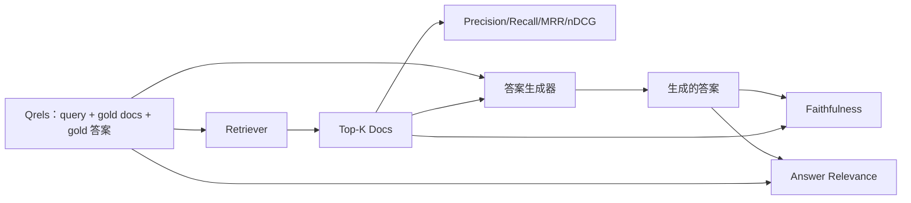

# RAG 评测：Precision、Recall、MRR、nDCG、Faithfulness、Answer Relevance

> 如果你没法同时给检索和答案打分，你就没法上线这个系统。这两者不是同一个指标，同一个 prompt 会在不同的维度上翻车。

**类型：** Build
**语言：** Python
**前置要求：** 阶段 11 第 06 课（RAG）、第 10 课（评测）；阶段 19 Track B 基础（第 20-29 课）；阶段 19 第 64、65、66、67 课
**预计时间：** ~90 分钟

## 学习目标
- 从 gold qrels 计算四个检索指标：precision@k、recall@k、MRR（mean reciprocal rank）和 nDCG@k。
- 计算两个答案级指标：faithfulness（每条 claim 都扎根于检索到的 context）和 answer relevance（答案确实回应了问题）。
- 构建一个 fixture qrels 文件（query、gold doc id、gold 答案文本），让评测端到端读它。
- 读这些指标值来诊断 pipeline 在哪一环失败：检索、排序、生成，还是 grounding。

## 问题背景

一个 RAG 系统至少有四个活动部件：chunker、retriever、reranker、generator。任何一个都可能是错误答案的祸根。没有按级别的指标，你就是在盲飞。

一个用户报告了一个错误答案。是因为 chunker 切断了答案 span 吗？是因为 retriever 没把那个 chunk 放进 top-k 吗？是因为 reranker 把正确的 chunk 挤过了第一位吗？是因为 generator 无视那个 chunk、自己瞎编了吗？光看答案你说不上来。你需要：

- 检索指标，来给从 retriever 出来的东西打分。
- 排序指标，来给正确 chunk 在顺序里坐在哪个位置打分。
- Faithfulness，来给 generator 有没有待在检索到的 context 之内打分。
- Answer relevance，来给答案到底有没有回应问题打分。

本课在一个 fixture qrels 文件之上把这六个全建起来。评测是离线且确定的；生产里你把 mock 的 LLM-as-judge 换成一个真的。

## 核心概念



### Precision@k

retriever 返回的 top-k 文档里，有多大比例在 gold 集合里？如果 gold 有三篇文档，top-3 返回了其中两篇加一篇错的，那 precision@3 就是 2 / 3。当一个无关的被检索 chunk 代价很高时（generator 在它上面浪费 token，或者这个 chunk 毒化了答案），用 precision。

### Recall@k

gold 文档里，有多大比例在 top-k 里？如果 gold 有三篇文档，top-5 含齐这三篇，那 recall@5 就是 1.0。当漏掉一个答案的代价很高时（你宁可多看一个错 chunk，也不愿彻底漏掉那个答案 chunk），用 recall。

生产 RAG 里大家通常引用的指标是 recall@k。生成可以轻松丢掉无关 chunk；它没法从一个从没见过的 chunk 里发明出答案。

### MRR（Mean Reciprocal Rank）

对每个 query，找到排序列表里第一个相关文档的位置。reciprocal rank 是 1 / 位置。在整个 query 集上取平均。MRR 是一个单数字小结，衡量 retriever 把最佳答案放到顶部的本事。

MRR 给位置 1 加很重的权。一个 gold doc 排在 rank 1 的 query 贡献 1.0。rank 2 贡献 0.5。rank 10 贡献 0.1。这个指标被列表顶部主导。

### nDCG@k

Normalized Discounted Cumulative Gain。完整公式给每个被检索文档赋一个 gain（通常相关为 1、不相关为 0），按位置的对数做折扣，求和，再除以理想 DCG（你排到完美时本该有的那个 DCG）。范围 0 到 1。

nDCG 容纳分级相关性：gold 可以说"doc A 是 3、doc B 是 2、doc C 是 1"。MRR 和 recall@k 把一切压成二元。当 corpus 里每个 query 有多篇部分相关的文档时，用 nDCG。

### Faithfulness

对生成答案里的每条 claim，检查这条 claim 是否被检索到的 context 支撑。标准实现用一个 LLM-as-judge prompt，接收 (claim, context) 返回 yes 或 no。这个指标就是通过的 claim 所占的比例。

Faithfulness 抓的是 generator 那种凭空发明内容的失败模式。哪怕 retriever 返回了正确的 chunk，一个会幻觉的 generator 也是坏的。Faithfulness 也叫 groundedness、support、attribution。

本课用一个确定性的 mock judge 实现 faithfulness：它检查每条 claim 的 token 跟检索到的 context 重叠是否超过一个阈值。生产里你换成一次真实模型调用。指标的形状是一样的。

### Answer relevance

答案到底有没有回应问题？Faithfulness 问的是"答案扎根于 context 吗？"。Answer relevance 问的是"答案扎根于问题吗？"。一个 faithful 但跑题的答案在 faithfulness 上得高分、在 relevance 上得低分。一个简短、切题但无视 context 的答案在 relevance 上得高分、在 faithfulness 上得低分。

标准实现同样用 LLM-as-judge：接收 (question, answer)，问答案有没有回应问题。本课实现一个 token 重叠加 judge 的替身。

## fixture qrels

```python
{
  "qid": "q1",
  "query": "what is the abort threshold for multipart uploads",
  "gold_doc_ids": ["d1", "d3"],
  "gold_answer_substring": "three failed parts",
  "graded_relevance": {"d1": 3, "d3": 2},
}
```

每个 query 携带：
- query 字符串，
- 一组 gold doc id（用于 precision / recall / MRR），
- 一个分级相关性字典（用于 nDCG），
- gold 答案子串（作为每条 qrel 上的参考 metadata 保留；本课的 faithfulness 是通过把抽取出的 claim 跟检索到的 context 对判得到的，而非对着这个子串）。

生产里你来标注这些。本课随附一个手工搭的 fixture，让评测开箱即跑。

## 动手构建

`code/main.py` 实现了：

- `precision_at_k(retrieved, gold, k)` —— 字面定义。
- `recall_at_k(retrieved, gold, k)` —— 字面定义。
- `mean_reciprocal_rank(retrieved_list_of_lists, gold_list)` —— 在各 query 上取均值。
- `ndcg_at_k(retrieved, graded_relevance, k)` —— DCG / IDCG，支持二元或分级 gain。
- `extract_claims(answer)` —— 把答案切成句子形状的 claim。
- `faithfulness(claims, context_texts, judge)` —— 被判为支撑的 claim 占比。
- `answer_relevance(question, answer, judge)` —— 判答案有没有回应问题。
- `MockJudge` —— 确定性的 token 重叠 judge，让评测离线就能跑。
- `evaluate_pipeline(pipeline_fn, qrels, ks)` —— 跑遍每个指标的编排器。
- 一个演示，把三个 pipeline 变体（chunker baseline、hybrid retrieval、hybrid + rerank）拿来对 qrels 跑，打印一张指标表。

运行：

```bash
python3 code/main.py
```

输出在一张指标表里展示每个变体的 precision@k、recall@k、MRR、nDCG@k、faithfulness 和 answer relevance。hybrid retrieval 那行在 recall 上打赢 chunker baseline；rerank 那行在 MRR 上打赢 hybrid。

## 读指标来诊断失败

| 症状 | 大概率的祸根 | 该修什么 |
|---------|-------------|-------------|
| recall@k 低、precision@k 低 | chunker 切断了答案，或 retriever 找不到它 | chunker 边界（第 64 课）或 retriever modality（第 65 课） |
| recall@k 还行、MRR 低 | 正确 chunk 在 top-k 里但不在第一位 | reranker（第 66 课） |
| MRR 高、faithfulness 低 | 有正确 context，generator 却发明内容 | 生成 prompt；强制引用否则拒答 |
| faithfulness 高、relevance 低 | 答案扎根但跑题 | query 改写器（第 67 课）或生成 prompt |
| 四项都高、用户还是抱怨 | 评测集不具代表性 | 用真实用户 query 扩充 qrels |

## 演示会藏起来的失败模式

**LLM-as-judge 偏向。** 一个模型会把自己的输出判得比实际更 faithful。给 judge 用一个跟 generator 不同的模型家族，或者手工标注一个样本。

**Qrels 烂掉。** gold 答案会随 corpus 变化而漂移。一篇在 2024 年 1 月对 q1 还是 gold 的 doc，到 2024 年 10 月就不再是正确答案了，因为团队把那个函数改名了。安排一个季度一次的 qrels 复审。

**Faithfulness 的微观检查漏掉宏观 claim。** 逐句 faithfulness 可以通过，而整体答案的结构却在误导人。在自动指标之上加一层样本级的定性复审。

**Recall@k 掩盖了按 query 的失败。** 90% 的平均 recall 可能藏着某一类 query 永远漏掉的事实。按 query 类别（字面、改写、多主题）切分 qrels，按切片分别报告。

## 投入使用

生产实践：

- 每次改 retriever 或 generator 都跑评测。把 recall@k 回归当成一次测试失败来对待。
- 持久化每个 query 的指标 trace。当一个用户抱怨时，查出对得上的那条 qrels 条目，看它本该不该被抓住。
- 给 qrels 分层：一个 20 条 query 的 smoke 集在 CI 里跑；一个 200 条的回归集每晚跑；一个 2000 条的深度集每周跑。

## 交付上线

第 69 课把整条 pipeline（chunker、retriever、reranker、generator）接起来，对端到端系统跑这套评测。

## 练习

1. 加上第五个检索指标：hit-rate@k。跟 recall@k 对比。解释它俩什么时候不一样。
2. 实现分级 faithfulness：0（不支撑）、1（部分支撑）、2（完全支撑）。相应更新指标。
3. 把 mock judge 换成一次真实模型调用。在 fixture 上测量 mock judge 和真 judge 之间的分歧。
4. 加一个 query 类别切片（"字面"、"改写"、"多主题"）。按切片报告指标。
5. 加一个"答案长度"指标，把它跟 faithfulness 做相关分析。画出曲线。

## 关键术语

| 术语 | 大家嘴上怎么说 | 它实际指什么 |
|------|-----------------|------------------------|
| Precision@k | "被检索里的命中率" | top-k 里属于 gold 的占比 |
| Recall@k | "gold 里的命中率" | gold 落在 top-k 里的占比 |
| MRR | "首个命中位置" | 第一个相关文档的 1 / rank 的均值 |
| nDCG@k | "分级排序质量" | top-k 上的 DCG 除以理想 DCG |
| Faithfulness | "groundedness" | 被检索 context 支撑的答案 claim 占比 |
| Answer relevance | "它回应问题了吗？" | 答案是否匹配问题的意图 |
| Qrels | "gold 标签" | query 及其 gold 文档和答案的标注集 |

## 延伸阅读

- Buckley, Voorhees, "Evaluating Evaluation Measure Stability", SIGIR 2000 —— 排序指标的经典论文
- Jarvelin, Kekalainen, "Cumulated Gain-based Evaluation of IR Techniques" —— nDCG 论文
- [Ragas: Automated Evaluation of RAG Pipelines](https://docs.ragas.io)
- [Anthropic, Evaluating RAG](https://www.anthropic.com/news/evaluating-rag)
- 阶段 11 第 10 课 —— 评测框架基础
- 阶段 19 第 64-67 课 —— 在这里被评测的各组件
- 阶段 19 第 69 课 —— 这套评测打分的端到端 pipeline
