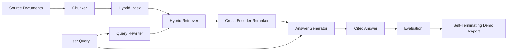

# End-to-End RAG System

> Six lessons of components. One pipeline. One evaluation loop. One self-terminating demo. This is the system you ship.

**Type:** Build
**Languages:** Python
**Prerequisites:** Phase 11 Lesson 06 (RAG), Lesson 10 (Evaluation); Phase 19 Track B foundations (Lessons 20-29); Phase 19 Lessons 64, 65, 66, 67, 68
**Time:** ~90 minutes

## Learning Objectives
- Compose the chunker, hybrid retriever, query rewriter, cross-encoder reranker, and answer generator into a single end-to-end pipeline.
- Implement an answer generator that cites each claim by chunk anchor and includes a refuse-on-low-confidence fallback.
- Run the Lesson 68 evaluation against the assembled pipeline, proving that the layered build beats the same components in isolation on every metric.
- Build a self-terminating CLI demo: ingest a fixture corpus, run a fixed query set, and exit with code 0 along with a summary report.

## The Problem

Six isolated components prove nothing. A chunker can win on recall@5 against the corpus yet lose on the system's recall@5 — because the retriever cannot rank what the chunker emits. A reranker can lift MRR on a synthetic candidate pool yet fail on real bi-encoder candidates — because the bi-encoder's recall at the reranking budget is too low. A query rewriter can push the gold doc up on one query and collapse on the next — because the LLM mock returned a degenerate hypothetical.

Integration testing is the entire pipeline running end-to-end against the same fixture qrels, with the same metrics, through a single orchestrator file that wires everything together. That is what this lesson builds. If the integrated pipeline's metrics beat every per-level isolated demo's metrics, you have proven the system.

## The Concept



### Wiring Choices

The pipeline is a small graph. Each stage is a function with a clean signature.

| Stage | Input | Output |
|-------|-------|--------|
| Chunker | Document text | List of chunk records |
| Retriever | Query string | Top-N chunk records |
| Rewriter (optional) | Query string | Rewrites + hypotheticals |
| Reranker | Query, candidates | Top-K chunk records with cross scores |
| Generator | Query, top-K chunk records | Cited answer string |

As long as each signature is stable, composition is straightforward. This lesson's `Pipeline` class holds the five stages and a `query` method that runs them in sequence. Each stage is swappable: pass in a different chunker, retriever, rewriter, reranker, or generator and the pipeline still runs.

### Cited Answer Generator

The generator is the last stage and the easiest to break. This lesson ships a deterministic mock generator that:

1. Takes the reranked top-K chunks.
2. Selects up to two chunks whose text has the highest content-token overlap with the query.
3. Emits an answer that concatenates one sentence from each selected chunk, each followed by a `[doc_id:chunk_index]` anchor.
4. If no chunk's overlap exceeds the refusal threshold, emits "I do not know" with no citations.

In production you replace the mock with a real LLM call using a prompt template like:

```
You are answering a question using only the snippets below.
Cite every claim with the anchor in parentheses.
If the snippets do not answer the question, say "I do not know".

Question: {query}

Snippets:
{enumerated chunks with anchors}

Answer:
```

The refuse-on-low-confidence path is the entire reason the cross-encoder rank-1 score is logged. If it falls below the corpus threshold, the generator refuses. This is the safety valve against hallucinated answers.

### Self-Terminating Demo

The demo runs everything end-to-end. It prints a per-stage breakdown of one query, runs evaluation on four fixture qrels, prints a metric table, and exits with status 0 when all Lesson 68 metrics meet the thresholds set in the demo. If any metric falls below threshold, the demo exits with a non-zero status and a message naming the failing metric.

This is the shape of a CI smoke test. The pipeline runs offline, fast, and deterministically. Thresholds on the fixture are intentionally tight so that a regression in any of the six lessons causes the demo to fail.

## Build It

`code/main.py` implements:

- `Chunk` — the record threaded through all stages (extends Lesson 64's shape with a chunk_index and source doc_id).
- `Chunker` — one strategy chosen from Lesson 64 (default recursive split).
- `HybridIndex` — wraps Lesson 65's BM25 + dense + RRF.
- `Rewriter` (optional) — picks from Lesson 67's HyDE, multi-query, and decomposition based on query length and presence of conjunctions.
- `Reranker` — Lesson 66's trained cross-encoder with a smaller fixture training set that converges in seconds.
- `Generator` — the deterministic mock generator with citation and refuse-on-low-confidence.
- `Pipeline` — composes the five stages with a `query(question)` method, returns `Result(answer, top_k, latency_ms_per_stage)`.
- `run_demo()` — ingests the corpus, runs three fixture queries, runs evaluation, prints results, sets the exit code by threshold.

Run:

```bash
python3 code/main.py
```

Output is a printed query trace, the full evaluation table, and a final pass/fail status. Returns exit code 0 on the fixture.

## Failure Modes the Demo Hides

**Chunker boundary drift.** If you change the chunker strategy between the qrels annotation pass and the demo, gold doc ids no longer match. Lock the chunker strategy in the qrels file. The demo includes a header naming the chunker.

**Reranker training set leaking into evaluation.** Some of Lesson 66's 14 training triples have queries that resemble the evaluation queries. In production, strictly hold out evaluation queries. The demo's evaluation queries are intentionally disjoint from the reranking training set.

**Mock generator hides hallucination risk.** The mock cannot hallucinate because it only emits text from retrieved chunks. This lesson states this explicitly and points the production replacement path at a real model.

**No streaming.** The pipeline returns the full answer at the end of each stage. A production system would stream the generator's output. Streaming is out of scope for this lesson; answer-level metrics are computed on the final string regardless.

**Latency is offline.** Mock LLM calls are constant time. Real LLM calls are the dominant cost. Budget a latency allowance at the request scope; this lesson's per-stage timing only measures CPU work.

## Use It

Production practices:

- Ship the pipeline file under an orchestrator with explicit stage interfaces. Do not scatter wiring across the repo.
- Run evaluation before every merge that touches a stage. If evaluation drops, the merge is blocked.
- Persist metric traces from each CI run so you can attribute regressions to a specific stage replacement.
- Add a 20-query smoke set (subset of the regression set) that runs in 30 seconds; run the full regression set nightly.

## Ship It

This lesson's pipeline file is the shape that the rest of Phase 19 Track F lessons assume by default. Subsequent lessons add ingestion automation, incremental index rebuilds, telemetry, and a serving layer. Retrieval, reranking, rewriting, and evaluation are complete here.

## Exercises

1. Add a per-query strategy selector inside the rewriter: use Lesson 67's heuristics (length, conjunctions, jargon ratio) to pick HyDE, multi-query, or decomposition.
2. Add a real LLM call for the generator behind an environment variable toggle. Default to mock. Measure the latency difference.
3. Extend the demo to accept a `--corpus path` flag to load a real corpus. Re-run evaluation and threshold checks.
4. Add a `--strategy` flag for the chunker. Measure each strategy's contribution to end-to-end recall.
5. Add a streaming generator interface and feed it into evaluation. Confirm that faithfulness is computed on the final string, not on streaming prefixes.

## Key Terms

| Term | Common Usage | What It Actually Means |
|------|-----------------|------------------------|
| Pipeline | "RAG pipeline" | The composed stages from ingestion to cited answer |
| Citation anchor | "source link" | A (doc_id, chunk_index) reference attached to each claim |
| Refuse-on-low-confidence | "I do not know" | Generator does not return an answer when the reranker top-1 score is below threshold |
| Smoke set | "CI evaluation" | The minimal qrels subset run in every PR check |
| Stage interface | "function signature" | The stable input-output types of each pipeline stage |

## Further Reading

- [Anthropic, Building search and retrieval](https://www.anthropic.com/news/contextual-retrieval)
- [Pinterest, MCP internal search](https://medium.com/pinterest-engineering) — reference production architecture
- [Ragas: Automated Evaluation of RAG Pipelines](https://docs.ragas.io)
- Phase 11 Lesson 06 — RAG foundations
- Phase 19 Lessons 64-68 — the components composed here
