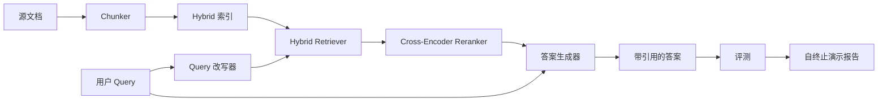

# 端到端 RAG 系统

> 六节课的组件。一条 pipeline。一个评测循环。一个自终止的演示。这就是你要交付上线的系统。

**类型：** Build
**语言：** Python
**前置要求：** 阶段 11 第 06 课（RAG）、第 10 课（评测）；阶段 19 Track B 基础（第 20-29 课）；阶段 19 第 64、65、66、67、68 课
**预计时间：** ~90 分钟

## 学习目标
- 把 chunker、hybrid retriever、query 改写器、cross-encoder reranker 和答案生成器组合进一条单一的端到端 pipeline。
- 实现一个答案生成器，它按 chunk anchor 给自己的每条 claim 加引用，并带 refuse-on-low-confidence 兜底。
- 对组装好的 pipeline 跑第 68 课的评测，证明分级构建在每一个指标上都打赢同样组件各自孤立时的表现。
- 构建一个自终止的 CLI 演示：摄入一个 fixture corpus，跑一个固定的 query 集，带一份小结报告以退出码 0 退出。

## 问题所在

六个孤立的组件什么都证明不了。chunker 可以在对着 corpus 的 recall@5 上赢，却在系统的 recall@5 上输——因为 retriever 排不动 chunker 吐出来的东西。reranker 可以在一个合成候选池上抬高 MRR，却在真实的 bi-encoder 候选上失败——因为 bi-encoder 在重排预算处的 recall 太低。query 改写器可以在单个 query 上把 gold doc 顶上去，下一个就崩——因为那个 LLM mock 返回了一个退化的假想。

集成测试就是整条 pipeline 对着同一个 fixture qrels、用同一个指标、用一个把一切接起来的编排器文件，从头跑到尾。这正是本课构建的东西。如果集成 pipeline 上的指标打赢每一级孤立演示上的指标，你就证明了这个系统。

## 核心概念



### 接线选择

这条 pipeline 是一张小图。每一级是一个签名清晰的函数。

| 级 | 输入 | 输出 |
|-------|-------|--------|
| Chunker | 文档文本 | Chunk 记录列表 |
| Retriever | query 字符串 | Top-N Chunk 记录 |
| Rewriter（可选） | query 字符串 | 改写列表 + 假想 |
| Reranker | query、候选 | 带 cross 分数的 Top-K Chunk 记录 |
| Generator | query、top-K Chunk 记录 | 带引用的答案字符串 |

只要每个签名都稳定，组合就很直接。本课的 `Pipeline` 类持有这五级和一个按顺序运行它们的 `query` 方法。每一级都可替换：传入不同的 chunker、retriever、rewriter、reranker 或 generator，pipeline 照样跑。

### 带引用的答案生成器

generator 是最后一级，也是最容易弄坏的。本课随附一个确定性的 mock generator，它：

1. 取重排后的 top-K chunk。
2. 选出最多两个 chunk，它们的文本跟 query 的内容 token 重叠最高。
3. 吐出一个答案，它是"每个被选 chunk 出一句"的拼接，每句后面跟一个 `[doc_id:chunk_index]` anchor。
4. 如果没有 chunk 的重叠高过拒答阈值，就吐出"我不知道"，不带引用。

生产里你把 mock 换成一次真实 LLM 调用，prompt 模板如下：

```
You are answering a question using only the snippets below.
Cite every claim with the anchor in parentheses.
If the snippets do not answer the question, say "I do not know".

Question: {query}

Snippets:
{enumerated chunks with anchors}

Answer:
```

refuse-on-low-confidence 这条路径，正是 cross-encoder rank-1 分数被记录下来的全部理由。如果它低于 corpus 阈值，generator 就拒答。这是抵御幻觉答案的安全阀。

### 自终止的演示

演示把一切从头跑到尾。它打印一个 query 的逐级拆解，对四个 fixture qrels 跑评测，打印一张指标表，并在第 68 课所有指标都达到演示里设定的阈值时以状态 0 退出。如果任何一个指标低于阈值，演示就以非零状态退出，并附一条点名失败指标的消息。

这就是一个 CI smoke 测试的形状。pipeline 离线、快、确定地运行。fixture 上的阈值被故意设得很紧，这样六节课里任何一处回归都会让演示失败。

## 动手构建

`code/main.py` 实现了：

- `Chunk` —— 贯穿所有级的记录（在第 64 课的形状上扩展了一个 chunk_index 和源 doc_id）。
- `Chunker` —— 从第 64 课选一种策略（默认 recursive split）。
- `HybridIndex` —— 把第 65 课的 BM25 + dense + RRF 打包。
- `Rewriter`（可选） —— 按 query 长度和有没有连接词，从第 67 课的 HyDE、multi-query、decomposition 中挑一个。
- `Reranker` —— 第 66 课训过的 cross-encoder，配一个更小的 fixture 训练集，几秒就收敛。
- `Generator` —— 那个带引用和 refuse-on-low-confidence 的确定性 mock generator。
- `Pipeline` —— 用一个 `query(question)` 方法组合这五级，返回 `Result(answer, top_k, latency_ms_per_stage)`。
- `run_demo()` —— 摄入 corpus，跑三个 fixture query，跑评测，打印结果，按阈值设退出码。

运行：

```bash
python3 code/main.py
```

输出是一段打印出来的 query trace、完整的评测表，和一个最终的 pass/fail 状态。在 fixture 上返回退出码 0。

## 演示会藏起来的失败模式

**Chunker 边界漂移。** 如果你在 qrels 标注那一遍和演示之间换了 chunker 策略，gold doc id 就对不上了。在 qrels 文件里把 chunker 策略锁死。演示里包含一个点名 chunker 的头部。

**Reranker 训练集漏进了评测。** 第 66 课的那 14 个训练三元组里，有些 query 跟评测 query 长得很像。生产里要严格留出评测 query。演示的评测 query 被刻意做得跟重排训练集互不相交。

**Mock generator 藏起了幻觉风险。** 这个 mock 没法幻觉，因为它只从检索到的 chunk 里吐文字。本课点明了这一点，并把生产替换路径指向一个真实模型。

**没有流式。** 这条 pipeline 在每一级结束时返回完整答案。一个生产系统会把 generator 的输出流式吐出。流式不在本课范围；不管怎样，答案级指标都是在最终字符串上算的。

**Latency 是离线的。** mock LLM 调用是常数时间。真实 LLM 调用才是大头。在请求范围里规划一个 latency 预算；本课每一级的计时只测了 CPU 的活儿。

## 投入使用

生产实践：

- 把 pipeline 文件放在一个带显式级接口的编排器之下交付。别把接线散落在整个 repo 里。
- 每次触碰某一级的合并之前都跑评测。如果评测掉了，这次合并就不许进。
- 持久化每次 CI 运行的指标 trace，这样你才能把回归归因到某一级的替换上。
- 加一个 20 条 query 的 smoke 集（回归集的子集），它在 30 秒内跑完；完整回归集每晚跑。

## 交付上线

本课的 pipeline 文件，是阶段 19 Track F 其余课程所默认假定的那个形状。后续课程会在它之上加摄入自动化、增量重建索引、遥测和一个服务层。检索、重排、改写、评测这几半，在这里已经完整了。

## 练习

1. 在改写器内部加一个按 query 的策略选择器：用第 67 课的启发式（长度、连接词、行话比例）来挑 HyDE、multi-query 或 decomposition。
2. 在一个环境变量开关后面给 generator 加一次真实 LLM 调用。默认走 mock。测量 latency 差。
3. 扩展演示，让它接受一个 `--corpus path` 标志加载真实 corpus。重跑评测和阈值检查。
4. 给 chunker 加一个 `--strategy` 标志。测量每种策略对端到端 recall 的贡献。
5. 加一个流式 generator 接口，把它喂进评测。确认 faithfulness 是在最终字符串上算的，而不是在流式前缀上。

## 关键术语

| 术语 | 大家嘴上怎么说 | 它实际指什么 |
|------|-----------------|------------------------|
| Pipeline | "RAG pipeline" | 从摄入到带引用答案的组合各级 |
| Citation anchor | "来源链接" | 附在每条 claim 上的 (doc_id, chunk_index) 引用 |
| Refuse-on-low-confidence | "我不知道" | reranker top-1 分数低于阈值时 generator 不返回答案 |
| Smoke set | "CI 评测" | 在每次 PR 检查里跑的最小 qrels 子集 |
| Stage interface | "函数签名" | 每个 pipeline 级稳定的输入输出类型 |

## 延伸阅读

- [Anthropic, Building search and retrieval](https://www.anthropic.com/news/contextual-retrieval)
- [Pinterest, MCP internal search](https://medium.com/pinterest-engineering) —— 参考的生产架构
- [Ragas: Automated Evaluation of RAG Pipelines](https://docs.ragas.io)
- 阶段 11 第 06 课 —— RAG 基础
- 阶段 19 第 64-68 课 —— 在这里被组合起来的各组件
