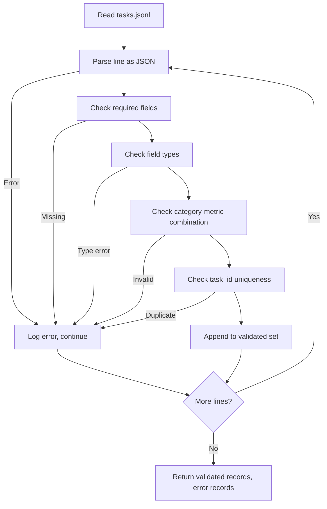

# Task Spec Format

> An eval harness is only as good as the contract its tasks obey. Before you write the first scoring function, freeze the JSONL shape and the metric naming vocabulary.

**Type:** Build
**Languages:** Python
**Prerequisites:** Phase 19 Track B foundations
**Time:** ~90 minutes

## Learning Objectives

- Define a JSONL task record schema that covers arithmetic, multiple-choice, code execution, classification, and free-text summary tasks in a single shape.
- Lock down a closed metric naming vocabulary so subsequent lessons (71-73) can dispatch on a single field.
- Encode few-shot examples and post-processing rules into the task rather than the runner, so the same prompt produces the same target across different models.
- Implement a strict validator that rejects malformed records before they reach the runner.
- Ship a 10-task fixture that exercises every branch of the spec and gives the validator real material to chew on.

## Why Freeze the Spec

A research codebase accumulates eval scripts faster than it accumulates tests. Six months in, every notebook has its own JSON shape, every metric has been rewritten twice, and nothing can be compared across runs. The fix is boring: choose a schema, write a validator, reject everything else. That is what this lesson does.

The shape draws from BIG-bench, HELM, and lm-eval style harnesses, but the field names are our own. Every field has a single owner: the runner reads the task, the metric reads targets, the post-processing step normalizes the generation. No field is rewritten mid-pipeline.

## The Record Shape

A task is a JSON object on a single line. The harness reads `tasks.jsonl` and validates each line independently. A bad line invalidates only that record, not the entire run.

```json
{
  "task_id": "arith_001",
  "category": "arithmetic",
  "prompt": "Compute the result. Question: 17 + 24\nAnswer:",
  "targets": ["41"],
  "metric_name": "exact_match",
  "few_shot_examples": [
    {"prompt": "Question: 2 + 2\nAnswer:", "completion": "4"}
  ],
  "post_process": "strip_whitespace",
  "metadata": {"difficulty": "easy"}
}
```

Required fields are `task_id`, `category`, `prompt`, `targets`, `metric_name`, `post_process`. `few_shot_examples` and `metadata` are optional. Unknown top-level fields cause validation failure.

## Field Rules

`task_id` is a string with no whitespace. The validator enforces uniqueness across the file.

`category` is one of `arithmetic`, `mcq`, `code_exec`, `classification`, `summary`. The category constrains which metric and post-processing combinations are valid. A `code_exec` task must use `metric_name = code_exec`; an `mcq` task must use `metric_name = exact_match` matching a single-letter target.

`prompt` is a non-empty string. The validator forbids trailing whitespace and rejects records where few-shot blocks are already baked into the prompt body. Few-shot rendering happens in the runner, not at authoring time.

`targets` is a non-empty list of strings. For `exact_match`, any element matching counts. For `f1` and `rouge_l`, the highest-scoring target is used. For `mcq`, the list must contain exactly one element.

`metric_name` is one of `exact_match`, `f1`, `bleu_4`, `rouge_l`, `accuracy`, `code_exec`. The vocabulary is closed. Adding a metric means opening a new lesson and adding an entry here.

`few_shot_examples` is a list of `{prompt, completion}` pairs. The validator caps the list at eight entries to keep prompt length bounded.

`post_process` is one of `none`, `strip_whitespace`, `lower`, `extract_letter`, `extract_code_block`, `extract_first_line`. Each rule has a single deterministic behavior. The validator forbids combining multiple rules.

## Validator Behavior



The validator returns two lists: validated records, and error records (with the offending line, the violated rule, and the failing field). If the error list is non-empty, the runner refuses to start unless the `--allow-bad-tasks` flag is explicitly passed.

## Few-Shot Rendering

The runner joins few-shot examples with a blank line separator and prepends them to the prompt. Every model goes through the same code path, so the only source of variation is the model itself. Authors write examples once rather than per-provider.

```python
def render(task):
    parts = []
    for ex in task.get("few_shot_examples", []):
        parts.append(ex["prompt"] + " " + ex["completion"])
    parts.append(task["prompt"])
    return "\n\n".join(parts)
```

## Post-Processing Rules

The post-processing step runs after generation and before the metric. It is deterministic and stateless.

- `none` returns the string as-is.
- `strip_whitespace` strips leading and trailing whitespace.
- `lower` lowercases the string.
- `extract_letter` returns the first character matching `[A-E]`, for MCQ.
- `extract_code_block` returns the body of the first triple-backtick fenced block, for code-exec.
- `extract_first_line` returns the first non-empty line, for summary-style classification.

Tasks requiring rules outside this list should go into a new lesson.

## What This Lesson Does Not Do

It does not score. It does not call a model. It does not execute code. Those appear in Lessons 71, 72, and 75 respectively. This lesson freezes the contract they all must obey.

The 10-task fixture covers two arithmetic, two MCQ, two code-exec, two classification, and two summary tasks. The validator passes on all 10. A separate fixture (`tasks_bad.jsonl`) violates every rule once, and the validator returns exactly as many errors as violations.

## How to Read the Code

`main.py` defines `TaskSpec`, `validate_task`, `validate_file`, and a CLI entry point. The fixture loader is `load_fixtures`. Rendering and post-processing helpers sit alongside the validation logic so that the Lesson 75 runner only needs to import one module.

Read `main.py` end to end. Then read `code/tests/test_spec.py`. The tests pin every validation rule and every post-processing behavior. The demo at the bottom of `main.py` validates the shipped fixtures and prints a summary.

## Going Further

Real eval suites grow categories the way schemas grow columns: the sane approach is to disallow adding a category without also adding a metric, a post-processing rule, and at least one fixture task. Treat the spec like a database migration — every change goes through review, versioning, and tests. The validator in this lesson is that gate.
