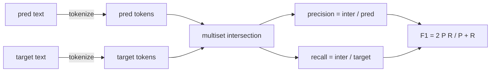
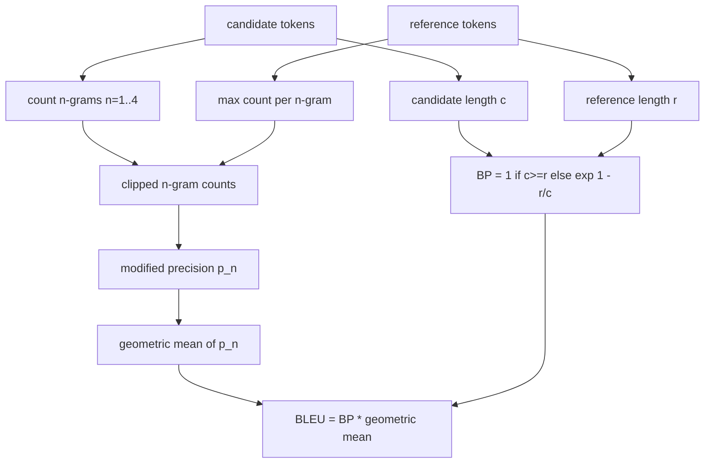

# Classical Evaluation Metrics

> BLEU, ROUGE-L, F1, exact-match, accuracy. These five metrics still account for the majority of published LLM eval numbers. Rewrite each one from first principles and you will truly understand what the number means.

**Type:** Build
**Languages:** Python
**Prerequisites:** Phase 19 Track B foundations, Lesson 70
**Time:** ~90 minutes

## Learning Objectives

- Implement token-level exact-match, F1, and accuracy with explicit tokenization rules.
- Implement BLEU-4 from scratch: modified n-gram precision, geometric mean over n from 1 to 4, brevity penalty.
- Implement ROUGE-L using longest common subsequence, combined with an F-beta of precision and recall.
- Dispatch based on the `metric_name` field from Lesson 70, decoupling the runner from specific metrics.
- Pin behavior with reference vectors derived from hand-computed examples (not third-party libraries).

## Why Rewrite Them

You will read one paper reporting BLEU 28.3 and another reporting BLEU 0.283. You will find that the same text produces ROUGE-L scores ten points apart in two libraries because one lowercases the text and the other does not. The fastest way out of this confusion is to write these metrics yourself, then point to the exact line that decides the tokenizer and the exact line that applies smoothing. After that, comparing numbers across papers becomes a matter of reading metric configs rather than arguing about which library is correct.

Standard library plus numpy is enough. BLEU is counting plus a clamp. ROUGE-L is dynamic programming. F1 is set intersection over tokens. The hardest part is picking a tokenizer and committing to it.

## Tokenization

The tokenizer is `re.findall(r"\w+", text.lower())`. Lowercase, grab alphanumeric runs, discard punctuation. Every metric in this lesson uses this exact tokenizer. The runner has no choice. Change the tokenizer and you are running a different benchmark.

```python
TOKEN_RE = re.compile(r"\w+", re.UNICODE)
def tokenize(text):
    return TOKEN_RE.findall(text.lower())
```

This is an intentional simplification. Production would care about CJK, contractions, code identifiers. The point this lesson makes is: the tokenizer is a contract, not a knob.

## Exact Match

```python
def exact_match(pred, targets):
    return float(any(pred.strip() == t.strip() for t in targets))
```

It returns 1.0 or 0.0 per task. Aggregation across the dataset is the mean. This is the workhorse for arithmetic, MCQ, and short-text classification tasks.

## Token-Level F1

Build a token multiset for prediction and target. Precision is the multiset intersection divided by the prediction multiset; recall is the same intersection divided by the target multiset; F1 is their harmonic mean. The implementation handles the edge cases of empty prediction and empty target.



For multi-target tasks, we take the best F1 across the target list. This matches the widely-reported SQuAD-style behavior.

## BLEU-4

BLEU is the classic machine translation metric and still appears in summarization work. We implement corpus-level BLEU-4 with the standard brevity penalty and add-one smoothing on the modified n-gram counts so that a single missing 4-gram does not push the score to zero.

For each candidate-reference pair, we compute modified n-gram precision for n equal to 1, 2, 3, 4. Modified precision clips a candidate n-gram count to the maximum count of that n-gram in any reference, preventing a candidate from inflating its score by repeating a phrase. The geometric mean of the four precisions is then wrapped by the brevity penalty.



The smoothing rule is what Lin and Och call method 1: add one to both numerator and denominator of each n-gram precision before taking the log. This avoids `log 0` when the reference has no matching 4-gram and stays close to the unsmoothed value on long candidates.

## ROUGE-L

ROUGE-L compares the longest common subsequence between candidate and reference token sequences. LCS captures word order without requiring contiguity, which is why it is the default summarization metric. We compute the LCS length using the standard dynamic programming table, then derive recall as `lcs / reference length`, precision as `lcs / candidate length`, and combine with F-beta where beta equals 1 for the symmetric F1 form.

```python
def lcs_length(a, b):
    n, m = len(a), len(b)
    dp = numpy.zeros((n + 1, m + 1), dtype=int)
    for i in range(n):
        for j in range(m):
            if a[i] == b[j]:
                dp[i+1, j+1] = dp[i, j] + 1
            else:
                dp[i+1, j+1] = max(dp[i+1, j], dp[i, j+1])
    return int(dp[n, m])
```

The numpy table makes the implementation more readable; plain Python lists would also work. Tasks using ROUGE-L pay O(n m) per task. For typical summarization lengths this remains under one millisecond.

## Accuracy

For multi-target classification tasks, accuracy degenerates to exact-match on a single normalized target. We expose it as a separate function so the dispatcher can route directly on `metric_name` without string comparison inside the runner.

## Dispatch Contract

The single entry point is `score(metric_name, prediction, targets)`. It returns a float in `[0, 1]`. The runner does not branch on metric name; it hands off the call and writes back the result. This is the interface surface that Lesson 75 uses to glue Lesson 70's task spec together.

```python
def score(metric_name, pred, targets):
    if metric_name == "exact_match":
        return exact_match(pred, targets)
    if metric_name == "f1":
        return max(f1_score(pred, t) for t in targets)
    if metric_name == "bleu_4":
        return max(bleu4(pred, t) for t in targets)
    if metric_name == "rouge_l":
        return max(rouge_l(pred, t) for t in targets)
    if metric_name == "accuracy":
        return accuracy(pred, targets)
    raise ValueError(f"unknown metric_name: {metric_name}")
```

`code_exec` is handled in Lesson 72 and plugs into this dispatcher there.

## What This Lesson Does Not Do

It does not call a model. It does not normalize generation beyond the Lesson 70 post-processing rules. It does not compute confidence intervals. It does not do BLEURT or BERTScore (those require a model and belong in another lesson). The focus here is the foundation: five metrics, one tokenizer, one dispatch table.

## How to Read the Code

`main.py` defines each metric as a free function plus the dispatcher. Reference vectors live in the `_reference_examples` block at the bottom of the file. The demo runs eight examples through the dispatcher and prints each metric's score. Tests in `code/tests/test_metrics.py` pin the reference vectors and stress every edge case (empty prediction, empty reference, no shared tokens, exact match, repeated-phrase clipping).

Read `main.py` end to end. Functions are ordered by complexity: exact_match and accuracy are one line each, F1 is six lines, BLEU and ROUGE-L are the heavy lifters with detailed comments on the smoothing rule and LCS recurrence.

## Going Further

Classical metrics are necessary but not sufficient. They reward surface overlap and miss semantics. The fix is to layer model-based metrics (BLEURT, BERTScore, GEval) on top once you trust the classical foundation. That is a later lesson. For now: get these five working, pin them with tests, and you own an auditable, fast, reproducible metric stack.
