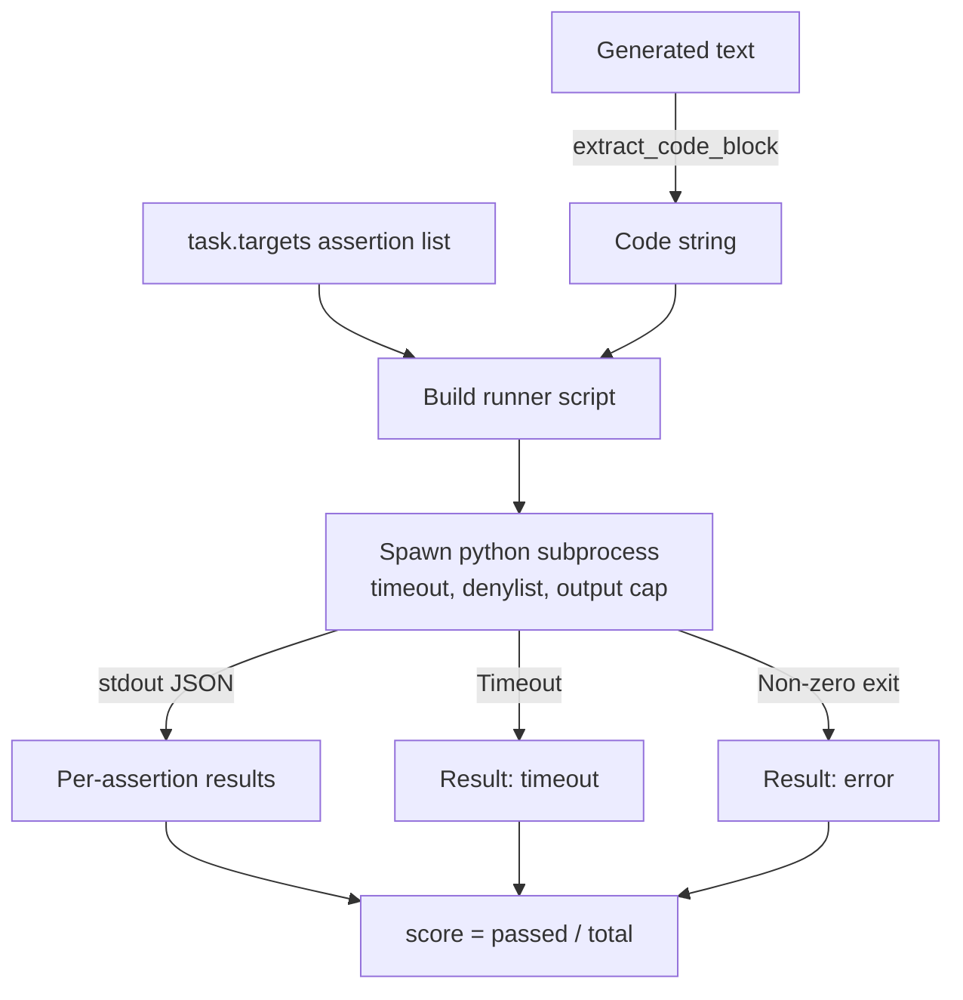
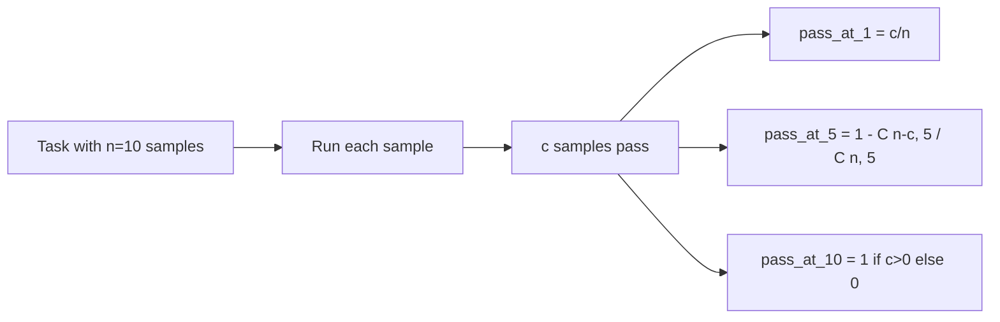

# Code Execution Evaluation Metric

> Generated code is correct only if it passes tests. The eval harness must extract the code, run it without crashing the host, and honestly report the pass rate. This lesson builds that interface surface.

**Type:** Build
**Languages:** Python
**Prerequisites:** Phase 19 Track B foundations, Lessons 70 and 71
**Time:** ~90 minutes

## Learning Objectives

- Extract a code block from free-form generation using the post-processing rule consistent with Lesson 70.
- Execute candidate code in an isolated subprocess with a wall-clock timeout, output cap, and import denylist.
- Define a task's score as the fraction of provided assertion strings that pass against the candidate code.
- Compute pass-at-k for tasks that sample multiple generations from a model.
- Treat sandbox crashes, syntax errors, and timeouts as first-class failure modes with distinct exit codes the runner can log.

## Why an Isolated Subprocess

Inline `exec` is a safety and stability hazard. A generated `while True: pass` hangs the eval forever. A generated `import shutil; shutil.rmtree('/')` is as catastrophic as it sounds. The fix: spawn a fresh Python interpreter per candidate, pipe the code in from stdin, write assertion results to stdout, and kill the process on timeout. The host eval process continues unaffected.

Real evals like HumanEval, MBPP, BigCodeBench, and LiveCodeBench all use subprocess sandboxes. Some layer Docker on top. We stop at the subprocess for a reason: it is portable, it is standard library, and it catches the failure modes that matter for a pedagogical eval. Production deployments add seccomp, network isolation, and read-only filesystems. The hardening lesson is outside this Track.

## Shape of a Code-Exec Task

A `code_exec` task carries assertion strings in `targets`. The runner extracts a fenced code block from the generation, wraps it in a test harness, and runs the result.



The score is a proportion in `[0, 1]`. A task with three assertions where two pass scores 0.667. Regardless of what fails, the runner returns the same shape: subprocess crashes are mapped to a normalized error code rather than letting a Python traceback bubble up to the harness.

## Denylist

The denylist is import-based. Before running candidate code, the runner script rewrites imports of dangerous modules into a stub that raises `ImportError("denied")`. The list is intentionally conservative: `os.system`, `subprocess`, `socket`, `requests`, `urllib`, `urllib.request`, `urllib.error`, `urllib.parse`, `ctypes`, `shutil`, `http.client`, `asyncio.subprocess`.

We do not pretend this is bulletproof. Determined adversarial code can escape any in-process sandbox in Python. The denylist is a guardrail. The real load-bearing controls are the wall-clock timeout and output cap.

```python
DENIED = {
    "os.system": True,
    "subprocess": True,
    "socket": True,
    "shutil": True,
    "requests": True,
    "urllib": True,
    "ctypes": True,
}
```

We wrap the candidate code by prepending `import sys` and a guard that monkey-patches `os.system` into raising an exception. The full template is in `main.py`.

## Wall-Clock Timeout

Each subprocess gets a default three-second wall-clock budget. The runner uses `subprocess.run(..., timeout=t)`. When the timeout fires, the runner catches `TimeoutExpired`, kills the process, and records a `timeout` exit reason for the task. That task scores zero. The runner continues.

The timeout is configurable per-task via `task.metadata.timeout_s`. Long-running unit tests can request more; the Lesson 70 validator caps this value at thirty seconds to keep the suite bounded.

## Output Cap

A subprocess can flood stdout and exhaust host memory. The runner streams stdout into a buffer and kills the subprocess as soon as the cumulative total exceeds 256 KB. The result is recorded as `exit_code = error` with detail string `"output overflow"`. In practice this often occurs when the generation accidentally writes a printing infinite loop.

## Pass-at-k

Pass-at-k is the unbiased estimator used in the HumanEval family. Given `n` independent samples per task with `c` passing, the probability that drawing `k` from those `n` contains at least one passing solution is:

```
pass_at_k(n, c, k) = 1 - C(n - c, k) / C(n, k)
```

When `n - c < k` the numerator is undefined and the value is `1`. The implementation handles this edge case directly. We expose `pass_at_k(n, c, k)` for the Lesson 74 leaderboard layer.



## Exit Codes

The runner returns one of five outcomes per task:

- `pass`: every assertion passes.
- `assertion_fail`: code runs but at least one assertion fails.
- `syntax_error`: code fails to import or has a SyntaxError.
- `timeout`: wall clock expired.
- `error`: any other crash including denylist hits and output overflow (overflow appears with detail `"output overflow"`).

The score remains a proportion; the exit code is metadata. Downstream lessons can decide whether to treat a timeout as zero or as missing data.

## What This Lesson Does Not Do

It does not give you a real sandbox. It does not run untrusted code from the open internet. It does not handle stateful tasks like file I/O or network calls. Those require containers or microVMs. The focus of this lesson is the contract: an isolated subprocess, a denylist, a timeout, an output cap, a clean exit-code vocabulary, and the math of pass-at-k.

## How to Read the Code

`main.py` defines `extract_code`, `run_candidate`, `score_code_exec`, `pass_at_k`. The subprocess runner script is constructed as a string and passed as `-c` to a fresh Python interpreter. Tests in `code/tests/test_exec.py` exercise the four exit codes and pass-at-k against hand-computed HumanEval-style examples.

Read `main.py` end to end. The runner template is the load-bearing piece. Stare at the assertion loop until you can predict the JSON envelope it writes back to the parent process.

## Going Further

Once the subprocess shape works, the next concern is portability. Different Python versions handle SIGKILL differently on Windows. The cleanest fix is wrapping the runner in a Docker image. One step beyond that: replace assertion strings with actual unit test files, aligning the eval with production CI practices. At that point stop calling assertion strings tests; they are toy tests with toy failure modes.
