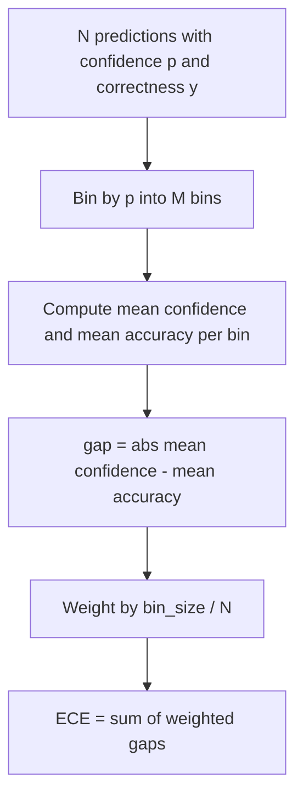
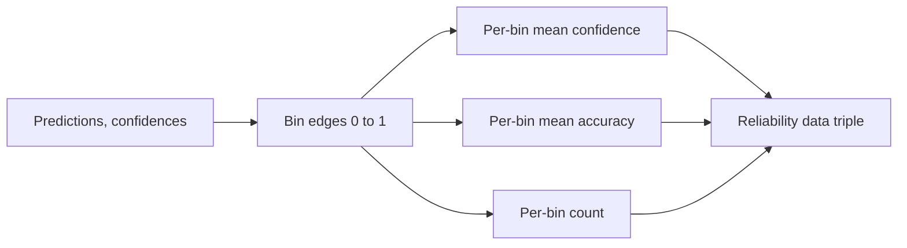

# Perplexity and Calibration

> If your model says it's 90% confident across a thousand answers but only gets six hundred right, its calibration is broken. Calibration is one half of trustworthy eval. The other half is perplexity, which tells you: does the model actually consider this held-out text plausible?

**Type:** Build
**Languages:** Python
**Prerequisites:** Phase 19 Track B foundations, Lessons 70 and 71
**Time:** ~90 minutes

## Learning Objectives

- Compute token-level perplexity on a held-out corpus from the token-level negative log-probabilities provided by a model adapter.
- Compute expected calibration error (ECE) for classifier or multiple-choice evals based on binned predicted probabilities.
- Compute Brier score (mean squared error against correctness indicator) and explain when it captures what ECE cannot.
- Build the reliability diagram data needed to plot confidence-accuracy curves.
- Wire all three into the eval harness so the runner can attach `perplexity`, `ece`, and `brier` numbers to model reports.

## What Perplexity Tells You

Perplexity is the exponent of the average per-token negative log-likelihood. Lower is better. A perplexity of one means the model assigns probability one to every ground-truth token. A perplexity equal to the vocabulary size means the model is uniform—it has learned nothing. Real numbers fall between the two: a strong 2026 base model on WikiText-103 lands around eight to twelve; a weak one on the same text exceeds fifty.

The harness does not compute log-probabilities itself—those come from the model adapter. The harness is responsible for aggregation: it takes a list of per-token log-probabilities, a list of per-sequence token counts, and returns corpus perplexity.

```python
def perplexity(neg_log_probs, token_counts):
    total_nll = sum(neg_log_probs)
    total_tokens = sum(token_counts)
    return math.exp(total_nll / total_tokens)
```

The implementation handles the zero-token edge case and asserts that negative log-probabilities are non-negative. A common mistake is forgetting the sign flip: an adapter that returns `log p` instead of `-log p` will produce perplexity below one, which is impossible. The function catches this as a contract violation.

## What ECE Measures

Expected calibration error bins predictions by their confidence into a fixed number of bins, then measures the average gap between confidence and accuracy across bins, weighted by bin size.



The standard practice uses ten equal-width bins on `[0, 1]`. The implementation supports any positive integer count. We expose a `bins` parameter so the runner can choose between the publication convention (10) and the comparison convention (15).

ECE is biased by bin count and sample size. With ten bins and one hundred predictions, you cannot distinguish an ECE of 0.02 from random noise. The implementation returns the number of populated bins alongside ECE, so the runner can refuse to report a single number when samples are too few.

## What Brier Score Does That ECE Cannot

ECE only cares about average gaps. A model that is overconfident in half the bins and underconfident in the other half can have low ECE yet be locally miscalibrated. Brier score measures squared error against the true outcome per prediction, so it directly penalizes this divergence.

For binary outcomes, Brier is `mean((p_i - y_i)^2)`. It decomposes into reliability, resolution, and uncertainty terms. We compute the score and its decomposition. The runner reports the scalar but logs the decomposition to the dashboard.

```python
def brier(p, y):
    return float(np.mean((p - y) ** 2))
```

## Reliability Diagram Data

A reliability diagram plots predicted confidence against empirical accuracy per bin. The diagonal is perfect calibration. The function returns three arrays: per-bin mean confidence, per-bin mean accuracy, per-bin count. Plotting code lives downstream; this lesson stops at the data shape.



The returned tuple is exactly what a caller needs to plot, or to compute a custom ECE variant (adaptive ECE, sweep ECE, etc.). We return numpy arrays so downstream code does not need to convert.

## Where Confidence Comes From

The harness does not assume confidence comes from softmax. It accepts any number in `[0, 1]` per prediction. For multiple-choice tasks the natural confidence is `softmax over per-option log-likelihoods`. For free-text the natural confidence is the model's self-reported probability or the exponent of mean log-likelihood. The eval only consumes this number. Where it comes from is the adapter's job.

## Edge Cases

- All predictions wrong: ECE is the mean confidence, Brier is high, perplexity is simply how the model views that text.
- All predictions correct with high confidence: ECE near zero, Brier near zero.
- A predictor completely uncertain at p=0.5: ECE is 0.5 minus accuracy, Brier is 0.25 minus a correction term.
- Empty input: ECE, Brier, reliability return `0.0` (or all-zero arrays). Perplexity returns `NaN` on zero tokens. None of these paths emit warnings; the runner checks the values and decides whether to report or skip.

These cases are all covered by tests. Real models on real benchmarks will not hit them, but a buggy adapter or a tiny sample will, and the runner must not crash.

## Distribution

Calibration is not a per-task metric like F1—it is a per-model report. The runner accumulates `(confidence, correct)` pairs across the entire eval, then computes ECE, Brier, and reliability data in one shot. Perplexity is computed on a held-out text corpus, separate from per-task scoring.

The interface is:

```python
report = CalibrationReport.from_predictions(confidences, correct)
report.ece          # float
report.brier        # float
report.reliability  # tuple of three numpy arrays
report.populated_bins  # int
```

`PerplexityResult.from_token_nll(neg_log_probs, token_counts)` returns perplexity and per-token mean negative log-likelihood.

## What This Lesson Does Not Do

It does not call a model. It does not implement softmax. It does not estimate confidence from output tokens—that is the adapter's job. It does not do temperature scaling or Platt scaling—those are post-hoc corrections belonging to another lesson. This lesson's focus is making these three numbers (perplexity, ECE, Brier) trustworthy and reproducible.

## How to Read the Code

`main.py` defines `perplexity`, `expected_calibration_error`, `brier_score`, `reliability_diagram`, and the `CalibrationReport` / `PerplexityResult` dataclasses. The demo runs on synthetic predictions with known ground truth: a well-calibrated model, an overconfident one, and an underconfident one. Tests in `code/tests/test_calibration.py` pin every edge case plus reference values for the synthetic predictors.

Read `main.py` top to bottom. Function order goes from scalar to vector to report. Each function has a brief docstring stating the math and the contract.

## Going Further

Calibration is the most neglected axis in published evals. Most leaderboards report a single accuracy number and call it done. A model that wins on accuracy but loses on Brier is worse as a production deployment than one that is a few accuracy points lower but can reliably report its own uncertainty. Once you have the calibration pipeline wired, add temperature scaling on a held-out validation slice, recompute ECE, and watch the gap shrink. That is a separate lesson, but the foundation is here.
