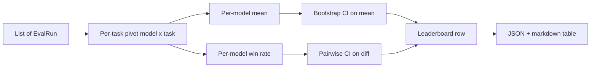
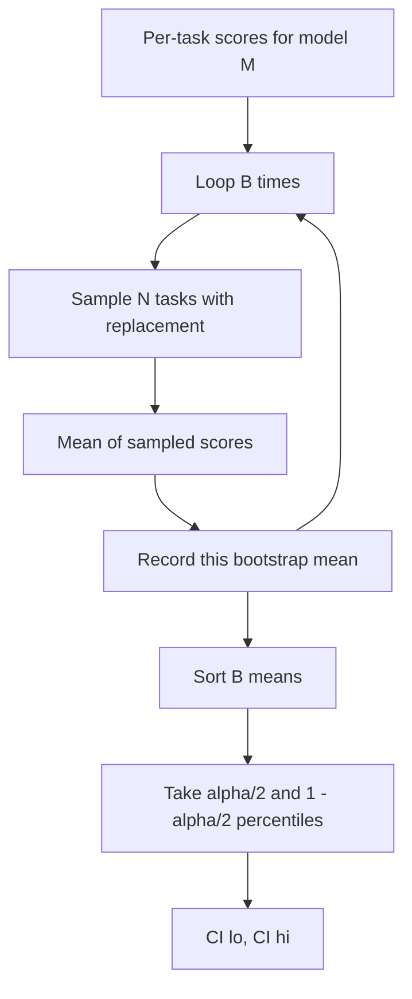

# Leaderboard Aggregation

> Per-task scores are easy to compute. Per-model rankings across heterogeneous tasks are hard. Statistical significance on a leaderboard with a thousand predictions is the part everyone skips. This lesson does not skip it.

**Type:** Build
**Languages:** Python
**Prerequisites:** Phase 19 Track B foundations, Lessons 70, 71, 73
**Time:** ~90 minutes

## Learning Objectives

- Aggregate per-task scores across multiple models and multiple tasks into a clean per-model row.
- Normalize heterogeneous scores so that pass rate and BLEU values do not unduly dominate the aggregate.
- Rank models by mean and by win-rate, and explain when each is the right summary.
- Compute bootstrap confidence intervals for each model's mean score and for pairwise differences.
- Emit the leaderboard as a JSON report and a markdown table that the Lesson 75 runner can paste into a CI comment.

## Input Shape

The aggregator consumes a list of `EvalRun` records:

```python
@dataclass
class EvalRun:
    model_id: str
    task_id: str
    metric_name: str
    score: float          # in [0, 1]
    category: str
```

The Lesson 75 runner emits one record per `(model, task)` pair. The aggregator does not care how the score was computed—it requires that normalization is already done: every score is in `[0, 1]`.

## Output

Three tables are produced:



A leaderboard row contains: `model_id`, `mean_score`, `mean_ci_lo`, `mean_ci_hi`, `win_rate`, `tasks_completed`, and an optional `categories` map storing per-category mean.

## Normalization

If one task scores in `[0, 1]` and another in `[0, 100]`, the second silently dominates the mean. The aggregator validates that every input score falls in `[0, 1]` and rejects the run otherwise. The fix is upstream: metrics should return a proportion. Lessons 71 through 73 enforce this contract.

## Mean and Win-Rate

These two ranking methods serve different goals.

Mean score is the average of a model's per-task scores. It is the headline number on the leaderboard report. It is sensitive to outliers and task imbalance.

Win-rate counts how often a model beats every other model on the same task. For each task, the model with the highest score wins (ties are split). Win rate equals wins divided by the number of tasks the model has scores for. It is less sensitive to outliers and scale differences but discards information.

```python
def win_rate(model_id, runs_by_task, all_models):
    wins, total = 0, 0
    for task_id, runs in runs_by_task.items():
        scores = {r.model_id: r.score for r in runs if r.model_id in all_models}
        if model_id not in scores:
            continue
        total += 1
        best = max(scores.values())
        if scores[model_id] >= best:
            wins += 1
    return wins / total if total else 0.0
```

The harness reports both. The Lesson 75 runner defaults to ranking by mean; the win-rate markdown column is there in case the user prefers it.

## Bootstrap Confidence Intervals

The per-model mean comes with a confidence interval estimated by bootstrap resampling over tasks. We resample task IDs with replacement, compute the mean on the resampled set, repeat `B` times, and take the percentile interval at level `alpha`.



For pairwise comparisons we bootstrap the per-task difference `score_A - score_B`, take the percentile interval, and report it. The user checks whether the interval excludes zero. If it does, the difference is significant at level alpha. If not, the leaderboard treats the two models as tied.

The low-level helper functions (`bootstrap_mean_ci`, `bootstrap_pairwise_diff`) default to `B=1000`; the public aggregator functions (`aggregate`, `pairwise_diffs`) default to `b=500` to keep the demo and tests fast. Default alpha is 0.05. This lesson keeps the bootstrap in pure numpy without scipy.

## Categories

If `EvalRun.category` is set, the aggregator also reports per-category mean. This is the columns labeled `math`, `reasoning`, `code`, `safety` on every leaderboard. It lets the runner see that a model is solid overall but weak on code—information the headline mean hides.

## Markdown Rendering

The leaderboard renders as a markdown table:

```text
| Rank | Model | Mean | 95% CI | Win rate | Tasks |
|------|-------|------|--------|----------|-------|
| 1    | gpt   | 0.78 | 0.74-0.82 | 0.62 | 50 |
| 2    | claude| 0.75 | 0.71-0.79 | 0.34 | 50 |
| 3    | random| 0.10 | 0.07-0.13 | 0.04 | 50 |
```

The table is sorted by mean score. CIs are rendered to two decimal places. Overly long model IDs are truncated to twenty characters.

## What This Lesson Does Not Do

It does not run models. It does not call the metric layer. It does not implement adaptive ECE or other calibration variants—those belong to Lesson 73. It does not implement task weighting—every task here has equal weight. Production leaderboards do weight tasks; we leave the hook via a `weight` field but ignore it in the aggregator. Add weighting in a follow-up lesson if needed.

## How to Read the Code

`main.py` defines `EvalRun`, `LeaderboardRow`, `aggregate`, `bootstrap_mean_ci`, `bootstrap_pairwise_diff`, `render_markdown`. The demo builds a synthetic suite of three models and twelve tasks, runs aggregation, and prints the leaderboard plus pairwise difference table. Tests in `code/tests/test_leaderboard.py` pin the bootstrap, markdown rendering, win-rate edge cases, and empty-input behavior.

Read `main.py` top to bottom. Data shapes (EvalRun, LeaderboardRow) come first, the aggregator second, bootstrap third, rendering last. Each function has a focused contract.

## Going Further

The natural next step is paired task significance rather than unpaired bootstrap. If models A and B both ran the same hundred tasks, the proper test is a paired bootstrap on per-task differences—which we implement. Beyond that, you would want a stratified bootstrap that respects task families (math problems are not independent of each other; a single arithmetic error pattern affects ten of them). That is a follow-up. This lesson's focus is getting the foundation right so that the numbers the eval reports are ones you can stand behind.
