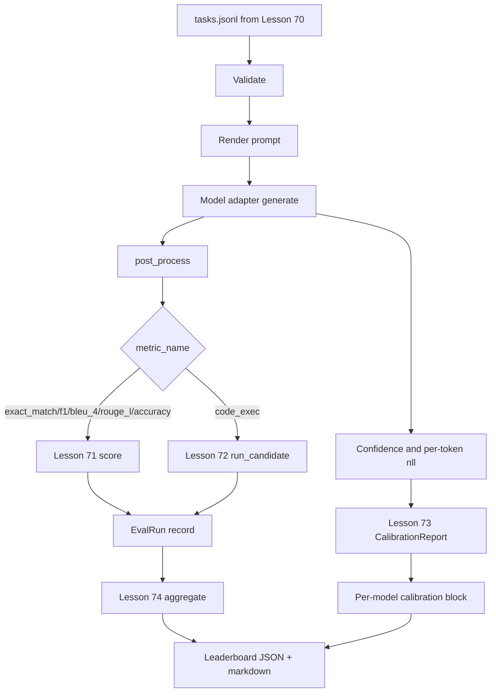

# End-to-End Eval Runner

> Five lessons of pipeline, one lesson to glue them together. The runner reads task specs from Lesson 70, calls a model through an adapter, scores with Lessons 71 and 72, attaches the Lesson 73 calibration report, and emits the Lesson 74 leaderboard. The demo self-terminates.

**Type:** Build
**Languages:** Python
**Prerequisites:** Phase 19 Track B foundations, Lessons 70 through 74
**Time:** ~90 minutes

## Learning Objectives

- Define a `ModelAdapter` interface that any model (mock, local, API) can satisfy with a minimal method surface.
- Run eval on a fixture JSONL file, executing tasks in parallel across a worker pool.
- Combine the metric layer (exact_match, F1, BLEU-4, ROUGE-L, code_exec) and the calibration layer in a single pass.
- Emit per-model `EvalRun` records that feed directly into the leaderboard aggregator.
- Output both a JSON report and a markdown table; self-terminate with exit code zero on a clean run, non-zero on validation or execution failures.

## The Pipeline



The runner is the integration point. Each of Lessons 70 through 74 owns a module; the runner composes them. The runner duplicates none of the logic in those modules—it imports them.

## The Adapter Interface

The adapter is the seam between the runner and any model. The interface is deliberately minimal.

```python
class ModelAdapter:
    model_id: str

    def generate(self, prompt: str, task: TaskSpec) -> Generation: ...
```

`Generation` is a dataclass with:

- `text`: the model's free-form output
- `confidence`: a float in `[0, 1]` representing the model's self-reported probability for this answer
- `token_nll`: optional, sum of negative log-likelihoods over generated tokens
- `token_count`: optional, number of generated tokens

The mock adapters in the runner come in three flavors: `RuleBasedAdapter` (deterministic, near-perfect), `NoisyAdapter` (overconfident, frequently wrong), `BiasedAdapter` (strong on one category, weak on another). The demo runs all three on the Lesson 70 fixture.

## Parallel Execution

The runner uses `concurrent.futures.ThreadPoolExecutor` to run tasks in parallel per model. Worker count defaults to the minimum of eight and the number of tasks. Threads suffice because real model calls are network-I/O bound. The code-exec path spawns its own subprocess within the task; the executor only schedules the wait.

For deterministic tests, the runner exposes `run_eval(adapters, tasks, parallel=False)` so tests can pin execution order.

## Single-Pass Scoring Loop

For each task:

1. Render the prompt (few-shot prefix plus prompt body).
2. Call the adapter and time the call.
3. Post-process the generation according to the task's rules.
4. Dispatch to the metric layer.
5. Build an `EvalRun` record with the score and metric metadata.
6. Append the `(confidence, correct)` pair to the calibration buffer.

The `correct` signal is `score >= 1.0` for exact-match-style metrics (`exact_match`, `accuracy`, `code_exec`) and `score >= 0.5` for graded metrics. This threshold lives in `_correct_from_score`; the runner does not expose a public override.

## Aggregation

Once every task has a result, the runner calls Lesson 74's `aggregate` and `pairwise_diffs`, and Lesson 73's `CalibrationReport.from_predictions`. The output is a single JSON envelope:

```json
{
  "leaderboard": [...],
  "pairwise": [...],
  "calibration": {
    "model_id_a": {"ece": 0.04, "brier": 0.10, "populated_bins": 8, ...},
    ...
  },
  "summary": {
    "tasks": 10,
    "models": 3,
    "wall_seconds": 1.2
  }
}
```

The runner also writes a markdown table to stdout so the user can paste results into a PR review.

## Self-Terminating Demo

The demo runs three mock adapters on ten fixture tasks from Lesson 70. Wall time should be under ten seconds. Exit code is zero on a clean run.

Clean run criteria:

- Every task validates under Lesson 70.
- Every task is scored under Lessons 71 and 72.
- The calibration report aggregates without error under Lesson 73.
- The leaderboard ranks the rule-based adapter strictly above the random adapter.

If any of these break, the runner exits non-zero with a structured error in the JSON envelope.

## What This Lesson Does Not Do

It does not call real models. It does not implement API key flows or rate limiting. It does not implement streaming or partial generation—the adapter returns one generation per call. It does not do retries or caching. Those concerns live in the adapter layer; the runner is metric-agnostic and provider-agnostic.

## How to Read the Code

`main.py` is the integration. It imports from the other five lessons' modules via a small `_load_sibling` helper that resolves relative paths. The `Generation`, `EvalReport`, and `ModelAdapter` dataclasses are defined locally. Mock adapters are at the bottom of the file.

Read `main.py` top to bottom. Scan the imports first, then `run_eval`, then `_score_one`, then the adapters. The demo at the end is the entry point.

Tests in `code/tests/test_runner.py` pin the adapter interface, the single-pass loop, parallel-vs-sequential equivalence, the calibration buffer, and the JSON envelope shape.

## Going Further

This runner is the foundation. A production eval system would add: a result cache keyed on `(task_id, model_id, model_version)`, a cost ledger tracking dollars and tokens per run, a retry layer that backs off on rate limits, a sampling strategy for pass-at-k tasks, and a streaming output format for long suites. Each of these is a single concern wrapped around the runner without modifying the metric or aggregation layers. That isolation is the point of this contract.

After getting the mocks running, add an adapter for a real provider. Pick one with a free tier, write thirty lines of glue, and watch the leaderboard light up. Then add a second provider and let the harness do the work for you.
