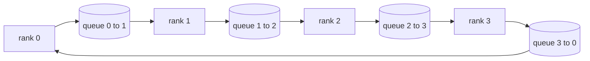

# Collective Operations from Scratch

> The four collective operations that underpin distributed training are allreduce, broadcast, allgather, and reduce_scatter. Every other primitive a training framework provides is a wrapper around these four. Implement them over a mesh of `multiprocessing.Queue` instances, verify byte-for-byte against a reference implementation, and everything downstream on this track is just plumbing.

**Type:** Build
**Languages:** Python
**Prerequisites:** Phase 19 Track C Lessons 42-49
**Time:** ~90 minutes

## Learning Objectives

- Implement ring allreduce in two passes (reduce-scatter then allgather) and prove that each rank's communication volume is 2(N-1)/N bytes per element.
- Build broadcast, allgather, and reduce_scatter on top of point-to-point send over `multiprocessing.Queue`.
- Verify each primitive byte-for-byte against `torch.distributed`'s gloo reference implementation on the same inputs.
- Argue when to choose ring vs. tree from cluster topology, latency floor, and bandwidth ceiling.

## The Problem

Naive allreduce over N ranks sends the tensor to a root N times, then broadcasts it back N times. Per-rank bandwidth grows O(N), the root becomes a bottleneck, and wall-clock lower bound is the slowest link multiplied by N. Ring allreduce flattens this into 2(N-1) chunks of size T/N, so per-rank bytes drop to 2T(N-1)/N and are independent of cluster size. Tree allreduce wins when N is small and links are high-latency because its depth is log2(N) hops rather than 2(N-1). Choosing the wrong topology for the cluster shape means the slowest GPU dictates the entire step duration.

Every distributed training framework you will read on this track relies on these four primitives. PyTorch DDP uses one allreduce per parameter bucket to synchronize gradients. ZeRO uses reduce_scatter to shard optimizer state and allgather to broadcast updated parameters. FSDP splits the entire forward into allgather plus reduce_scatter. Pipeline parallelism needs broadcast to pass activations between stage groups. If you cannot implement these four collectives, you cannot reason about why training hangs, why gradient mismatch appears specifically on rank 3, or why switching topologies doubles the pipeline bubble.

## The Concept



### Two-Pass Ring Allreduce

Split the tensor into N equal chunks numbered 0..N-1. Each rank owns the chunk numbered equal to its rank. The first pass is reduce-scatter, running N-1 steps. At step s, rank r sends chunk (r - s) mod N to rank (r + 1) mod N, and receives chunk (r - s - 1) mod N from rank (r - 1) mod N, accumulating the received chunk into its local copy. After N-1 steps, rank r holds the complete sum of chunk r. The second pass is allgather, running another N-1 steps, rotating the completed chunks around the ring until every rank holds the complete sum of every chunk.

| Primitive | Per-rank bytes | Steps | When to use |
|-----------|---------------|-------|-------------|
| Ring allreduce | 2T(N-1)/N | 2(N-1) | Large T, fat-pipe homogeneous clusters |
| Tree allreduce | T log2(N) | 2 log2(N) | Small T or high-latency links |
| Broadcast | T | log2(N) tree | Parameter initialization, scalar config |
| Allgather | T(N-1)/N | N-1 | Sharded forward, ZeRO unshard |
| Reduce_scatter | T(N-1)/N | N-1 | ZeRO gradient sharding |

### Queue Mesh Instead of NCCL

NCCL runs over PCIe and NVLink with hardware-offloaded reductions. On CPU you do not have that path. Wire one `multiprocessing.Queue` per ring edge and you get single-producer, single-consumer, ordered point-to-point delivery. Reduction happens in userspace, so you pay Python overhead, but the on-wire transfer pattern is identical to NCCL ring allreduce. Reason about correctness on the queue version and cluster behavior follows.

### Verifying Against Gloo

Each primitive ships with a unit test that compares its output against `torch.distributed` initialized with the gloo backend, running the same world size on the same tensor. If your ring allreduce deviates from gloo's output beyond float32 epsilon, the test fails. Verifying against a reference implementation is non-negotiable; without it, primitives look correct until real training diverges at step 10,000.

## Build It

`code/main.py` implements:

- `Mesh` class wiring N `multiprocessing.Queue` instances into a ring, exposing `send(dst, tensor)` and `recv(src)` per rank.
- `ring_allreduce(mesh, rank, world_size, tensor)` running the two-pass algorithm.
- `broadcast(mesh, rank, world_size, tensor, src)` via logarithmic tree.
- `allgather(mesh, rank, world_size, tensor)` via N-1 rotations.
- `reduce_scatter(mesh, rank, world_size, tensor)` as the first half of allreduce.
- `_gloo_reference(op, world_size, tensor)` feeding the same inputs to `torch.distributed` with gloo for byte-level comparison.

Run:

```bash
python3 code/main.py
```

Output: a per-primitive verification table comparing queue-mesh output to gloo output, followed by a per-rank byte counter proving the 2T(N-1)/N scaling law.

## Ship It

Three patterns polish these primitives for production.

**Bucket gradients before allreduce.** A 1-billion-parameter model has tens of thousands of gradient tensors. One allreduce per tensor pays N latency floors. DDP buckets gradients into ~25 MB chunks and fires one allreduce per bucket; small tensors ride on the coattails of large ones. Without bucketing, latency overhead dominates the step.

**Overlap communication with computation.** Backward computes gradients layer-by-layer in reverse. As soon as the last layer's gradients are ready, kick off their allreduce while the next layer continues computing. PyTorch DDP hooks this with bucket-ready callbacks. When the network has headroom, this overlap can halve visible communication time.

**Choose ring vs. tree by message size, not by faith.** NCCL ships a topology detector that selects ring above ~1 MB and tree below. The crossover point is the bandwidth-vs-latency tradeoff: above 1 MB the bandwidth term 2T(N-1)/N dominates and ring wins; below 1 MB the log2(N) hop count wins. Hard-coding one topology loses throughput at the wrong message size.

## Use It

Production patterns:

- **PyTorch DDP.** Calls `dist.all_reduce` on bucketed gradients after backward. Bucket size is tunable; the default 25 MB is reasonable for 100 Gbit Ethernet.
- **DeepSpeed ZeRO.** Issues reduce_scatter to shard gradients, issues allgather to reconstruct full parameters before forward. This lesson's primitives are exactly what ZeRO calls.
- **FSDP.** Forward begins with allgather to unshard the layer, computes, then issues reduce_scatter to reduce and discards the unshard. Same primitives, different schedule.

## Connections

Use the queue-mesh primitives in Lessons 77–81. Lesson 77 wires allreduce into DDP. Lesson 78 wires reduce_scatter into ZeRO. Lesson 79 wires broadcast into pipeline activations. Lesson 81 assembles all four collectives into the end-to-end demo.

## Exercises

1. Add a tree allreduce variant that switches between ring and tree by message size. Measure the crossover point.
2. Add a `recv_timeout_ms` that causes a stuck rank to throw a deadline error rather than hanging forever.
3. Replace `multiprocessing.Queue` in all four primitives with TCP sockets. Same tests, real wire.
4. Add a bandwidth instrumentation hook so the per-rank byte counter logs to JSONL.
5. On 4 ranks, compare ring vs. tree wall-clock time for tensor sizes of 1 KB, 1 MB, and 16 MB. Use measured data to argue the crossover point.

## Key Terms

| Term | Common phrasing | Actual meaning |
|------|-----------------|----------------|
| Allreduce | "sum across ranks" | After the call every rank holds the same reduced tensor |
| Ring | "the fast topology" | N-1 chunks of size T/N rotate around the ring twice |
| Tree | "the log topology" | Reduction proceeds along a binary tree; depth is log2(N) hops |
| Allgather | "concatenate shards" | Every rank ends up with every other rank's shard |
| Reduce_scatter | "split the sum" | Each rank ends up with only one chunk of the sum |
| Bucket | "fuse small tensors" | Merge N small allreduces into one large one |

## Further Reading

- [PyTorch Distributed: NCCL collectives](https://pytorch.org/docs/stable/distributed.html#collective-functions)
- [Horovod ring allreduce paper](https://arxiv.org/abs/1802.05799)
- [NCCL topology and algorithm selection](https://docs.nvidia.com/deeplearning/nccl/user-guide/docs/index.html)
- [Patarasuk and Yuan, bandwidth-optimal allreduce algorithms](https://www.cs.fsu.edu/~xyuan/paper/09jpdc.pdf)
- Phase 10 Lesson 05 — Distributed training overview
- Phase 19 Lesson 77 — DDP built on top of these primitives
