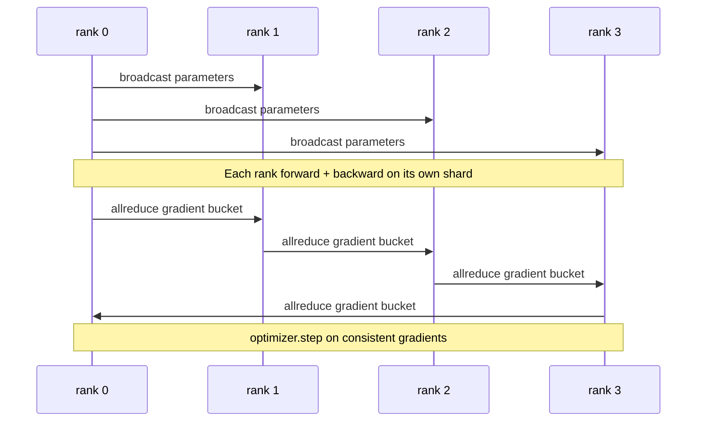

# Data Parallel DDP

> DistributedDataParallel is just a hook on top of allreduce. Wrap a model, broadcast initial parameters from rank 0 so every rank starts in sync, attach a backward hook to each parameter that fires an allreduce once the gradient is computed, and the rest is gradient descent. The entire pattern fits in 200 lines.

**Type:** Build
**Languages:** Python
**Prerequisites:** Phase 19 Track C Lessons 42-49
**Time:** ~90 minutes

## Learning Objectives

- Wire a `DistributedDataParallel`-shaped wrapper that broadcasts initial parameters and allreduces gradients after backward.
- Launch N CPU ranks on the gloo backend with file-based rendezvous using `torch.multiprocessing.spawn`.
- Prove gradient sync correctness by training the same model sequentially on the same data in a single process and showing per-step parameter equivalence.
- Argue that bucketing (gradient fusion) and overlap (communication during backward) are the two changes that turn a working DDP into a production-grade DDP.

## The Problem

A 1-billion-parameter model with 12 GB of activations does not fit on a consumer GPU. Even if it does, training takes weeks. Data parallelism splits the batch across N ranks; each rank computes forward and backward on its own shard, then every step sums each rank's gradients so all N replicas stay in sync. The summed gradient is what the optimizer uses to update.

Without gradient sync, N replicas diverge by step 2. The model is no longer "the same model trained on more data" but N independent models that happen to share initial weights. If gradient sync is done poorly (one allreduce per parameter, no overlap, no bucketing), the network becomes the bottleneck and GPUs idle waiting for the wire. DDP's craft is making gradient sync nearly free relative to compute. The classic PyTorch DDP achieves this by bucketing gradients, overlapping allreduce with the next layer's backward, and using NCCL over NVLink. We do all three on CPU with gloo—the lesson learned is the same.

## The Concept



### The Three Operations DDP Needs

| Phase | Collective | Why |
|-------|-----------|-----|
| Initialization | Broadcast from rank 0 | Every rank starts with the same parameters |
| After backward | Allreduce each gradient | The optimizer updates with the averaged gradient |
| Occasionally | Broadcast buffers | Keep batchnorm running stats in sync |

### Why Average, Not Sum

Allreduce-SUM divided by world_size yields the mean gradient. The mean is invariant to world_size: a learning rate tuned on 1 rank works on 4 ranks because the per-step gradient magnitude is unchanged. Allreduce-SUM without division forces you to retune the learning rate every time you change cluster size. DDP wraps SUM and divides; this lesson does the same.

### Why Bucket Gradients

A transformer has thousands of parameter tensors. One allreduce per tensor pays thousands of gloo latency floors. DDP groups gradients into ~25 MB buckets and fires one allreduce per bucket. Total bytes on the wire are the same, but latency is amortized over the entire bucket. This lesson's small model fits everything in one bucket; the structure that transfers is the point.

### Why Fix the Seed

Each rank must use `torch.manual_seed(seed + rank)` for shuffling but `torch.manual_seed(seed)` for parameter initialization. Sharing one seed means every rank sees the same batch order (defeating data parallelism); using rank-dependent seeds for parameters means initial parameters differ by float epsilon, and gradient sync can never bring replicas into exact agreement. Get the seed discipline right or the parameter-equivalence test fails at step 1.

## Build It

`code/main.py` implements:

- `MiniMLP`: a 3-layer MLP small enough to converge in seconds yet large enough to expose wiring details.
- `DistributedDataParallel(model, world_size)`: broadcasts parameters at construction, returns a wrapper whose `sync_grads` divides accumulated allreduce-summed gradients by world_size.
- `worker(rank, world_size, ...)`: full training loop with `torch.distributed` initialization on gloo, forward, backward, sync, step.
- `_reference_single_process_loop(...)`: trains the same model sequentially on the same data in a single rank, for tests to compare byte-for-byte parameter equivalence after each step.

Run:

```bash
python3 code/main.py
```

Output: a per-step training table comparing single-process loss and parameter checksum against a 4-rank DDP run. The two paths produce loss curves identical within float epsilon, proving gradient sync is correct.

## Ship It

Three patterns polish DDP for production.

**Find unused parameters.** Some forward paths conditionally skip parameters (early exit, mixture-of-experts router). Skipped parameters have no gradient, but DDP's bucket-ready hook still waits for them, deadlocking the allreduce. `find_unused_parameters=True` makes DDP check which parameters received gradients before reducing. The cost is one pass over the computation graph per step, so do not enable it unless your forward branches.

**Static graph optimization.** When the forward is stable across steps, `static_graph=True` lets DDP precompute the bucket schedule. The optimization is meaningful only at scale: precomputation saves a few milliseconds per step that accumulate over 10,000 steps.

**Gradient accumulation requires care.** Accumulating gradients over K microbatches without syncing every microbatch can yield 10x throughput improvement. DDP exposes `no_sync()` as a context manager that suppresses the post-backward allreduce. Forgetting this manager means you allreduce K times for nothing; throughput drops to the floor.

## Use It

Production patterns:

- **PyTorch DDP.** The canonical implementation. `torch.nn.parallel.DistributedDataParallel(model)` wires bucketing, overlap, and the no_sync context.
- **HuggingFace Accelerate.** Adds a launcher handling `torchrun` environment variables and model wrapping. Under the hood it is the same DDP.
- **Megatron-LM data parallelism.** Combines DDP with tensor parallelism for large-model training; the data-parallel piece is the same allreduce-after-backward pattern.

## Connections

Lesson 78 (ZeRO sharding) replaces the per-parameter allreduce with reduce_scatter so each rank stores only its shard of optimizer state. Lesson 81 assembles DDP and ZeRO into the end-to-end demo.

## Exercises

1. Add configurable gradient bucket sizes and measure the speedup over per-parameter allreduce on a deeper model.
2. Implement `no_sync()` as a context manager and verify that gradient accumulation over K microbatches matches the single-process baseline.
3. Add a `find_unused_parameters` mode where the forward sometimes skips an MLP layer; running without the flag should deadlock.
4. Replace gloo with synchronization using only `torch.distributed.barrier()` and feel the difference between allreduce-based and barrier-based sync.
5. Measure gradient-sync overhead as a fraction of total step time for batch sizes 1, 16, and 256, and explain the scaling behavior.

## Key Terms

| Term | Common phrasing | Actual meaning |
|------|-----------------|----------------|
| DDP | "data parallel" | A wrapper that broadcasts parameters and allreduces gradients each step |
| Bucket | "fuse gradients" | Merge N small allreduces into one large one |
| Overlap | "hide communication" | Fire allreduce while later layers are still computing backward |
| no_sync | "accumulate" | Skip post-backward allreduce for gradient accumulation |
| find_unused | "branching forward" | Detect parameters without gradients before reducing |

## Further Reading

- [PyTorch DistributedDataParallel docs](https://pytorch.org/docs/stable/generated/torch.nn.parallel.DistributedDataParallel.html)
- [PyTorch DDP internals tutorial](https://pytorch.org/tutorials/intermediate/ddp_tutorial.html)
- [Li et al., PyTorch Distributed: Experiences on Accelerating Data Parallel Training](https://arxiv.org/abs/2006.15704)
- Phase 19 Lesson 76 — The collectives DDP is built on
- Phase 19 Lesson 78 — ZeRO sharding replaces per-parameter allreduce with reduce_scatter
