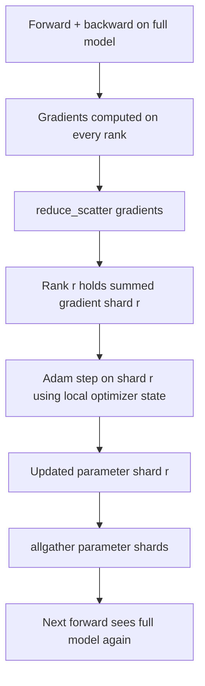

# ZeRO Optimizer State Sharding

> Adam stores two moment estimates per parameter, both in float32. A 7-billion-parameter model carries 56 GB of optimizer state. ZeRO stage 1 shards this across N ranks; each rank owns 1/N of the optimizer. After the local step, the updated parameter shard is broadcast back so every rank reconstructs the full model for the next step. The payoff: the single largest allocation in the training stack drops linearly.

**Type:** Build
**Languages:** Python
**Prerequisites:** Phase 19 Track C Lessons 42-49
**Time:** ~90 minutes

## Learning Objectives

- Shard optimizer state (first moment, second moment, fp32 master copy) across N ranks so each rank owns 1/N.
- Use reduce_scatter to deliver only the summed gradients for each rank's own shard, then allgather to broadcast the updated parameter shard back.
- Compute the memory savings table for stage 1, stage 2, and stage 3 relative to vanilla DDP.
- Given model size and bandwidth budget, argue when to choose stage 1 vs. stage 2 vs. stage 3.

## The Problem

Vanilla DDP replicates everything: parameters, gradients, and optimizer state exist in full on every rank. For an fp16 7-billion-parameter model this means 14 GB of parameters, 14 GB of gradients, and 28 GB of optimizer state per rank. Optimizer state is the largest item and the easiest to shard because it is only touched during the step — never during forward or backward.

ZeRO stage 1 shards the optimizer state. Each rank holds 1/N of the Adam moments. After backward, instead of allreducing the full gradient and stepping locally, ZeRO uses reduce_scatter so each rank receives only the summed gradient for its own shard. That rank applies the optimizer step to its shard of the master parameters. The updated parameter shard is then allgathered back so every rank has the full model for the next forward pass. Optimizer memory drops by N. Per-step wire traffic is identical to DDP: one reduce_scatter plus one allgather equals one allreduce in bandwidth. Memory wins, throughput stays the same.

## The Concept



### ZeRO Stages

| Stage | What is sharded | Per-rank memory | Per-step communication |
|-------|----------------|------------------|---------------|
| DDP | Nothing | params + grads + optim | 1 allreduce |
| ZeRO-1 | Optimizer state | params + grads + optim/N | 1 reduce_scatter + 1 allgather |
| ZeRO-2 | Optim + grads | params + grads/N + optim/N | 1 reduce_scatter + 1 allgather |
| ZeRO-3 | Optim + grads + params | params/N + grads/N + optim/N | 1 allgather + 1 reduce_scatter per layer |

Stage 1 is the cheapest win because optimizer state dominates the memory budget. Stage 2 requires gradient-shard accumulation logic but the same bandwidth. Stage 3 (FSDP) pays per-layer communication for every forward and backward in exchange for parameter-shard memory savings. This lesson fully implements stage 1.

### Memory Math with Real Numbers

For a model with P parameters using Adam with mixed-precision training:

| Item | Vanilla | ZeRO-1 | Why |
|------|---------|--------|-----|
| fp16 params | 2P bytes | 2P bytes | Needed for forward |
| fp16 grads | 2P bytes | 2P bytes | Needed for backward |
| fp32 master copy | 4P bytes | 4P/N bytes | Only the optimizer uses it |
| fp32 first moment | 4P bytes | 4P/N bytes | Only the optimizer uses it |
| fp32 second moment | 4P bytes | 4P/N bytes | Only the optimizer uses it |
| Total | 16P bytes | 4P + 12P/N bytes |   |

At N=8: vanilla 16P, ZeRO-1 5.5P — a 65% reduction. At N=64: vanilla 16P, ZeRO-1 4.19P — a 74% reduction.

### Why reduce_scatter Beats "Allreduce Then Shard"

Allreduce gives every rank the full summed gradient. If you only need shard r, then (N-1)/N of the reduced gradient on rank r is wasted work. Reduce_scatter delivers exactly the shard each rank owns; per-rank bytes are the same as allreduce (because allreduce is reduce_scatter + allgather), but the second half is replaced by the subsequent parameter-shard allgather. Net wire traffic is identical to DDP; memory is divided by N.

## Build It

`code/main.py` implements:

- `flatten_params(module)` and `unflatten_into(module, flat)` — pack model parameters into a contiguous tensor and unpack them back. This flat layout makes per-rank sharding a simple slice.
- `ZeroOptimizer(model, world_size, rank, lr)` — holds this rank's shard of the master copy and Adam moments.
- `step()` — runs reduce_scatter on the flat gradient, applies Adam to this rank's shard, then allgathers the updated parameters back.
- A demo that trains a 3-layer MLP for 20 steps and prints the per-step memory budget alongside a vanilla DDP baseline.

Run:

```bash
python3 code/main.py
```

Output: per-step loss and a memory table showing ZeRO-1 holds only 1/N of the optimizer state per rank while DDP holds the full copy.

## Ship It

Three patterns harden ZeRO for production.

**Sharded checkpointing is critical.** ZeRO-1 optimizer state is scattered across ranks; checkpoints must record which rank owns which piece. Lesson 80 builds the sharded checkpoint manifest that lets a ZeRO run resume on the same world size. Without it, saved state is unreadable on restart.

**Mixed precision is the point.** ZeRO is a mixed-precision technique; the fp32 master copy is what gets sharded. Running ZeRO without mixed precision pays the fp32 master memory tax without the corresponding fp16 forward benefit. Production runs always pair ZeRO with autocast or bf16 weights.

**Stage 1 is a near-free win.** Communication is bandwidth-identical to DDP. Memory savings scale linearly with N. The only cost is the bookkeeping for optimizer shards. Production stacks default to stage 1 unless parameter-shard memory also becomes a problem; then stage 2 or 3 trades communication for memory.

## Use It

Production patterns:

- **DeepSpeed ZeRO.** The reference implementation. `deepspeed_config.json` selects stage 1/2/3 and partition size.
- **PyTorch FSDP.** PyTorch-native equivalent. `ShardingStrategy.SHARD_GRAD_OP` is ZeRO-2; `FULL_SHARD` is ZeRO-3.
- **HuggingFace Accelerate.** Wraps both DeepSpeed and FSDP under a unified config.

## Connections

Lesson 79 (pipeline parallel) is an orthogonal sharding axis: instead of sharding optimizer state on the same model, it shards layers across ranks. Lesson 81 assembles DDP + ZeRO in an end-to-end demo.

## Exercises

1. Extend to ZeRO-2 with gradient sharding: each rank stores only its own gradient shard by zeroing the non-shard portion after backward.
2. Add a memory profiler that prints actual fp32 byte usage on rank 0 and compares it to the formula prediction.
3. Measure per-step wall-clock time for vanilla DDP vs. ZeRO-1, broken down into forward, backward, and communication.
4. Implement gradient clipping under ZeRO-1: the L2 norm must be computed across all shards by allreducing the local squared norms.
5. Implement a "naive ZeRO" that uses allreduce instead of reduce_scatter and measure the wire-time difference. Use the numbers to argue why reduce_scatter is preferred.

## Key Terms

| Term | Common usage | Precise meaning |
|------|----------------|------------------------|
| ZeRO-1 | "shard optimizer" | Each rank holds 1/N of fp32 master + Adam moments |
| ZeRO-2 | "shard gradients too" | After reduce_scatter each rank also discards non-shard gradients |
| ZeRO-3 | "shard parameters" | Each rank holds 1/N of fp16 params; per-layer allgather during forward |
| Master copy | "fp32 weights" | The high-precision parameter copy that the optimizer updates |
| Reduce_scatter | "split the sum" | Delivers only the summed gradient shard each rank owns |

## Further Reading

- [Rajbhandari et al., ZeRO: Memory Optimizations Toward Training Trillion Parameter Models](https://arxiv.org/abs/1910.02054)
- [DeepSpeed ZeRO documentation](https://www.deepspeed.ai/tutorials/zero/)
- [PyTorch FSDP documentation](https://pytorch.org/docs/stable/fsdp.html)
- Phase 19 Lesson 76 — The reduce_scatter and allgather this lesson depends on
- Phase 19 Lesson 80 — Sharded checkpoint required for ZeRO state
