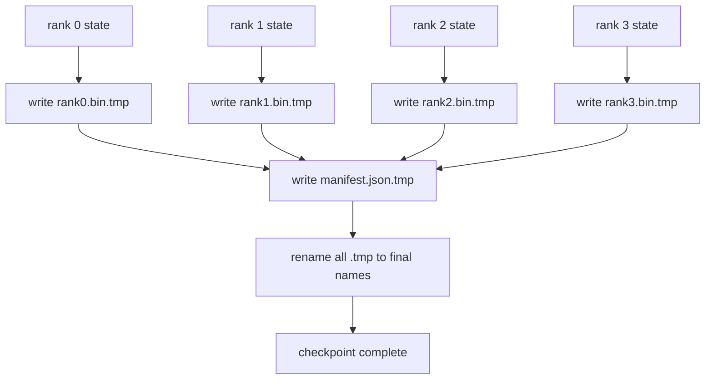

# Sharded Checkpoint and Atomic Resume

> A 70-billion-parameter training job gets interrupted by a node failure every few hours. The checkpoint format determines whether you lose 30 minutes or 30 hours. Sharded checkpoint writes each rank's shard in parallel and records ownership in a manifest. On resume, each rank loads its own shard from its own file, reconstructs state on the same world size, and the optimizer continues stepping as if nothing happened. Atomic writes prevent a half-written checkpoint from poisoning the next resume.

**Type:** Build
**Languages:** Python
**Prerequisites:** Phase 19 Track C Lessons 42-49
**Time:** ~90 minutes

## Learning Objectives

- Store a multi-rank checkpoint as one shard file per rank plus a manifest recording which rank owns what.
- Use an atomic write pattern (write to a temporary path then rename) so a crash mid-write never produces a half-finished checkpoint.
- Resume from the manifest and verify byte-for-byte equality of fp16 parameters and ZeRO optimizer state on every rank.
- Make the manifest schema resilient to three failure modes: world size change, shard count mismatch, and incomplete write.

## The Problem

Naive checkpointing reads all parameters and optimizer state into rank 0, gathers them, and writes a single file. For a 70-billion model that is 1.1 TB of state flowing through one rank's network port. During the write every other rank is blocked because they sit idle waiting for the gather. IO bandwidth is the slowest GPU's network link, not aggregate bandwidth. On real clusters this gather-then-write step can take longer than the previous training hour, meaning the job cannot produce a single checkpoint per training day.

Sharded checkpointing inverts this: each rank writes its own shard to its own file in parallel. The manifest records which rank owns which shard, so resume can put each shard back where it came from. Aggregate write bandwidth scales with cluster size. A 1 TB checkpoint takes 4 hours through one rank but 4 minutes through 64 ranks. The manifest also gives you a contract against incompatible resumes: world size changes are detected, incomplete writes are detected, and the load path can fail loudly instead of silently using stale data.

## The Concept



### Manifest Schema

```json
{
  "world_size": 4,
  "step": 1234,
  "wall_clock_seconds": 4521,
  "shards": [
    {"rank": 0, "path": "rank0.bin", "sha256": "...", "param_shard_offset": 0, "param_shard_numel": 65536},
    {"rank": 1, "path": "rank1.bin", "sha256": "...", "param_shard_offset": 65536, "param_shard_numel": 65536}
  ],
  "schema_version": 1
}
```

Three fields are load-bearing. `world_size` makes resume on a different scale fail loudly instead of silently corrupting. Per-shard `sha256` catches incomplete writes or corruption. Per-shard `param_shard_offset` and `param_shard_numel` let the loader reconstruct the flat parameter tensor at the correct position.

### Atomic Write

Standard pattern: write each shard to `<name>.tmp`, write the manifest to `manifest.json.tmp`, fsync each, then rename. POSIX rename within the same filesystem is atomic; either the new file exists completely or the old one remains. A crash before the final rename leaves the previous checkpoint as the live one. Without atomic writes, a crash can leave an incomplete shard and a manifest pointing to it, corrupting optimizer state on resume.

### Three Failure Modes the Schema Must Resist

| Failure | Symptom | Defense |
|---------|---------|---------|
| World size change | Resume with N=4 manifest on N=8 | world_size mismatch in manifest, fail loudly |
| Shard count mismatch | Fewer rank*.bin files than shards in manifest on resume | Enumerate shards, verify each exists |
| Incomplete write | Shard file truncated mid-flush | sha256 verification on load |

Each defense rejects bad loads early; otherwise silent corruption surfaces as NaN loss 100 steps later.

### Why One File Per Rank, Not One Big File

Concurrent writes to one file via `O_APPEND` are possible on POSIX for byte-aligned writes, but in practice offsets within a shard span MB-scale regions and locking becomes dominant. One file per rank has zero contention and benefits from striping when the underlying filesystem is parallel (Lustre, GPFS). This is why production stacks (DeepSpeed, FSDP, NeMo) all use one file per rank.

## Build It

`code/main.py` implements:

- `ShardManifest` dataclass with the schema above plus `to_json`/`from_json`.
- `save_sharded(state_dict_per_rank, dir, step)` — writes each rank's binary state to its own file using atomic temp-then-rename, then writes the manifest.
- `load_sharded(dir, expected_world_size)` — reads the manifest, verifies each shard's sha256, and returns per-rank state dicts.
- A round-trip test: build per-rank state, save, load, assert byte-for-byte equality.

Run:

```bash
python3 code/main.py
```

Output: writes 4 shard files plus manifest, then reloads them with byte-for-byte verification.

## Ship It

Three patterns harden checkpointing for production.

**Async writes.** Production stacks dispatch checkpoint writes to a separate thread or process so training can continue. The barrier is at the next checkpoint: do not start a new save until the previous one completes. DeepSpeed's `async_io` flag does exactly this. This lesson keeps writes synchronous to make steps visible.

**Write to fast local disk, then upload asynchronously.** Write to local NVMe (fast), then async-upload to S3 or GCS. This two-tier pattern keeps in-cluster checkpoints fast for resume while shipping a durable copy off-cluster for archival. The manifest carries local paths; an upload manifest carries remote paths.

**Rotation is essential.** Production runs keep the most recent K checkpoints (typically 3-5) and rotate out the oldest. Without rotation, disk fills mid-run and the next checkpoint fails. With rotation, the next save deletes the oldest first, freeing budget.

## Use It

Production patterns:

- **DeepSpeed checkpointing.** `deepspeed.save_checkpoint(tag=step)` writes per-rank files plus a `latest` file pointing to the active tag.
- **PyTorch FSDP checkpointing.** `torch.distributed.checkpoint` saves sharded state with a `Planner` that determines per-rank layout.
- **NeMo.** Wraps both DeepSpeed and FSDP under a unified `save_to_checkpoint` API with metadata.

## Connections

Lesson 81 stores the state of an end-to-end DDP+ZeRO run as a sharded checkpoint, then reloads on the same world size to prove the resume contract holds.

## Exercises

1. Add async writes: launch the save in a thread and let training continue. Block the next save until the previous one completes.
2. Add a `last_5_steps` rotation: keep the most recent 5 checkpoints and delete the oldest before saving a new one.
3. Add a fast CRC-only verification path for the inner-loop reload (rotation rolls a checkpoint into the new active one without full sha256).
4. Add a cross-world-size load: rebalance shards from N=4 to N=8 by reading the manifest, concatenating, and re-sharding.
5. Add an upload to a fake S3 (a second directory) and write an upload manifest. Argue for this two-tier storage strategy.

## Key Terms

| Term | Common usage | Precise meaning |
|------|----------------|------------------------|
| Sharded checkpoint | "per-rank save" | Each rank writes its own shard file in parallel |
| Manifest | "the index" | JSON file recording shard paths, offsets, and sha256 |
| Atomic write | "tmp then rename" | Write to .tmp then POSIX rename; crash leaves previous file alive |
| Partial write | "truncated shard" | A crash during write produces a corrupted shard; sha256 catches it |
| Rotation | "keep last K" | Delete the oldest checkpoint before writing a new one to bound disk usage |

## Further Reading

- [DeepSpeed checkpointing](https://www.deepspeed.ai/tutorials/checkpointing/)
- [PyTorch torch.distributed.checkpoint](https://pytorch.org/docs/stable/distributed.checkpoint.html)
- [POSIX rename atomicity](https://pubs.opengroup.org/onlinepubs/9699919799/functions/rename.html)
- Phase 19 Lesson 78 — The ZeRO state this checkpoint is shaped to save
- Phase 19 Lesson 81 — End-to-end demo round-trips the saved state
