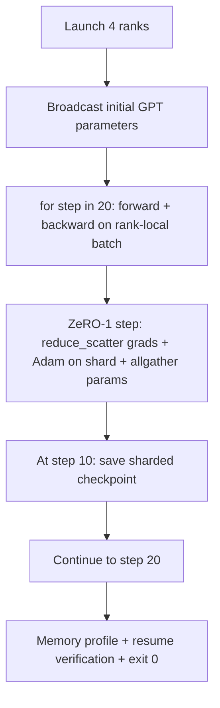

# End-to-End Distributed Training

> Lessons 76 through 80 each built one component. This lesson is the assembly: DDP for gradient sync, ZeRO-1 for optimizer-state sharding, a sharded checkpoint saved mid-run — training a tiny GPT across 4 simulated ranks. The demo runs 20 steps, self-terminates, prints a loss curve with a memory profile, and writes a resumable checkpoint.

**Type:** Build
**Languages:** Python
**Prerequisites:** Phase 19 Track C Lessons 42-49
**Time:** ~90 minutes

## Learning Objectives

- Assemble DDP (Lesson 77), ZeRO-1 (Lesson 78), and sharded checkpoint (Lesson 80) into a single training loop.
- Train a 2-layer transformer language model for 20 steps across 4 simulated ranks on a small synthetic corpus.
- Print a per-step loss table, a per-rank memory profile, and a checkpoint manifest that can resume byte-for-byte on the same world size.
- Argue for this combination: each component was independently testable in earlier lessons, and this lesson proves they compose correctly.

## The Problem

The capstone proves the components fit together. Lesson 76 implemented collectives. Lesson 77 wrapped them into DDP. Lesson 78 sharded optimizer state with reduce_scatter. Lesson 79 analyzed pipeline. Lesson 80 saved a sharded checkpoint. Each lesson stands alone with its own tests. Real training uses every primitive at once; if the combination is wrong, loss diverges, the checkpoint refuses to resume, or per-rank memory that should shrink grows instead.

This lesson runs the end-to-end demo and verifies four invariants: (a) loss monotonically decreases over 20 steps (with float noise tolerance), (b) every rank holds identical parameter norms at every step, (c) per-rank optimizer memory matches the ZeRO-1 formula of 12P/N bytes, (d) the step-10 checkpoint reloads byte-for-byte on restart. The demo self-terminates: 20 steps, single command, exit 0.

## The Concept



### The Mini GPT

The model is deliberately small: 2 transformer blocks, embed dim 32, 4 attention heads, vocab 64, sequence length 16, batch 4. A few thousand parameters. Large enough to exercise every wiring decision (multi-head attention uses the standard masked path; LayerNorm has weights that need syncing; the LM head is a separate linear projection back to vocab). Small enough that 20 steps finish in seconds on 4 CPU ranks.

### Composition Rules

| Component | What it handles | What it leaves to the loop |
|--------------|--------------|----------------------------|
| DDP broadcast | Initial parameter sync | Called once at construction |
| ZeRO-1 step | Gradient sync, master copy update, parameter broadcast | Called once per step, replaces optimizer.step |
| Sharded checkpoint | Persist per-rank state, manifest with sha256 | Called on rank 0; state gathered via allgather |
| Training loop | Forward, backward, loss logging | Calls the above three in order |

The loop knows nothing about reduce_scatter or rendezvous files. ZeRO and checkpoint modules expose narrow interfaces; the loop composes them.

### Why a Mini GPT Instead of Just an MLP

Lesson 77's MLP is sufficient to verify gradient sync. A mini GPT adds three things: a separate LM head covering the vocab (untied in this lesson for clarity; full GPTs typically tie the head with the token embedding), softmax + cross-entropy as loss (more numerical edge cases than MSE), and an asymmetric forward (embedding then attention then MLP per layer). A capstone that stays with an MLP hides whether the composition correctly handles gradient shapes from LayerNorm or embedding layers.

### Self-Terminating Means Exit 0

The loop runs a fixed 20 steps then exits. No `while True`, no manual intervention, no resume from external state. A capstone you can walk away from and return to find a complete log is a capstone that proves the system is wired correctly. If any component deadlocks, the demo never returns and the test harness catches it.

## Build It

`code/main.py` implements:

- `MiniGPT`: 2-layer transformer with masked self-attention and a separate LM head.
- `make_corpus(seed, total_tokens)`: deterministic next-token prediction data.
- `_train_worker`: launched per rank; broadcasts initial parameters, runs the loop, calls the ZeRO step, writes the sharded checkpoint at step 10.
- `verify_resume`: after the main run, reloads the step-10 checkpoint in-process and asserts the saved master shard matches the in-memory snapshot byte-for-byte.
- `main`: orchestrates the full demo, prints the loss table, memory profile, and verification result.

Run:

```bash
python3 code/main.py
```

Output: a 20-row loss table, a 4-row per-rank memory profile, a checkpoint manifest, and a single "RESUME VERIFIED" line on success.

## Ship It

Three patterns finalize the combination for production.

**Checkpoint every K minutes, not every K steps.** Step time varies with sequence length and microbatch count. A 10-minute checkpoint cadence covers the same amount of compute regardless of model size. This lesson uses step-based for simplicity; production uses wall-clock-based.

**Detect divergence early.** Production runs add a NaN guard and a loss-spike detector after backward; if loss jumps by more than 2x in a single step, roll back to the previous checkpoint rather than letting the optimizer walk into a degenerate state. This lesson's loss curve is smooth so the guard is never triggered, but the hook is in place.

**Aggregate memory profiles across ranks.** In real runs per-rank memory varies by rank (the rank holding the largest pipeline stage holds more activations). Production logs the cross-rank max and mean; this lesson prints per-rank to show the formula matches.

## Use It

Production patterns:

- **DeepSpeed.** Combines DDP + ZeRO + pipeline + activation checkpointing under a single config. This lesson's combination is a miniature version of the DeepSpeed form factor.
- **PyTorch FSDP.** Native equivalent. `FullyShardedDataParallel` with `ShardingStrategy.SHARD_GRAD_OP` is ZeRO-2.
- **NeMo and Megatron-LM.** Add tensor parallel on top for the largest models; otherwise the combination is the same form factor.

## Connections

The full track ends here. These 6 lessons together form the distributed training subsystem a real team would build before adopting DeepSpeed; the abstractions have been validated against gloo and the failure modes exercised. Phase 17 (Infrastructure & Production) is where this goes onto a real cluster.

## Exercises

1. Add a tensor-parallel split to the attention heads and verify loss matches the single-rank baseline. Two ranks: half the heads per rank, allreduce on the attention output.
2. Add gradient accumulation across 4 microbatches and prove the gradient equals the large-batch gradient.
3. Add a resume-from-step-10 path that actually continues training to step 20 and produces the same final loss as the original run.
4. Add a metrics export (loss, grad norm, step time) to JSONL so the run can be visualized post-hoc.
5. Add a NaN guard that rolls back to the previous checkpoint on a loss spike, and force a spike with a one-step LR multiplier to exercise the rollback.

## Key Terms

| Term | Common usage | Precise meaning |
|------|----------------|------------------------|
| End-to-end | "wire everything together" | A single run combines every component instead of one unit test per component |
| Memory profile | "how many GB per rank" | Bytes held per rank for parameters, gradients, and optimizer state |
| Resume contract | "save then load" | Per-rank state is byte-for-byte equal after a checkpoint round-trip |
| Self-terminating | "bounded run" | Fixed step count, exit 0 on completion, no human in the loop |

## Further Reading

- [DeepSpeed end-to-end training tutorial](https://www.deepspeed.ai/getting-started/)
- [PyTorch FSDP advanced tutorial](https://pytorch.org/tutorials/intermediate/FSDP_advanced_tutorial.html)
- [Megatron-LM training script reference](https://github.com/NVIDIA/Megatron-LM)
- Phase 19 Lessons 76-80 — Every component this lesson combines
- Phase 17 — Where this combination goes onto a real cluster
