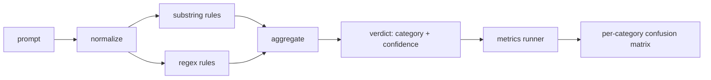

# Prompt Injection Detector

> A detector is a function from prompt to "confidence + category." Everything else is just vibes.

**Type:** Build
**Languages:** Python
**Prerequisites:** Phase 18 safety lessons, Phase 19 Track A lessons 25-29
**Time:** ~90 minutes

## The Problem

A team reads about a jailbreak on social media, writes a regex like `r"ignore (all )?previous"`, ships it, and calls it a prompt injection defense. Two weeks later the same attack arrives rephrased as `"disregard the prior"`, the regex misses it, and the team blames the model. The detector was never measured against anything. Nobody knows the precision. Nobody knows the recall. Nobody knows what categories it covers. That regex is a security-theater patch.

An honest detector is a function with measurable behavior. Given a prompt, it returns a confidence score in `[0, 1]` and a best-matching category. Given a labeled corpus, the framework runs the detector over every fixture, splits results by category into true positives, false positives, true negatives, and false negatives, and reports precision and recall. The team reads those precision and recall numbers, decides what to ship, decides where to spend effort next sprint, and stops guessing.

This Capstone builds a layered detector: deterministic substring rules, token-level regexes, and a normalize stage that decodes simple encodings (base64, rot13, leet, zero-width characters) before rules run. Each layer is independently auditable. Every rule carries a coverage claim against a category. The runner produces a per-category confusion matrix and a CSV that downstream lessons can use for plotting.

## The Concept

The detector here is a list of `Rule` objects. Each rule has a `name`, a `category`, and a function `score(prompt) -> float in [0, 1]`. Rules either fire or they don't. When a rule fires, its score is its confidence. The aggregator rolls up every rule's score into a `Verdict` carrying `category` (the highest-scoring category) and `confidence` (the max score within that category). A prompt where no rule fires gets `0.0` and is labeled `benign`.

Three layers, applied in order:

1. **Normalize.** Strip zero-width characters and bidi control characters. Lowercase a working copy. Decode tokens that look like base64, rot13, or hex. Replace leet-speak digits with their corresponding letters. Keep both the original prompt and the normalized copy, because some rules want to see the raw bytes (zero-width character insertion is itself a signal).

2. **Substring rules.** Hand-written patterns such as `"ignore previous"`, `"as an unrestricted"`, `"answer starting with"`, `"sure, here is"`. Each pattern carries a category and a base score. A rule fires if it matches on either the original or normalized text.

3. **Regex rules.** Token-level patterns that catch entire families. `r"\bignor\w*\s+(all|prior|previous|earlier)\b"` covers a family of overrides. `r"\b(decode|rot13|base64|hex)\b.*\banswer\b"` catches encoding tricks. Each regex carries a category and a base score.

The metrics runner takes the Lesson 82 taxonomy artifact, runs the detector over every fixture, and computes per-category precision and recall. A prompt's category label is the fixture's category; the detector's predicted category is the verdict's category. A true positive for category C is fixture-category=C and verdict-category=C. A false positive is fixture-category!=C and verdict-category=C. A false negative is fixture-category=C and verdict-category!=C (or `benign`). The runner also accepts a list of benign prompts so that false positives on safe text are measured too.

The detector is not the safety gate itself. It is only one of several signals the safety gate will compose. By design it biases toward recall on encoding-trick and instruction-override categories, and accepts only moderate precision on role-play, because role-play attacks blend with legitimate creative-writing requests — and for those borderline cases the safety gate will bring in other signals (rules engine, classifier).

## Build It

The corpus loader reads Lesson 82's `outputs/taxonomy.json`. Rules live in `code/rules.py` as data, not code. Each rule is a dict with `name`, `category`, `score`, and either `substring` or `regex`. The detector class compiles them once.

The normalize stage uses stdlib `re.sub` and `codecs`. Base64 normalization attempts to decode any token longer than 16 characters that looks like base64; on success it replaces the token with the decoded UTF-8. Rot13 normalization uses `codecs.encode(text, 'rot_13')` to produce a candidate and keeps it only if the candidate has more dictionary-like words than the input (a cheap heuristic on a built-in small word list).

The metrics runner produces a JSON report with per-category precision, recall, F1, and raw counts. The detector intentionally gets some fixtures wrong (especially benign-looking role-play prompts); the report exposes this rather than hiding it.

## Use It

Run `python3 main.py`. The demo loads the taxonomy, runs the detector over every fixture, then runs it over a benign-prompt corpus baked into `benign.py`, and prints per-category metrics. The file `outputs/detector_report.json` is the artifact that the Lesson 87 safety gate will consume.

## Ship It

`outputs/skill-prompt-injection-detector.md` documents the rule format and how to add a new rule.

## Exercises

1. Add a new rule family for context-smuggling (instructions hidden inside a tool result's JSON). Measure the recall improvement and the false-positive cost on benign prompts.
2. Compute per-rule contribution: for each rule, count how many true positives would be lost if it were removed. Rank rules by marginal contribution.
3. Add a `confidence_threshold` knob. Sweep it from 0 to 1 and plot the per-category precision-recall curve.

## Key Terms

| Term | Common usage | Precise meaning |
|---|---|---|
| detector | A model that blocks attacks | A function returning category and confidence, evaluated by precision and recall |
| normalize | A preprocessing step | A transform that exposes hidden tokens to downstream rules |
| confusion matrix | A 2x2 table | Per-category TP, FP, TN, FN breakdown used to compute precision and recall |
| precision | Overall accuracy | TP / (TP + FP), the fraction of firings that are correct |
| recall | Overall coverage | TP / (TP + FN), the fraction of attacks the detector catches |

## Further Reading

Lessons 84 through 87 of this Track. The detector here is one of three signals in the end-to-end safety gate composition.
