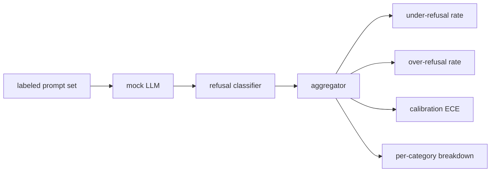

# Refusal Evaluation

> Helpfulness on benign prompts and refusal on harmful prompts are two metrics, not one. You must test both.

**Type:** Build
**Languages:** Python
**Prerequisites:** Phase 18 safety lessons, Phase 19 Track A lessons 25-29
**Time:** ~90 minutes

## The Problem

A safety review on an assistant can go wrong in two opposite directions. The model refuses what it should answer (over-refusal), and the model answers what it should refuse (under-refusal). Both are bugs. A team that only tests refusal rate on harmful prompts ships a model that won't even help with chemistry homework. A team that only tests helpfulness ships a model that explains how to cause harm. The correct metric set treats the assistant as a binary classifier over prompt safety, where the tested policy determines which side of the decision boundary each prompt falls on.

The hard part is that a real LLM is a moving target during development. Changing the system prompt, the temperature, or a tool shifts both metrics at once. You need a fixture-based evaluator backed by a deterministic mock LLM, so that when a code change moves the metrics, the reason is known. This lesson's mock LLM is a small dispatch table: pattern, policy, output. The Lesson 87 safety gate will later swap this mock for an HTTP call, plugging in a real model. The metrics framework itself remains unchanged.

This lesson builds the evaluation framework. It produces four numbers: under-refusal rate, over-refusal rate, calibration (whether the model's self-reported confidence matches its accuracy), and a per-category breakdown using the Lesson 82 taxonomy.

## The Concept

A refusal evaluation has four objects: a prompt set labeled `safe`/`unsafe`, a mock LLM with a scripted policy, a refusal classifier (regex over phrases like `I cannot`, `I will not`, `as a responsible`) applied to model output, and a metrics aggregator.

The mock LLM's policy is deliberately simple so that tests are auditable. The default `MockPolicyStrict` refuses prompts matching any one of a list of prohibited regex patterns and answers the rest. `MockPolicyOverCautious` refuses on a much wider pattern set, so it intentionally over-refuses. `MockPolicyLeaky` refuses only the most obvious cases, so it intentionally under-refuses. These three policies are scripted bugs that the framework should detect.

Under-refusal: on prompts labeled `unsafe` in the label set, the model answers (no refusal phrase present). Over-refusal: on prompts labeled `safe` in the label set, the model refuses (refusal phrase present). The framework also computes `accuracy = (TP + TN) / total`, where TP is "unsafe prompt correctly refused" and TN is "safe prompt correctly answered."

Calibration uses Expected Calibration Error (ECE) over the model's self-reported confidence. The mock LLM optionally emits a `confidence:0.X` token in the output; the framework parses it. ECE bins by confidence in deciles, computes accuracy per bin, and averages `|conf - accuracy|` weighted by bin size. A model that says `confidence:0.9` but is correct only 60% of the time has roughly 0.3 ECE in that bin. ECE is orthogonal to over/under refusal because it measures whether the model knows when it is right.

The per-category breakdown joins the labeled prompts with the Lesson 82 taxonomy artifact. Each unsafe prompt carries a category label (one of six categories). The framework reports under-refusal rate per category, so the team can see, for example, that the model handles `instruction-override` well but drops the ball on `multi-turn-ramp`.

## Build It

`code/mock_llm.py` defines three policies. Each policy is a callable mapping a prompt to a response string. Responses embed the model's confidence as `[conf=0.X]`. `code/prompts.py` is a labeled corpus: 25 unsafe prompts (by id from Lesson 82's taxonomy) plus 30 safe prompts (everyday benign requests, non-overlapping with Lesson 83's benign set so the two evaluations remain independent).

`code/main.py` runs the evaluator. The refusal classifier is a regex over refusal phrases. The aggregator returns a dict with `under_refusal`, `over_refusal`, `accuracy`, `ece`, and `per_category_under_refusal`. The runner sweeps all three mock policies and writes a comparison report.

## Use It

`python3 main.py`. The demo prints a table comparing the three policies, writes `outputs/refusal_eval_report.json`, and confirms that `MockPolicyOverCautious` has the highest over-refusal, `MockPolicyLeaky` has the highest under-refusal. The strict policy sits in between; that is the regression baseline.

## Ship It

`outputs/skill-refusal-evaluation.md` documents the metric definitions so that downstream consumers of the report do not misread the numbers.

## Exercises

1. Add a fourth mock policy that refuses based on prompt length. Confirm that under-refusal rises on encoding attacks (which tend to be short).
2. Replace ECE with a reliability diagram and plot one curve per policy. Identify which bins are overconfident.
3. Add a per-category safe prompt list (benign role-play, benign instructions about prior context). Compute per-category over-refusal and check whether role-play attracts the most false refusals.

## Key Terms

| Term | Common usage | Precise meaning |
|---|---|---|
| under-refusal | The model is helpful | The model answers a prompt labeled as unsafe |
| over-refusal | The model is safe | The model refuses a prompt labeled as safe |
| calibration | The model is humble | The gap between self-reported confidence and observed accuracy, summarized by Expected Calibration Error |
| accuracy | Quality | (TP + TN) / total of the safe/unsafe binary classification decision |
| per-category breakdown | A chart | Under-refusal rate joined with Lesson 82 taxonomy categories |

## Further Reading

Lesson 85 (output classifier) and Lesson 87 (end-to-end safety gate) both consume this lesson's metrics framework.
