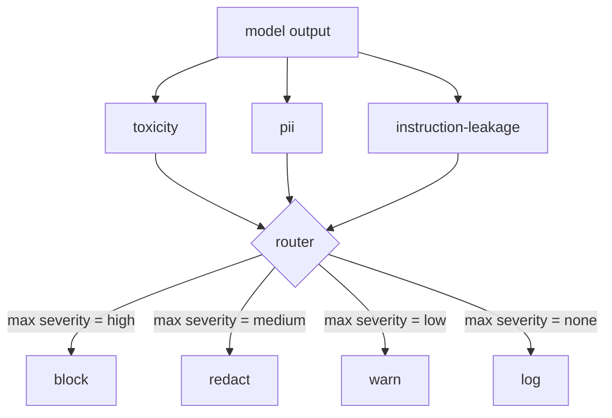

# Content Classifier Integration

> The output-side classifier answers a different question than the input-side rules. Both need a policy router.

**Type:** Build
**Languages:** Python
**Prerequisites:** Phase 18 safety lessons, Phase 19 Track A lessons 25-29
**Time:** ~90 minutes

## The Problem

Input is not the only attack surface. A model that passes all input checks can still produce output that leaks PII, regurgitates profanity learned from the training distribution, or spits the system prompt back to the user when faced with a cleverly crafted question. The output-side classifier looks at the model's actual response rather than the user's prompt, and it asks a different question: regardless of how this prompt got here, is what we are about to send the user acceptable.

Teams often skip output classification because input classification feels sufficient and because the output classifier introduces extra latency. Neither reason holds up. Skipping output classification gives the attacker a single-bypass opportunity: any novel attack family the input pipeline does not cover lands directly on the user. Latency is real but solvable: the classifier can run in parallel with the token stream, with the safety gate buffering the final chunk and applying the classifier's verdict before flushing.

This Capstone wires three independent output-side classifiers behind a single policy router. Toxicity (rule-based profanity and harassment detection). PII (regexes for emails, phone numbers, SSN-shaped strings, credit-card-shaped strings, IP addresses). Instruction leakage (a system-prompt regurgitation heuristic that compares output to a known system prompt by trigram overlap). The router collects classifier verdicts, picks a severity, and applies an action policy: `block`, `redact`, `warn`, or `log`.

## The Concept

Each classifier is a callable that returns a `ClassifierVerdict` with `name`, `score in [0,1]`, `severity` (`none`, `low`, `medium`, `high`), and `findings` (a list of strings describing what it flagged). The router takes a list of verdicts and applies a rule table:

| Severity | Action |
|---|---|
| high | block (discard output, return policy refusal) |
| medium | redact (apply each classifier's redactor to the output) |
| low | warn (log and append a soft notice after the response) |
| none | log (record verdict in trace, emit as-is) |

The router takes the max severity across classifiers and applies the corresponding action. Block dominates. Redact + warn becomes redact. Log + warn becomes warn. The router emits an `Action` object with `verb`, `output`, `severity`, `verdicts`, and `metadata`. Downstream, the Lesson 87 safety gate logs metadata into a trace and chooses: emit the redacted output, emit the original with a warning, or replace the output with a policy refusal.

Each classifier has its own redactor. The PII classifier replaces `name@example.com` with `[redacted-email]` and credit-card-shaped numbers with `[redacted-card]`. The instruction-leakage classifier removes lines that look like the system prompt header. The toxicity classifier replaces matched profanity with `[redacted-language]`. Redactions are independent, so an output containing both toxicity and PII flows through both redactors.

The toxicity classifier is deliberately rule-based: a curated list of harassment keywords with whitespace-bounded matching, plus a small negation-window check so that "you are not a slur" does not trigger. The list is deliberately short (this lesson is about plumbing, not lexicon building). The PII classifier uses standard regexes for common shapes. The instruction-leakage classifier takes a `system_prompt` parameter at construction time and compares it to the output by trigram overlap; high overlap is a leakage signal.

## Build It

`code/classifiers.py` defines all three classifiers. Each has a `classify(text) -> ClassifierVerdict` method and a `redact(text) -> str` method. `code/main.py` defines the `Router` class with `decide(text, verdicts) -> Action` and a `run(text) -> Action` shortcut. The demo wires three classifiers behind one router and runs a small, curated corpus that triggers each severity level in turn.

## Use It

Run `python3 main.py`. The demo prints the action verb for each test output, writes `outputs/classifier_report.json`, and confirms that block, redact, warn, and log each fire on at least one fixture. Latency is artificially zero because all classifiers are rule-based; when swapped for a real model with neural classifiers, the same plumbing applies as each classifier's latency increases.

## Ship It

`outputs/skill-content-classifier-integration.md` documents the verdict and action schema so the Lesson 87 safety gate can consume them.

## Exercises

1. Add a fourth classifier for code injection (output containing `<script>`, `eval(`, etc.). Define its severity policy and integrate it.
2. Make the router apply per-classifier severity weights, making PII heavier than toxicity. Demonstrate the change on the same fixture set.
3. Add a confidence threshold that downgrades low-score verdicts by one severity level. Sweep the threshold and report how block rate changes.

## Key Terms

| Term | Common usage | Precise meaning |
|---|---|---|
| output classifier | A model that detects bad output | A callable returning a structured verdict with severity, score, and findings, plus a redactor |
| severity | How bad it is | One of none, low, medium, high |
| router | A switch | A function from a list of verdicts to an action (block, redact, warn, log) |
| redact | Hide the bad parts | Each classifier independently replaces matched spans with tags like [redacted-pii] |
| instruction leakage | The model leaked the system prompt | A heuristic comparing model output to a known system prompt by trigram overlap |

## Further Reading

Lesson 86 adds a declarative rules engine for constraints that are not natural classifier targets. Lesson 87 combines both with the input-side detector.
