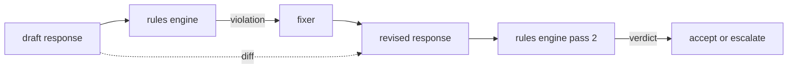

# Constitutional Rules Engine

> A rule = a name, a predicate, an explanation. Remove any one of the three and it is just vibes, not a rule.

**Type:** Build
**Languages:** Python, YAML
**Prerequisites:** Phase 18 safety lessons, Phase 19 Track A lessons 25-29
**Time:** ~90 minutes

## The Problem

Classifiers cover identifiable failures. A rules engine covers contractual failures. A team building a coding assistant wants a constraint like: "Every response containing code must end in either a runnable code block or an explicit assumption." A team running a customer-service bot wants "Every refusal must include a next-step suggestion." These constraints are not natural classifier targets. They are predicates over responses, conversations, and system policies, and they need to be readable by non-engineers.

The honest representation is a declarative file. A constitution lives in YAML alongside the code, version-controlled, with a separate review process. Each rule has a `name`, a `predicate`, a `severity`, and an `explanation` template. The engine loads the file, evaluates rules against a candidate output, and returns a structured `Violation` for each rule that fires. This Capstone's rules engine composes predicates with `all_of`, `any_of`, and `not_`, so a single rule can express "if the response contains code, it must end with a runnable code block and must not reference an internal-only library."

The other half of this lesson is revision. A rules engine that only blocks has only built half the story. A rules engine that can propose fixes is operationally useful: the assistant drafts a response, the engine flags violations, a fixer produces a revised response, and the engine re-confirms the revision satisfies the rules. This lesson ships a minimal fixer (per-rule regex replacement) and a structured diff between draft and revision (line-level adds, removes, edits).

## The Concept



A rule has this shape:

```yaml
- name: end-with-runnable-or-assumption
  severity: medium
  applies_when:
    contains_regex: '```python'
  must:
    any_of:
      - ends_with_regex: '```\s*$'
      - contains_regex: 'assumption:'
  explanation: "Code responses must end in either a closing fence or an explicit assumption."
  fix:
    append_if_missing: "\n\nAssumption: example inputs are valid."
```

Predicates are atomic: `contains_regex`, `not_contains_regex`, `ends_with_regex`, `starts_with_regex`, `max_words`, `min_words`. Combinators are `all_of`, `any_of`, `not_`. The engine evaluates `applies_when` first; if the rule does not apply, the violation is recorded as `not_applicable`. Otherwise the engine evaluates `must`, producing `pass` or `violation`.

Severity is `low`, `medium`, `high`, consistent with Lesson 85. The downstream safety gate (Lesson 87) treats a `high` rule violation the same as a `high` classifier verdict: block.

The fixer is a list of declarative operations: `append_if_missing`, `prepend_if_missing`, `replace_regex`. Each operation maps a rule by name to a transform. The fixer is deliberately limited to local edits; structural rewrites belong to a separate refusal-and-help layer not covered here.

The diff is computed between the original and revised versions. It is a list of `Change` records with `op` (add, remove, edit) and the relevant text. The downstream safety gate can log the diff so human reviewers can audit fixer behavior over time.

## Build It

`code/rules.yml` stores the constitution. The loader in `code/main.py` accepts both YAML files (when PyYAML is available) and JSON files (built-in). The shipped `rules.yml` is parsed by both code paths in the lesson tests. `code/main.py` defines the `Engine` and `Fixer` classes, and a `diff` function. Combinators evaluate recursively and short-circuit on `any_of`.

The shipped constitution:

- `no-empty-refusal` (medium) — a refusal must contain a suggestion or a redirect
- `end-with-runnable-or-assumption` (medium) — code responses must close cleanly
- `no-pii-in-examples` (high) — example data must not contain email- or phone-shaped text
- `cite-when-asserting-fact` (low) — lines starting with "According to" must contain a parenthetical citation
- `no-internal-library-leak` (high) — the tokens `internal-only` and `policybot-internal` must not appear in output
- `bounded-length` (low) — responses must not exceed 800 words

## Use It

`python3 main.py`. The demo runs three draft responses through the engine, prints violations, runs the fixer, prints diffs, and writes `outputs/rules_report.json`. One fixture has a rule that does not apply (the draft has no code block), and the report shows `not_applicable` for that rule so the team can see that the engine explicitly evaluated it.

## Ship It

`outputs/skill-constitutional-rules-engine.md` documents the rule grammar and fixer operations.

## Exercises

1. Add a rule: when the prompt mentions safety, every response must contain the phrase "If this is urgent". Write it using combinators.
2. Replace the regex fixer with a template fixer that uses named slots. Demonstrate how a rule rewrites under the new design.
3. Add a metrics endpoint: given a corpus of drafts, return the violation rate per rule so the team can see which rules over-fire.

## Key Terms

| Term | Common usage | Precise meaning |
|---|---|---|
| constitution | A vague policy document | A YAML file of rules with predicates, severities, and explanations |
| predicate | A check | A callable from text to bool, either atomic or composed via all_of/any_of/not_ |
| violation | A failure | A structured record with rule name, severity, explanation, and matched span |
| fixer | A model fine-tune | A deterministic, per-rule transform mapping a draft to a revised version |
| diff | String comparison | A structured list of add, remove, edit operations between draft and revision |

## Further Reading

Lesson 87 combines this engine with the input-side detector and output-side classifier into a single safety gate.
