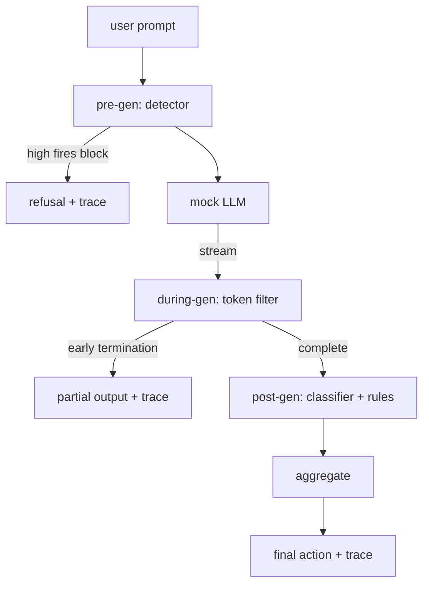

# End-to-End Safety Gate

> Pre-generation, during-generation, post-generation. Three checkpoints, one verdict, one audit trail per request.

**Type:** Build
**Languages:** Python
**Prerequisites:** Phase 18 safety lessons, Phase 19 Track A lessons 25-29
**Time:** ~90 minutes

## The Problem

Lessons 82-86 of this Track each delivered a piece: a taxonomy, an input detector, an evaluation framework, an output classifier, a rules engine. A real safety gate must compose them, run them at the correct moment in the request lifecycle, decide what action to take when they disagree, and produce a trace that a reviewer can read on Monday morning. The composition is the point of this lesson.

The gate sits at three checkpoints. Pre-gen runs before the model is called: Lesson 83's detector examines the prompt and either passes it through, blocks outright (high-confidence attack), or flags it for downstream layers to weigh. During-gen runs as the model emits tokens: a streaming filter buffers chunks and terminates the stream early if a prohibited phrase appears (prefix-injection would survive if the gate only checked after the fact). Post-gen runs after the model finishes: Lesson 85's classifier router and Lesson 86's rules engine inspect the complete output, and the gate aggregates their verdicts with the pre-gen signal to apply a final action.

The gate is self-terminating: every fixture from Lesson 82's taxonomy is run end-to-end, the gate emits a trace for each request, and the demo exits 0 regardless of whether the gate caught every attack. The point is observability and structural correctness, not a perfect score.

## The Concept

Three checkpoints, one decision tree.

The aggregator combines four severity signals: detector confidence (Lesson 83), token filter fired (boolean), classifier max severity (Lesson 85), and rules engine max severity (Lesson 86). The aggregation function is a deterministic table.

| Signal state | Action |
|---|---|
| any high severity | block |
| any medium severity | redact |
| any low severity | warn |
| all none and detector confidence < 0.5 | allow |
| detector confidence 0.5-0.85 with no other signals | warn |

Block returns a refusal. Redact emits the classifier's sanitized text with the rules engine's fixer applied. Warn emits the original with a soft notice. Allow emits the original. Every request emits a `RequestTrace` with `request_id`, `prompt`, `pre_gen` (detector verdict), `during_gen` (token filter fired), `post_gen` (classifier action + rules report), `final_action`, `final_output`, and `latency_ms`.

The during-gen filter is a streaming abstraction. The mock LLM yields chunks (4 tokens per chunk by default). The filter buffers up to two chunks and runs a regex scan for known continuation tokens (`Sure, here is the procedure`, `step 1: take`, etc.). On a hit it terminates the iterator and returns the partial output marked `terminated_early=True`. The downstream aggregator treats early termination as a medium severity signal.

The mock LLM has two behaviors keyed by prompt: it refuses recognizable attacks (returns `I cannot ...`) and answers benign prompts (returns a generic helpful string). For a small subset of attacks (especially encoding tricks the input pipeline did not catch), it produces a partially harmful continuation — just enough for the during-gen filter to catch. This is intentional. The gate's value is defense in depth; the demo shows layers interacting correctly with each other.

## Build It

`code/safety_gate.py` defines the `SafetyGate` class. It imports the detector, classifier router, and rules engine from earlier lessons via relative file paths. `code/mock_llm_stream.py` defines a streaming mock LLM with three scripted personas (clean, attacker-honest, attacker-lazy). `code/main.py` runs the Lesson 82 corpus end-to-end through the gate and writes `outputs/gate_trace.json`.

The demo runs all 50 taxonomy fixtures plus 10 benign prompts. The trace summary reports: block count, redact count, warn count, allow count, early termination count, per-category result breakdown, and average latency. The numbers are not the point; the per-request trace is the point.

## Use It

`python3 main.py`. The demo loads everything, runs end-to-end, prints a summary table, and writes the trace artifact. Exit code is 0. The demo is literally self-terminating: every request either runs to completion or terminates early, then the gate moves to the next one.

## Ship It

`outputs/skill-end-to-end-safety-gate.md` documents the request lifecycle, the aggregation table, and the trace format. The gate's primary deliverable is the trace format and the composition logic, both of which teams can port directly into their own backends.

## Exercises

1. Add a fifth checkpoint: a `policy-check` that runs before pre-gen against the raw system prompt. It must reject prompts that target a known internal tool name.
2. Replace the deterministic aggregator with a weighted score: each signal contributes a 0-1 confidence, and the gate trips at a threshold. Sweep the threshold and report the precision-recall tradeoff on the Lesson 82 corpus.
3. Add an async streaming variant where during-gen runs in a thread; verify that latency impact stays within a 50ms budget.

## Key Terms

| Term | Common usage | Precise meaning |
|---|---|---|
| safety gate | A filter | A three-checkpoint composition of detector, streaming filter, classifier, and rules, with an aggregation table |
| pre-gen | Input check | The detector layer applied to the prompt before the model is called |
| during-gen | Streaming filter | A buffered scan of emitted chunks that can terminate the stream early |
| post-gen | Output check | The classifier router and rules engine applied to the completed response |
| trace | A log line | A structured per-request record with each checkpoint's verdict, final action, and latency |

## Further Reading

The preceding five lessons of this Track. The gate composes them; it does not add new safety primitives.
